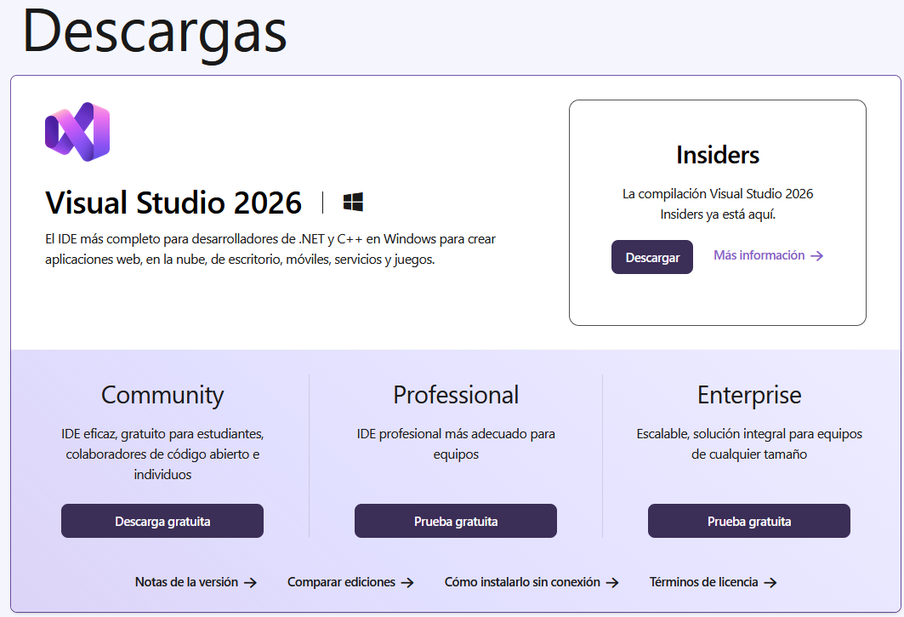
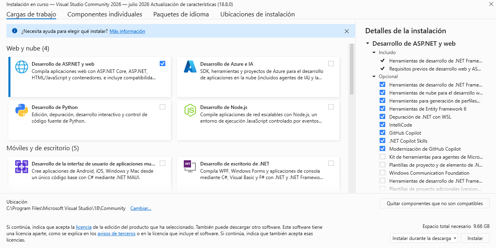
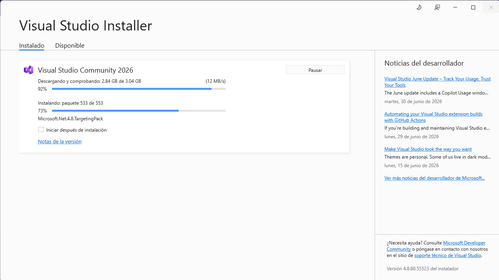

# Instalación y/o configuraciones
1. Descargue el paquete de instalación.  

En el navegador web puede escribir `descargar visual studio 2026` o ingrese a la URL `https://visualstudio.microsoft.com/es/downloads/`  

 

Descargue `Community` edition.  

2. Inicie el proceso de instalación. 

Vea en la siguiente imagen la opción que debe seleccionar para trabajar con ASP.NET.  

  

Progueso de instalación   

   