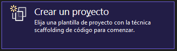
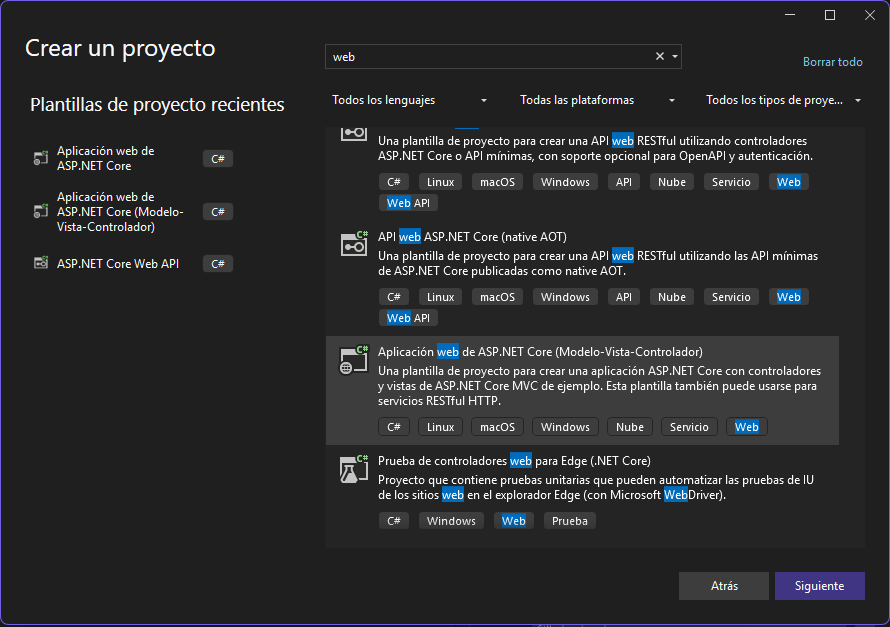
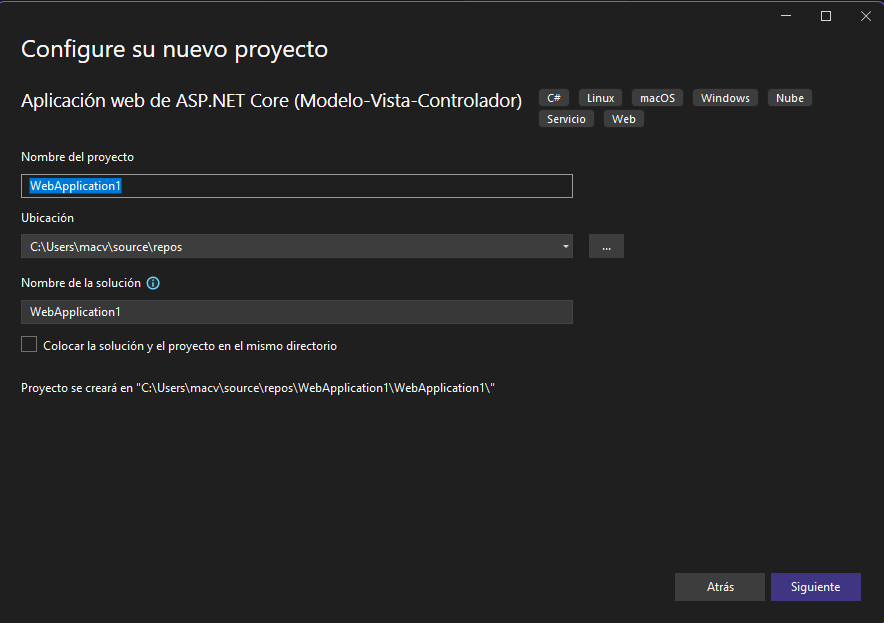
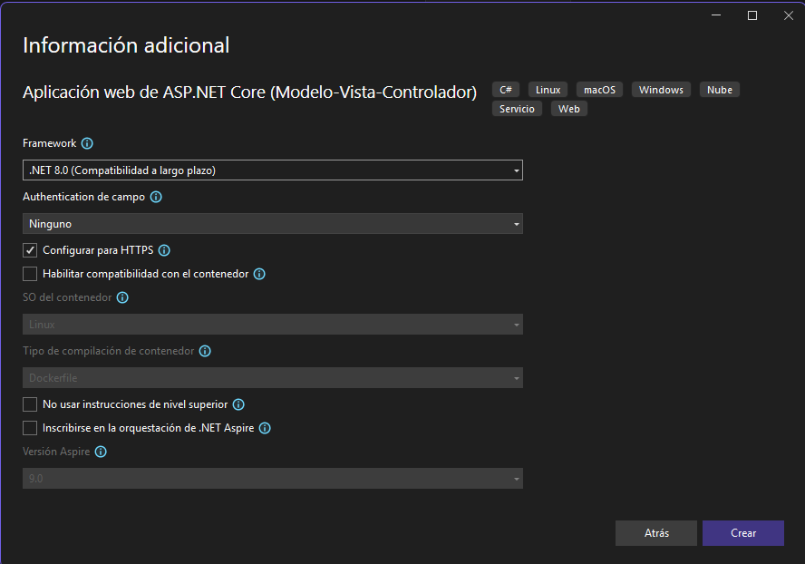
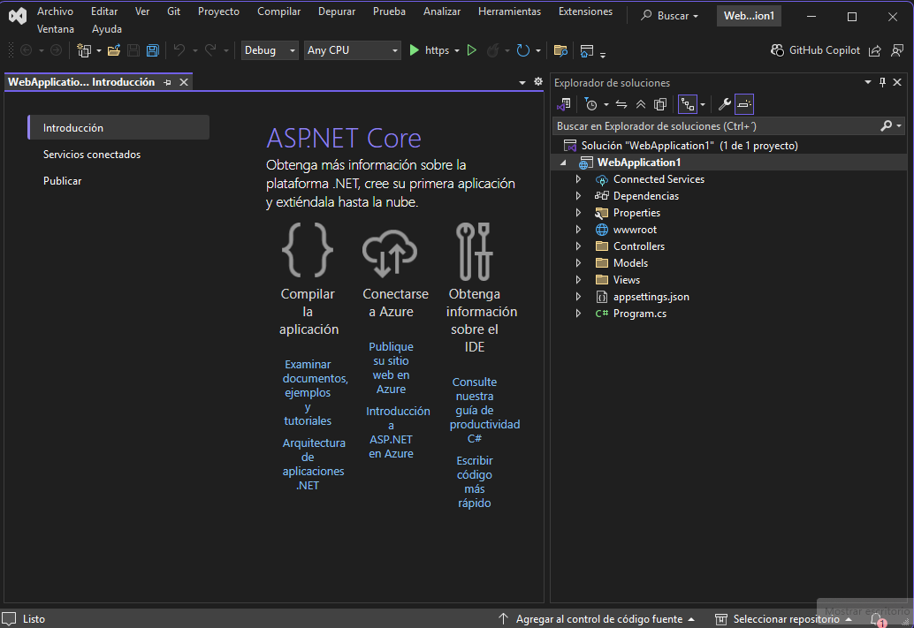

# Creación de un nuevo proyecto
1. Ingrese a **Visual Studio 2022** y seleccione la opción **Crear un proyecto**  

  

2. Busque y seleccione la plantilla **Aplicación web ASP.NET Core (Modelo-Vista-Controlador)**.  

  

3. Haga clic en **Siguiente**  

4. En este cuadro de diálogo puede cambiar entre otras cosas, el nombre del proyecto. Luego haga clic en **Siguiente**.  

  

5. En el siguiente cuadro de diálogo se muestra la versión del Framework. Solo haga clic en **Crear**  

  

En la siguiente imagen se muestra cómo queda la estructura del proyecto recién creado.  

  

