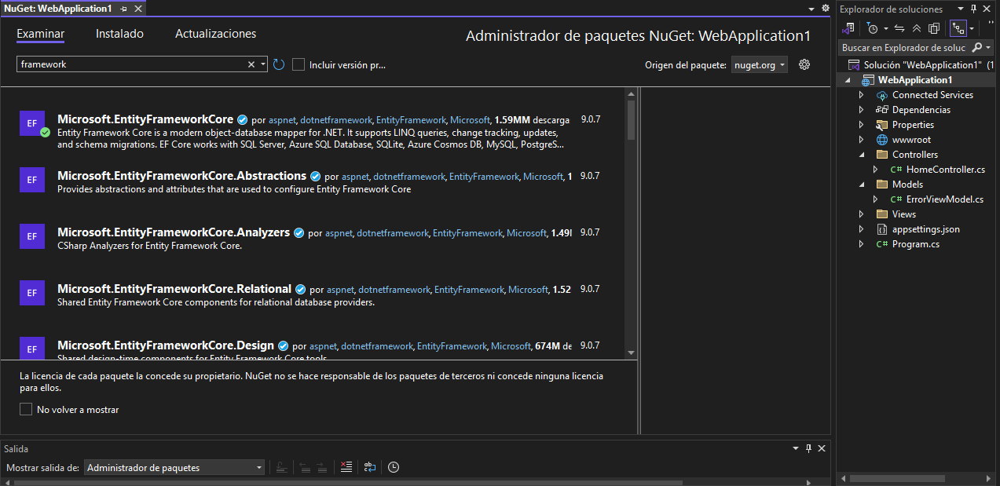
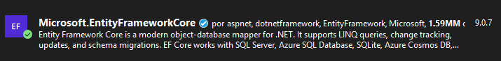
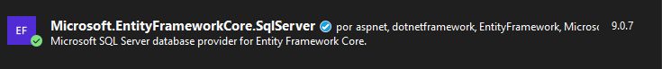
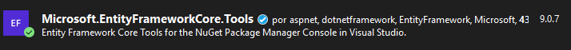
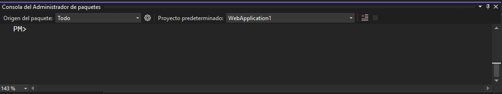
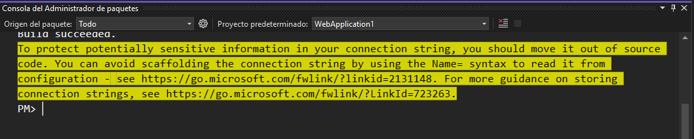
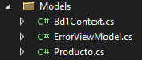
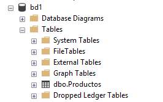

# SCAFFOLDING

## INSTALACIÓN DE PAQUETES

Para este ejemplo, se utilizará **Microsoft SQL Server**

1. Haga **clic derecho** en el nombre del proyecto **WebApplication1**  

2. Seleccione la opción **Administrar paquetes NuGet...**

3. En el cuadro de diálogo que se muestra a continuación debe buscar e instalar los paquetes que se muestran más abajo.  

***Cuadro de diálogo para buscar e instalar paquetes***  

 

***Paquetes que necesita instalar***  

  

  

  


## CREAR EL MODELO (CONTEXTO) A PARTIR DE LA ESTRUCTURA DE LA BASE DE DATOS

* En el proyecto **WebApplication1** vaya al menú **Herramientas**.  
* Seleccione la opción **Administrador de paquetes NuGet**
* Seleccione la opción **Consola del administrador de paquetes**. Se mostrará una consola para escribir los comandos que permitirán crear un nuevo contexto o actualizar el existente.  

  

Para crear inicialmente el contexto, puede utilizar uno de los siguientes comandos; pero claro está que debe cambiar por ejemplo, el nombre del servidor, el nombre de la base de datos y las credenciales para autenticarse.  

***FORMA 1. Con autenticación integrada***

```
Scaffold-DbContext "Server=ITCHAD32;Database=bd1;Trusted_Connection=True; Trust Server Certificate=true;" Microsoft.EntityFrameworkCore.SqlServer -OutputDir Models
```

***FORMA 2. Con autenticación de SQL Server***

```
Scaffold-DbContext "Server=ITCHAD32;Database=bd1;User Id=sa;Password=adminsql; Trust Server Certificate=true;" Microsoft.EntityFrameworkCore.SqlServer -OutputDir Models
```

Cuando se ha creado el contexto, se presenta un mensaje como el siguiente:    

  

A continuación se muestra el contexto creado:  

 

El modelo está creado en función de las tablas de la base de datos **bd1** que actualmente solo tiene la tabla **Productos**  

  

## ACTUALIZAR EL MODELO (CONTEXTO)

:books: Nota. Para actualizar el modelo es necesario agregar el parámetro `-force` o su equivalente `-f`. Esto significa que si las clases ya existen, que sobrescriba su contenido.  

Si agrega nuevas tablas, puede actualizar el contexto utilizando el siguiente comando:  

```
Scaffold-DbContext "Server=ITCHAD32;Database=bd1;User Id=sa;Password=adminsql; Trust Server Certificate=true;" Microsoft.EntityFrameworkCore.SqlServer -OutputDir Models -force -Context Db1Context
```

### Otras opciones posibles para actualizar el modelo (contexto)  

***Actualizando el modelo para varias tablas***
```
Scaffold-DbContext "Server=ITCHAD32;Database=bd1;User Id=sa;Password=adminsql; Trust Server Certificate=true;" Microsoft.EntityFrameworkCore.SqlServer -OutputDir Models -Tables Empleados, Usuarios, Productos -force -Context Db1Context
```

***Actualizando el modelo para una sola tabla***

```
Scaffold-DbContext "Server=ITCHAD32;Database=bd1;User Id=sa;Password=adminsql; Trust Server Certificate=true;" Microsoft.EntityFrameworkCore.SqlServer -OutputDir Models -table Productos -force -Context Db1Context
```  


**Ejemplo de archivo de contexto:**  

```csharp
using System;
using System.Collections.Generic;
using Microsoft.EntityFrameworkCore;

namespace WebApplication1.Models;

public partial class Bd1Context : DbContext
{
    public Bd1Context()
    {
    }

    public Bd1Context(DbContextOptions<Bd1Context> options)
        : base(options)
    {
    }

    public virtual DbSet<Cliente> Clientes { get; set; }

    public virtual DbSet<Producto> Productos { get; set; }

    protected override void OnConfiguring(DbContextOptionsBuilder optionsBuilder)
#warning To protect potentially sensitive information in your connection string, you should move it out of source code. You can avoid scaffolding the connection string by using the Name= syntax to read it from configuration - see https://go.microsoft.com/fwlink/?linkid=2131148. For more guidance on storing connection strings, see https://go.microsoft.com/fwlink/?LinkId=723263.
        => optionsBuilder.UseSqlServer("Server=ITCHAD32;Database=bd1;User Id=sa;Password=adminsql; Trust Server Certificate=true;");

    protected override void OnModelCreating(ModelBuilder modelBuilder)
    {
        modelBuilder.Entity<Cliente>(entity =>
        {
            entity.Property(e => e.Apellido)
                .HasMaxLength(35)
                .IsUnicode(false);
            entity.Property(e => e.Nombre)
                .HasMaxLength(35)
                .IsUnicode(false);
            entity.Property(e => e.Telefono)
                .HasMaxLength(15)
                .IsUnicode(false);
        });

        modelBuilder.Entity<Producto>(entity =>
        {
            entity.Property(e => e.Nombre)
                .HasMaxLength(50)
                .IsUnicode(false);
            entity.Property(e => e.Precio).HasColumnType("decimal(18, 4)");
        });

        OnModelCreatingPartial(modelBuilder);
    }

    partial void OnModelCreatingPartial(ModelBuilder modelBuilder);
}
```

:bookmark: Algunas veces, al tratar de actualizar el modelo o contexto, se presenta el mensaje de error **Build failed**. Esto indica que no puede hacer la actualización del modelo porque podría generar inconsistencias con la codificacion o programación actual del proyecto. En el código fuente se mostrarán los mensajes de error.

Por ejemplo, en la función Index puede dar error en la palabra Productos y quizá pueda solventarse definiendo esa colección de datos en el archivo de contexto solo para escapar el problema y luego ejecutar los comandos para actualizar el contexto:  

```
public async Task<IActionResult> Index()
{
    return View(await _context.Productos.ToListAsync());
}
```