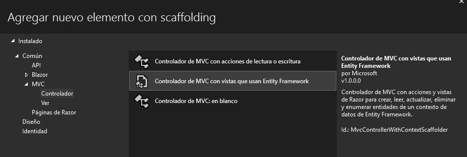
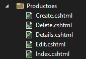

# Asistente para crear un CRUD
1. Haga clic derecho en **Controllers**
2. Seleccione la opción **Agregar**
3. Seleccione la opción **Controlador...**
4. Seleccione **Controlador de MVC con vistas que usan Entity Framework.**  

   

5. Haga clic en **Agregar** y luego, seleccione las opciones como se muestra en la imagen siguiente.  

   

6. Haga clic en **Agregar**  

**Controlador creado:**  

  

**Vistas creadas**  

  