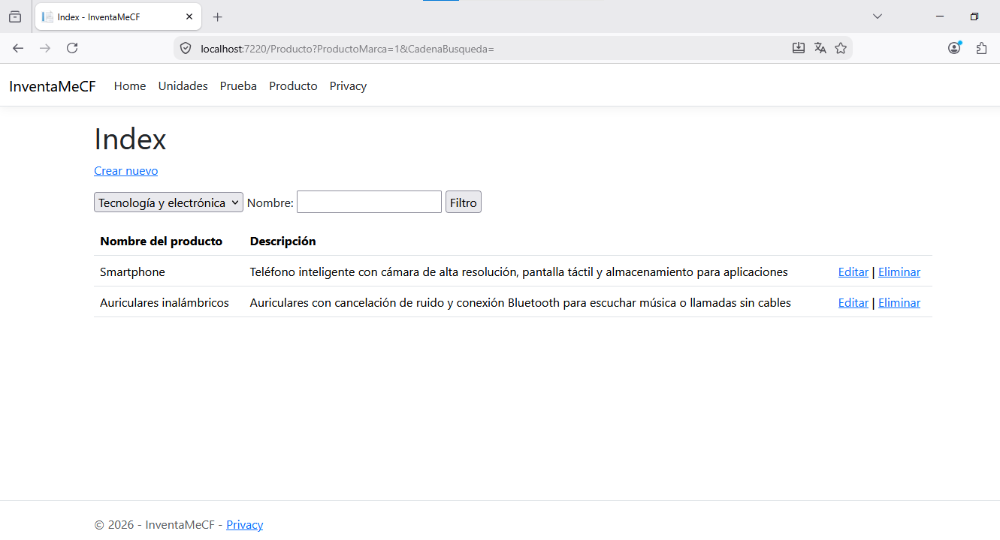

# CREAR UN CONTROLADOR Y VISTAS MANUALMENTE

## 1. Cree una nueva clase llamada `ProductoMarcaViewModel` en la carpeta `Models`  

## 2. Modifique la clase  `ProductoMarcaViewModel`  

```cs
using Microsoft.AspNetCore.Mvc.Rendering;
namespace InventaMeCF.Models
{
    public class ProductoMarcaViewModel
    {
        public List<Producto>? Productos { get; set; }
        public SelectList? Marcas { get; set; }
        public int? ProductoMarca { get; set; }
        public string? CadenaBusqueda { get; set; }
    }
}
```

## 3. Cree un controlador en blanco llamado `ProductoController` 

- En la carpeta **Controllers** haga clic derecho.  

- Seleccione la opción **Agregar**  

- Seleccione la opción **Controlador...**  

- Elija la opción **Controlador de MVC: en blanco**  

- Haga clic en **Agregar**  

- Escriba un nombre para el controlador. Por ejemplo **ProductoController**  

- Haga clic en **Agregar**  


```csharp
using Microsoft.AspNetCore.Mvc;

namespace InventaMeCF.Controllers
{
    public class ProductoController : Controller
    {
        public IActionResult Index()
        {
            return View();
        }
    }
}
```


## 4. Configure `ProductoController` para que pueda conectarse al modelo de datos  


```csharp
using Microsoft.AspNetCore.Mvc;
using Microsoft.EntityFrameworkCore;
using InventaMeCF.Models;
namespace InventaMeCF.Controllers
{
    public class ProductoController : Controller
    {
        private readonly InventaMeCFContext _context;
        public ProductoController(InventaMeCFContext context)
        {
            _context = context;
        }
        public IActionResult Index()
        {
            return View();
        }
    }
}
```

## 5. Modifique la función `Index` de `ProductoController` 

:warning: **NO DEBE** hacer otra función **Index**, sino solo modificar su contenido.  


```csharp
using InventaMeCF.Models;
using Microsoft.AspNetCore.Mvc;
using Microsoft.AspNetCore.Mvc.Rendering;
using Microsoft.EntityFrameworkCore;

namespace InventaMeCF.Controllers
{
    public class ProductoController : Controller
    {
        private readonly InventaMeCFContext _context;
        public ProductoController(InventaMeCFContext context)
        {
            _context = context;
        }
        public async Task<IActionResult> Index(int? productoMarca, string cadenaBusqueda)
        {
            if (_context.Productos== null)
            {
                return Problem("El conjunto 'InventaMeCFContext.Productos' está vacío.");
            }


            IQueryable<Marca> marcaQuery = from m in _context.Marcas select m;

            var productos = from m in _context.Productos
                         select m;
            if (!string.IsNullOrEmpty(cadenaBusqueda))
            {
                productos = productos.Where(s => s.Nombre!.ToUpper().Contains(cadenaBusqueda.ToUpper()));
            }

            if (productoMarca !=0)
            {
                productos = productos.Where(x => x.Marca!.Id == productoMarca);
            }
            
            var productoMarcaVM = new ProductoMarcaViewModel
            {
                Marcas = new SelectList(marcaQuery, "Id", "Nombre"),
                Productos = await productos.ToListAsync()
            };

            return View(productoMarcaVM);
        }
    }
}
```


## 6. Cree una vista vacía `Views` > `Producto` > `Index.cshtml` 

- En la carpeta **Views** haga una nueva carpeta llamada **Producto**. 

- En la carpeta **Producto** recién creada, haga una nueva `Vista de Razor: vacía` llamada **Index.cshtml**.  

    ***Pasos para crear la Vista de Razor: vacía***  

    * Haga **clic derecho** en la carpeta **Producto**  

    * Seleccione **Agregar**  

    * Seleccione la opción **Vista...**  

    * Seleccione **Vista de Razor: vacía**  

    * Haga clic en **Agregar**  

    * Asegúrese de escribir **Index.cshtml** en **Nombre**  

    * Haga clic en **Agregar**  

    
    ```csharp
    @*
        For more information on enabling MVC for empty projects, visit https://go.microsoft.com/fwlink/?LinkID=397860
    *@
    @{
    }
    ```

## 7. Sustituya completamente el contenido de la vista `Index.cshtml` creada en el paso anterior.  

```csharp
@model InventaMeCF.Models.ProductoMarcaViewModel

@{
   ViewData["Title"] = "Index";
}

<h1>Index</h1>

<p>
    <a asp-action="Crear">Crear nuevo</a>
</p>
<form asp-controller="Producto" asp-action="Index" method="get">
    <p>

        <select asp-for="ProductoMarca" asp-items="Model.Marcas">
            <option value="0">Todas</option>
        </select>

        <label>Nombre: <input type="text" asp-for="CadenaBusqueda" /></label>
        <input type="submit" value="Filtro" />
    </p>
</form>

<table class="table">
    <thead>
        <tr>
            <th>
                @Html.DisplayNameFor(model => model.Productos![0].Nombre)
            </th>
            <th>
                @Html.DisplayNameFor(model => model.Productos![0].Descripcion)
            </th>
            <th></th>
        </tr>
    </thead>
    <tbody>
        @foreach (var item in Model.Productos!)
        {
            <tr>
                <td>
                    @Html.DisplayFor(modelItem => item.Nombre)
                </td>
                <td>
                    @Html.DisplayFor(modelItem => item.Descripcion)
                </td>
                <td>
                    <a asp-action="Editar" asp-route-id="@item.Id">Editar</a> |
                    <a asp-action="Eliminar" asp-route-id="@item.Id">Eliminar</a>
                </td>
            </tr>
        }
    </tbody>
</table>
``` 

## 8. Agregue una opción de menú para acceder al formulario de búsqueda.  

- Abra el archivo `_Layout.cshtml` de la carpeta `Shared`  
- Agregue el código siguiente para crear la opción de menú.

```cs
<li class="nav-item">
    <a class="nav-link text-dark" asp-area="" asp-controller="Producto" asp-action="Index">Producto</a>
</li>
```

## 9. Ejecute la aplicación.  

## 10. Realice pruebas de búsqueda de información.  

  

## 11. Detenga la aplicación.

### Referencia:

https://learn.microsoft.com/es-es/aspnet/core/tutorials/first-mvc-app/search?view=aspnetcore-10.0
