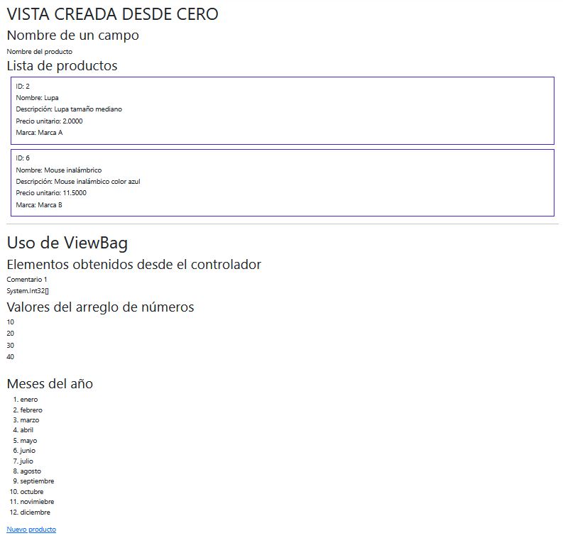
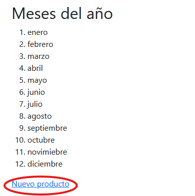
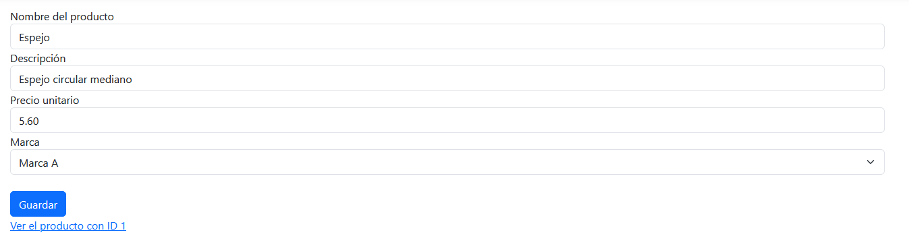
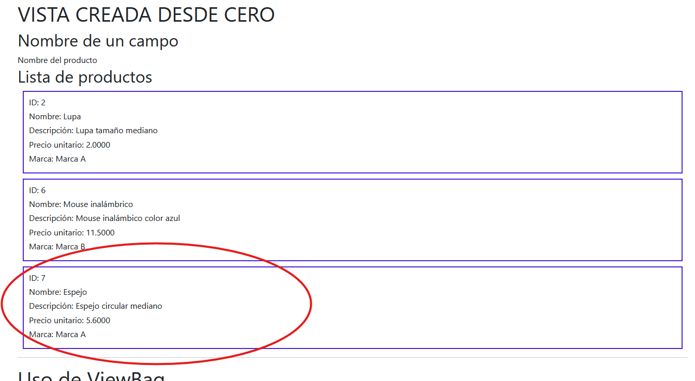
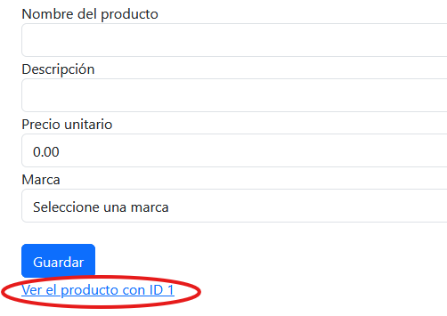
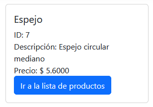
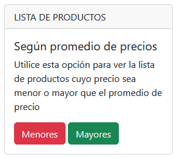
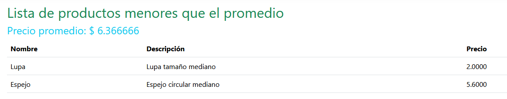
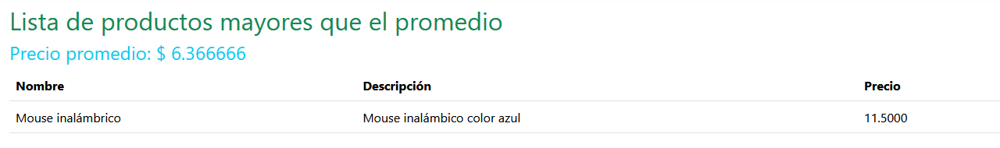

# CREAR UN CONTROLADOR Y VISTAS MANUALMENTE

## 1. Antes de comenzar, revise que los modelos y la clase de contexto estén actualizados como se muestra a continuación.  


### Marca
```cs
using System.ComponentModel.DataAnnotations;
using System.ComponentModel.DataAnnotations.Schema;

namespace InventaMeCF.Models
{
    public class Marca
    {
        [Key]
        [DatabaseGenerated(DatabaseGeneratedOption.Identity)]
        public int Id { get; set; }
        public string Nombre { get; set; }
        public virtual ICollection<Producto> Productos { get; set; }
    }
}
```

### Producto
```cs
using Microsoft.EntityFrameworkCore;
using System.ComponentModel;
using System.ComponentModel.DataAnnotations;
using System.ComponentModel.DataAnnotations.Schema;
namespace InventaMeCF.Models
{
    [Table("Productos")]
    public class Producto
    {
        [Key]
        [DatabaseGenerated(DatabaseGeneratedOption.Identity)]
        public int Id { get; set; }
        [Column("Nombre",TypeName ="varchar(80)")]
        [DisplayName("Nombre del producto")]
        [Required(ErrorMessage = "El nombre del producto es requerido.")]
        [StringLength(80, ErrorMessage = "El nombre del producto debe tener una longitud mínima de 3 caracteres y como máximo 80",
            MinimumLength = 3)]
        public string? Nombre { get; set; }
        [Precision(10, 4)]
        [DisplayName("Precio unitario")]
        public decimal PrecioUnitario { get; set;  }

        [Required(ErrorMessage = "La descripción es obligatoria")]
        [Column(TypeName = "varchar(200)")]
        [DisplayName("Descripción")]
        [StringLength(200, MinimumLength = 3)]
        public string? Descripcion { get; set; }
        public int MarcaId { get; set; }

        [ForeignKey("MarcaId")]
        public virtual Marca? Marca { get; set; }
    }
}
```

### UnidadMedida
```cs
using System.ComponentModel.DataAnnotations;
using System.ComponentModel.DataAnnotations.Schema;

namespace InventaMeCF.Models
{
    public class UnidadMedida
    {
        [Key]
        [DatabaseGenerated(DatabaseGeneratedOption.Identity)]
        public int Id { get; set; }
        public string Nombre { get; set; }
    }
}
```

### InventaMeContext
```cs
using InventaMeCF.Seeds;
using Microsoft.EntityFrameworkCore;
namespace InventaMeCF.Models
{
    public class InventaMeCFContext:DbContext
    {
        public InventaMeCFContext(DbContextOptions<InventaMeCFContext> options) : base(options)
        {

        }
        public DbSet<Producto> Productos { get; set; }
        public DbSet<Marca> Marcas { get; set; }
        public DbSet<UnidadMedida> UnidadesMedida { get; set; }
        protected override void OnModelCreating(ModelBuilder modelBuilder)
        {
            modelBuilder.Entity<UnidadMedida>().HasData(
                new UnidadMedida { Id = 1,Nombre= "Libra"},
                new UnidadMedida { Id = 2, Nombre = "Kilogramo" }
            );
            new MarcaSeed(modelBuilder);
        }
    }
}
```


## 2. Cree un controlador en blanco llamado `PruebaController` 

- En la carpeta **Controllers** haga clic derecho.  

- Seleccione la opción **Agregar**  

- Seleccione la opción **Controlador...**  

- Elija la opción **Controlador de MVC: en blanco**  

- Haga clic en **Agregar**  

- Escriba un nombre para el controlador. Por ejemplo **PruebaController**  

- Haga clic en **Agregar**  


```csharp
using Microsoft.AspNetCore.Mvc;

namespace InventaMeCF.Controllers
{
    public class PruebaController : Controller
    {
        public IActionResult Index()
        {
            return View();
        }
    }
}
```


## 3. Configure `PruebaController` para que pueda conectarse al modelo de datos  


```csharp
using Microsoft.AspNetCore.Mvc;
using Microsoft.EntityFrameworkCore;
using InventaMeCF.Models;
namespace InventaMeCF.Controllers
{
    public class PruebaController : Controller
    {
        private readonly InventaMeCFContext _context;
        public PruebaController(InventaMeCFContext context)
        {
            _context = context;
        }
        public IActionResult Index()
        {
            return View();
        }
    }
}
```

## 4. Modifique la función `Index` de `PruebaController` 

:warning: **NO DEBE** hacer otra función **Index**, sino solo modificar su contenido.  


```csharp
using Microsoft.AspNetCore.Mvc;
using Microsoft.EntityFrameworkCore;
using InventaMeCF.Models;
namespace InventaMeCF.Controllers
{
    public class PruebaController : Controller
    {
        private readonly InventaMeCFContext _context;
        public PruebaController(InventaMeCFContext context)
        {
            _context = context;
        }
        public async Task<IActionResult> Index()
        {
            int[] a = new int[] { 10, 20, 30, 40 };
            ViewBag.Comentario1 = "Comentario 1";
            ViewBag.a = a;
            string[] meses = new string[] { "enero", "febrero","marzo","abril","mayo","junio","julio","agosto","septiembre","octubre" ,"novimiebre","diciembre"};
            ViewBag.meses = meses;
            return View(await _context.Productos
                .Include(p => p.Marca)
                .ToListAsync());
        }
    }
}
```


## 5. Cree una vista vacía `Views` > `Prueba` > `Index.cshtml` 

- En la carpeta **Views** haga una nueva carpeta llamada **Prueba**. 

- En la carpeta **Prueba** recién creada, haga una nueva `Vista de Razor: vacía` llamada **Index**.  

    ***Pasos para crear la Vista de Razor: vacía***  

    * Haga **clic derecho** en la carpeta **Prueba**  

    * Seleccione **Agregar**  

    * Seleccione la opción **Vista...**  

    * Seleccione **Vista de Razor: vacía**  

    * Haga clic en **Agregar**  

    * Asegúrese de escribir **Index.cshtml** en **Nombre**  

    * Haga clic en **Agregar**  

    
    ```csharp
    @*
        For more information on enabling MVC for empty projects, visit https://go.microsoft.com/fwlink/?LinkID=397860
    *@
    @{
    }
    ```

## 6. Sustituya completamente el contenido de la vista `Index.cshtml` creada en el paso anterior.  

```csharp
@model IEnumerable<InventaMeCF.Models.Producto>
@{
    ViewData["Title"] = "VISTA CREADA DESDE CERO";
}
@{
    <h1>@ViewData["Title"]</h1>
}
<h2>Nombre de un campo</h2>
@Html.DisplayNameFor(model => model.Nombre)

<h2>Lista de productos</h2>

@foreach (var item in Model)
{
    <div style="border:#4C22D6 2px solid;padding:10px;margin:10px;">
        <h6>ID: @item.Id</h6>
        <h6>Nombre: @item.Nombre</h6>
        <h6>Descripción: @item.Descripcion</h6>
        <h6>Precio unitario: @item.PrecioUnitario</h6>
        <h6>Marca: @item.Marca.Nombre</h6>
    </div>
}

<hr />
<h1>Uso de ViewBag</h1>
<h2>Elementos obtenidos desde el controlador</h2>
<h6>@ViewBag.Comentario1</h6>
<h6>@ViewBag.a</h6>

<h2>Valores del arreglo de números</h2>
@foreach (var item in ViewBag.a)
{
    <h6>@item</h6>
}

<br />
<h2>Meses del año</h2>
<ol>
@foreach (var item in ViewBag.meses)
{
    <li>@item</li>
}
</ol>

<a asp-action="Crear">Nuevo producto</a>
```  


## 7. Agregue una opción `Prueba` en el menú de la aplicación

- Abra el archivo `_Layout.cshtml` de la carpeta `Shared` y agregue el siguiente código:  

```html
<li class="nav-item">
<a class="nav-link text-dark" asp-area=""  asp-controller="Prueba" asp-action="Index">Prueba</a>
</li>
```

## 8. Ejecute por primera vez la aplicación.  

Una vez ejecutada la aplicación, vaya a la opción `Prueba` del menú. Verá un resultado como el siguiente.

  

## 9. Detenga la aplicación.

## 10. Agregue las siguientes dos funciones al controlador `PruebaController` 

:warning: No hay lugar específico; pero sugiero que lo haga abajo de la función `Index`  


```csharp
    public async Task<IActionResult> Crear()
    {
        ViewBag.Marcas = await _context.Marcas
            .OrderBy(m => m.Nombre)
            .Select(m => new SelectListItem
            {
                Value = m.Id.ToString(),
                Text = m.Nombre
            })
            .ToListAsync();
            return View(new Producto());
    }
    [HttpPost]
    [ValidateAntiForgeryToken]
    public async Task<IActionResult> Crear([Bind("Id,Nombre,Descripcion,PrecioUnitario,MarcaId")] Producto producto)
    {
        if (ModelState.IsValid)
        {
            _context.Add(producto);
            await _context.SaveChangesAsync();
            return RedirectToAction(nameof(Index));
        }
        return View(producto);
    }
```

## 11. Agregue una vista `Views` > `Prueba` > `Crear.cshtml` 

A continuación se muestra el contenido de la vista:

```html
@model InventaMeCF.Models.Producto
<form asp-action="Crear">
    <div asp-validation-summary="All" class="text-danger"></div>
    <div>
        <label asp-for="Nombre" class="control-label"></label>
        <input asp-for="Nombre" class="form-control" />
    </div>
    <div>
        <label asp-for="Descripcion" class="control-label"></label>
        <input asp-for="Descripcion" class="form-control" />
        <span asp-validation-for="Descripcion" class="text-danger"></span>
    </div>
    <div>
        <label asp-for="PrecioUnitario" class="control-label"></label>
        <input asp-for="PrecioUnitario" class="form-control" />
    </div>
    <div>
        <label asp-for="Marca" class="control-label"></label>
        <select asp-for="MarcaId"
                asp-items="ViewBag.Marcas" class="form-select">
            <option value="">Seleccione una marca</option>
        </select>
    </div>
    <br />
    <input type="submit" value="Guardar" class="btn btn-primary" />
</form>
<a asp-action="Tarjeta" asp-route-id="1">Ver el producto con ID 1</a>
```

## 12. Ejecute por segunda vez la aplicación.  


Igual como lo hizo la primera vez que ejecutó la aplicación, vaya a la opción de menú `Prueba`. Al final encontrará un link para crear un `Nuevo producto`.  

  

Haga click allí, llene el formulario y guarde el producto.  

  


Resultado después de guardar:  

  

## 13. Detenga la aplicación.


## 14. Agregue una función llamada `Tarjeta` en el controlador `PruebaControler` 

:warning: Sugiero que lo haga abajo de las funciones `Crear` que agregó anteriormente.  

```csharp
public async Task<IActionResult> Tarjeta(int? id)
{
    var prod1 = await _context.Productos.FindAsync(id);
    if (prod1 == null)
    {
        return View(null);
    }
    return View(prod1);
}
```

## 15. Agregue una vista `Views` > `Prueba` > `Tarjeta.cshtml` 


```csharp
@model InventaMeCF.Models.Producto
@if (Model != null)
{
    <div class="card" style="width: 18rem;">
        <div class="card-body">
            <h5 class="card-title">@Model.Nombre</h5>
            <div>
                ID: @Model.Id
            </div>
            <div>
                Descripción: @Model.Descripcion
            </div>
            <div>
                Precio: $ @Model.PrecioUnitario
            </div>
            <a asp-action="Index" class="btn btn-primary">Ir a la lista de productos</a>
        </div>
    </div>
}
else
{
    <h1>No se ha encontrado el producto</h1>
}
```

## 16. Ejecute por tercera vez la aplicación  

Igual que la segunda vez, vaya a la opción `Prueba` y busque al final (abajo) el link para crear un nuevo producto. Allí encotrará justo al final una opción que dice `Ver el producto con ID 1`, haga clic en esa opción.  

  

Si no existe un producto con ID 1 se mostrará un mensaje como **No se ha encontrado el producto** , en caso contrario se mostrará una ficha de datos con la información del producto con ID 1.  

  

## 17. Detenga la aplicación

## 18. Agregue el siguiente código al final del archivo `Views` > `Prueba` > `Index.cshtml`  

```cs
<hr />

<div class="card" style="width: 18rem;">
    <div class="card-header">
        LISTA DE PRODUCTOS
    </div>
  <div class="card-body">
    <h5 class="card-title">Según promedio de precios</h5>
    <p class="card-text">Utilice esta opción para ver la lista de productos cuyo precio sea menor o mayor que el promedio de precio</p>
    <a asp-action="ListaPrecioMedio" class="btn btn-danger" asp-route-mayores="false">Menores</a>&nbsp;<a asp-action="ListaPrecioMedio" class="btn btn-success" asp-route-mayores="true">Mayores</a>
  </div>
</div>
```

## 19. Agregue la función `ListaPrecioMedio` en `PruebaController`  

:warning: Sugiero que lo haga abajo de la función `Tarjeta` 

```cs
public async Task<IActionResult> ListaPrecioMedio(bool mayores)
{
    if (_context.Productos == null)
    {
        return NotFound();
    }
    var precio_medio = await _context.Productos.AverageAsync(a => a.PrecioUnitario);
    var productos = (mayores) ? await _context.Productos.Where(a => a.PrecioUnitario > precio_medio).ToListAsync() : await _context.Productos.Where(a => a.PrecioUnitario < precio_medio).ToListAsync();
    ViewBag.Promedio = precio_medio;
    ViewBag.Titulo = (mayores) ? "mayores" : "menores";
    return View(productos);
}
```  

## 20. Agregue una vista `Views` > `Prueba` > `ListaPrecioMedio.cshtml`


```cs
@model IEnumerable<InventaMeCF.Models.Producto>

<h2 class="text-success">Lista de productos @ViewBag.Titulo que el promedio</h2>
<h4 class="text-info">Precio promedio: $ @ViewBag.Promedio</h4>

<table class="table">
    <thead>
        <tr>
            <th scope="col">Nombre</th>
            <th scope="col">Descripción</th>
            <th scope="col">Precio</th>
        </tr>
    </thead>
    <tbody>
        @foreach (var item in Model)
        {
            <tr>
                <td>@item.Nombre</td>
                <td>@item.Descripcion</td>
                <td>@item.PrecioUnitario</td>
            </tr>
        }
    </tbody>
</table>
```

## 21. Ejecute por cuarta vez la aplicación.  

Una vez ejecutada la aplicación, seleccione la opción `Prueba` y vaya al final (hasta abajo). Allí encontrará una ficha con dos botones para probar el funcionamiento.  

  

Si hace clic en el botón rojo podrá ver una lista de datos con la siguiente:  

  

y si hace clic en el botón verde, podrá una lista como la siguiente:  

  


## 22. Detenga la aplicación.