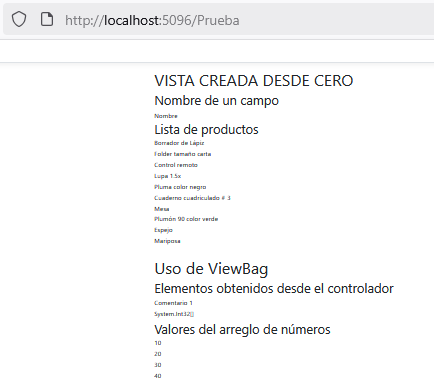

# CREAR UN CONTROLADOR Y VISTAS MANUALMENTE

## Creando el controlador

1. En la carpeta **Controllers** haga clic derecho.  
2. Seleccione la opción **Agregar**  
3. Seleccione la opción **Controlador...**  
4. Elija la opción **Controlador de MVC: en blanco**  
5. Haga clic en **Agregar**  
6. Escriba un nombre para el controlador. Por ejemplo **PruebaController**  
7. Haga clic en **Agregar**  

La programación por defector para el controlador vacío se muestra en el siguiente bloque de instrucciones:  

```csharp
using Microsoft.AspNetCore.Mvc;

namespace WebApplication1.Controllers
{
    public class PruebaController : Controller
    {
        public IActionResult Index()
        {
            return View();
        }
    }
}

```

8. Modifique la programación de **PruebaController** como se ve en el siguiente bloque de instrucciones  

```csharp
using Microsoft.AspNetCore.Mvc;
using Microsoft.EntityFrameworkCore;
using WebApplication1.Models;

namespace WebApplication1.Controllers
{
    public class PruebaController : Controller
    {
        private readonly Bd1Context _context;

        public PruebaController(Bd1Context context)
        {
            _context = context;
        }
        public async Task<IActionResult> Index()
        {
            int [] a = new int[] { 10, 20, 30, 40 };
            ViewBag.Comentario1 = "Comentario 1";
            ViewBag.a1 = a;
            return View(await _context.Productos.ToListAsync());
        }
    }
}
```

:books: Comentarios acerca de las funciones.  
En la programación de arriba se muestra el contenido de una función asíncrona:  

```csharp
public async Task<IActionResult> Index()
{
    int [] a = new int[] { 10, 20, 30, 40 };
    ViewBag.Comentario1 = "Comentario 1";
    ViewBag.a1 = a;
    return View(await _context.Productos.ToListAsync());
}
```

y en el siguiente bloque se presenta la misma función; pero en forma síncrona:  
```csharp
public IActionResult Index()
{
    int [] a = new int[] { 10, 20, 30, 40 };
    ViewBag.Comentario1 = "Comentario 1";
    ViewBag.a1 = a;
    return View(_context.Productos.ToList());
}
```

:books: Nota. Analice las diferencias entre una función asíncrona y una función síncrona.  

## Creando una vista vacía  

1. En la carpeta **Views** haga una nueva carpeta llamada **Prueba**. El nombre de coincidir con la parte inicial del nombre **PruebaController**  
2. En la carpeta **Prueba** recién creada, haga una nueva vista vacía llamada **Index**. También el nombre **Index** debe coincidir con el nombre de la función **Index** que está programada dentro de **PruebaController**  

***Crear la vista***  
* Haga **clic derecho** en la carpeta **Prueba**  
* Seleccione **Agregar**  
* Seleccione la opción **Vista...**  
* Seleccione **Vista de Razon: vacía**  
* Haga clic en **Agregar**  
* Asegúrese de escribir **Index.cshtml** en **Nombre**  
* Haga clic en **Agregar**  

Este es el contenido de la vista vacía:  
```csharp
@*
    For more information on enabling MVC for empty projects, visit https://go.microsoft.com/fwlink/?LinkID=397860
*@
@{
}
```

3. Cambie el contenido de la vista vacía por el siguiente contenido  

```csharp
@model IEnumerable<WebApplication1.Models.Producto>
@{
    ViewData["Title"] = "VISTA CREADA DESDE CERO";
}
@{
    <h1>@ViewData["Title"]</h1>
}
<h2>Nombre de un campo</h2>
@Html.DisplayNameFor(model => model.Nombre)

<h2>Lista de productos</h2>
@foreach (var item in Model)
{
    <h6>@item.Nombre</h6>
}

<hr />
<h1>Uso de ViewBag</h1>
<h2>Elementos obtenidos desde el controlador</h2>
<h6>@ViewBag.Comentario1</h6>
<h6>@ViewBag.a1</h6>

<h2>Valores del arreglo de números</h2>
@foreach (var item in ViewBag.a1)
{
    <h6>@item</h6>
}
```  

4. Agregue una opción de menú para ejecutar la vista creada  

La opción de menú se agrega en el archivo `_Layout.cshtml` de la carpeta `Shared`    

```csharp
<li class="nav-item">
<a class="nav-link text-dark" asp-area=""  asp-controller="Prueba" asp-action="Index">Prueba</a>
</li>
```

5. Ejecute la aplicación  

***Este es el resultado de la vista Index***  

  
