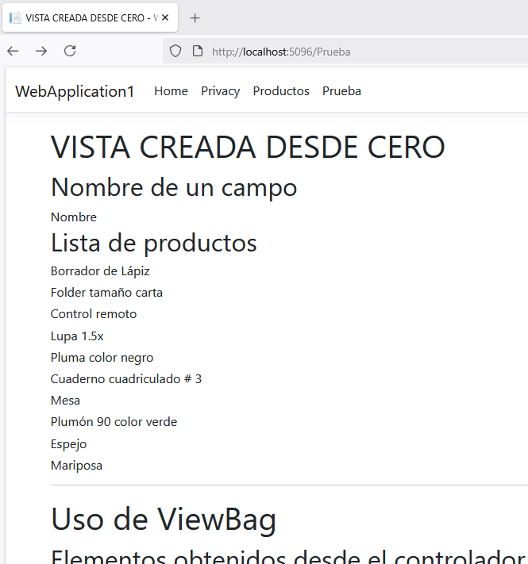
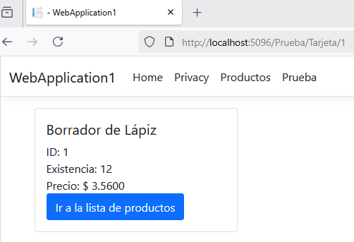

# CREAR UN CONTROLADOR Y VISTAS MANUALMENTE

## Creando el controlador

1. En la carpeta **Controllers** haga clic derecho.  

2. Seleccione la opción **Agregar**  

3. Seleccione la opción **Controlador...**  

4. Elija la opción **Controlador de MVC: en blanco**  

5. Haga clic en **Agregar**  

6. Escriba un nombre para el controlador. Por ejemplo **PruebaController**  

7. Haga clic en **Agregar**  


    La programación por defector para el controlador vacío se muestra en el siguiente bloque de instrucciones:  

    ```csharp
    using Microsoft.AspNetCore.Mvc;

    namespace WebApplication1.Controllers
    {
        public class PruebaController : Controller
        {
            public IActionResult Index()
            {
                return View();
            }
        }
    }

    ```


8. Modifique la programación de **PruebaController** como se ve en el siguiente bloque de instrucciones  


    ```csharp
    using Microsoft.AspNetCore.Mvc;
    using Microsoft.EntityFrameworkCore;
    using WebApplication1.Models;

    namespace WebApplication1.Controllers
    {
        public class PruebaController : Controller
        {
            private readonly Bd1Context _context;

            public PruebaController(Bd1Context context)
            {
                _context = context;
            }
            public async Task<IActionResult> Index()
            {
                int [] a = new int[] { 10, 20, 30, 40 };
                ViewBag.Comentario1 = "Comentario 1";
                ViewBag.a1 = a;
                return View(await _context.Productos.ToListAsync());
            }
        }
    }
    ```

    :books: Comentarios acerca de las `funciones síncronas` vs `funciones asíncronas`.  

    A continuación se presenta la misma función `Index` que se utilizó arriba. La idea es destacar las diferencias entre una `función síncrona` y una `función asíncrona`. Se pide analizar el código para encontrar las diferencias en el código fuente.  

    *Función asíncrona:*  

    ```csharp
    public async Task<IActionResult> Index()
    {
        int [] a = new int[] { 10, 20, 30, 40 };
        ViewBag.Comentario1 = "Comentario 1";
        ViewBag.a1 = a;
        return View(await _context.Productos.ToListAsync());
    }
    ```

    *Función síncrona:*  

    ```csharp
    public IActionResult Index()
    {
        int [] a = new int[] { 10, 20, 30, 40 };
        ViewBag.Comentario1 = "Comentario 1";
        ViewBag.a1 = a;
        return View(_context.Productos.ToList());
    }
    ```

    :beginner: **Diferencias a destacar:** Uso de `Task<>` , `await` y `ToListAsync()` 

## Creando una Vista de Razor: vacía 

1. En la carpeta **Views** haga una nueva carpeta llamada **Prueba**. El nombre de coincidir con la parte inicial del nombre **PruebaController**  

2. En la carpeta **Prueba** recién creada, haga una nueva `Vista de Razor: vacía` llamada **Index**. :speech_balloon: La vista y la función deben tener el mismo nombre para que se vinculen de forma automática.    

    ***Pasos para crear la Vita de Razor: vacía***  

    * Haga **clic derecho** en la carpeta **Prueba**  

    * Seleccione **Agregar**  

    * Seleccione la opción **Vista...**  

    * Seleccione **Vista de Razon: vacía**  

    * Haga clic en **Agregar**  

    * Asegúrese de escribir **Index.cshtml** en **Nombre**  

    * Haga clic en **Agregar**  


    Este es el contenido de la vista vacía:  
    ```csharp
    @*
        For more information on enabling MVC for empty projects, visit https://go.microsoft.com/fwlink/?LinkID=397860
    *@
    @{
    }
    ```

3. Cambie el contenido de la vista vacía por el siguiente contenido  

    ```csharp
    @model IEnumerable<WebApplication1.Models.Producto>
    @{
        ViewData["Title"] = "VISTA CREADA DESDE CERO";
    }
    @{
        <h1>@ViewData["Title"]</h1>
    }
    <h2>Nombre de un campo</h2>
    @Html.DisplayNameFor(model => model.Nombre)

    <h2>Lista de productos</h2>
    @foreach (var item in Model)
    {
        <h6>@item.Nombre</h6>
    }
    <hr />
    <h1>Uso de ViewBag</h1>
    <h2>Elementos obtenidos desde el controlador</h2>
    <h6>@ViewBag.Comentario1</h6>
    <h6>@ViewBag.a1</h6>

    <h2>Valores del arreglo de números</h2>
    @foreach (var item in ViewBag.a1)
    {
        <h6>@item</h6>
    }
    ```  

4. Agregue una opción de menú para ejecutar la vista creada  

    La opción de menú se agrega en el archivo `_Layout.cshtml` de la carpeta `Shared`    

    ```html
    <li class="nav-item">
    <a class="nav-link text-dark" asp-area=""  asp-controller="Prueba" asp-action="Index">Prueba</a>
    </li>
    ```

5. Ejecute la aplicación  

    ***Este es el resultado de la vista Index***  

      

    :speech_balloon: Nota. En la imagen, no se presenta toda la información.  

## ACTIVIDAD

:books: Se pide que agregue una lista de datos de tipo `string` a la vista `Index` de `PruebaController`. Puede agregar nombres de personas, de lugares, etc.

***Solución***    

En mi ejemplo, agregué la lista de capitales de los países de Centroamérica.  Vea en el siguiente código la línea agregada.  

```csharp
public async Task<IActionResult> Index()
{
    int [] a = new int[] { 10, 20, 30, 40 };
    ViewBag.Comentario1 = "Comentario 1";
    ViewBag.a1 = a;
    // LA SIGUIENTE LÍNEA ES LA QUE SE AGREGÓ  
    ViewBag.Capitales = new string[] { "Guatemala", "San Salvador", "Tegucigalpa", "Managua", "San José", "Panamá" };
    // LA LÍNEA ANTERIOR ES LA QUE SE AGREGÓ  
    return View(await _context.Productos.ToListAsync());
}
```

***Líneas agregadas a la vista Index de PruebaController***

```csharp
// omitidas lás líneas anteriores de la vista Index
<h2>Capitales de Centroamérica</h2>
<ol>
@foreach (var capital in ViewBag.Capitales)
{
    <li>@capital</li>
}
</ol>
```
## Agregar un formulario para registro de productos  

1. Haga una función llamada `Crear` en `PruebaController`.  

    ```csharp
    public IActionResult Crear()
    {
        return View();
    }
    ```

2. Agregar un link en la vista **Index**  

    ```csharp
    <a asp-action="Crear">Nuevo producto</a>
    ```

3. Agregue una vista llamada **Crear** para diseñar el formulario de captura de datos de los productos.

    ```html
    @model WebApplication1.Models.Producto
    <form asp-action="Guardar">
        <div>
            <label asp-for="Nombre" class="control-label"></label>
            <input asp-for="Nombre" class="form-control" />
        </div>
        <div>
            <label asp-for="Existencia" class="control-label"></label>
            <input asp-for="Existencia" class="form-control" />
        </div>
        <div>
            <label asp-for="Precio" class="control-label"></label>
            <input asp-for="Precio" class="form-control" />
        </div>
        <input type="submit" value="Guardar" class="btn btn-primary" />
    </form>
    <a asp-action="Tarjeta" asp-route-id="1">Ver el producto con ID 1</a>
    ```

    La línea `<a asp-action="Tarjeta" asp-route-id="1">Ver el producto con ID 1</a>` permite ir a la función `Tarjeta` de `PruebaController` y envía el número `1` a la función. Luego, la función buscará el producto que tenga el ID `1` para mostrar su información en la `Tarjeta`   


      


4. Crear la función `Guardar` en el `PruebaController` para guardar la información del producto.  

    **Código fuente de la función `Guardar`**. *:bulb: Más abajo se explica el por qué de utilizar el atributo **Bind** en la función **Guardar**. Si usted prefiere, de una vez vaya a los comentarios etiquetados con la viñeta :speech_balloon:*.   

    ```csharp
    [HttpPost]
    [ValidateAntiForgeryToken]
    public async Task<IActionResult> Guardar(Producto producto)
    {
        if (ModelState.IsValid)
        {
            _context.Add(producto);
            await _context.SaveChangesAsync();
            return RedirectToAction(nameof(Index));
        }
        return View(producto);
    }
    ```
    ---

    :speech_balloon: En la función `Guardar` mostrada arriba, la variable `producto` recibe como parámetro un objeto de tipo `Producto` y esto funciona correctamente.

    :speech_balloon: Cuando creamos la función `Guardar` expliqué que aún sin agregar `[Bind("Id,Nombre,Precio,Existencia")]` la información se guarda en la tabla de base de datos; pero luego leí que se utiliza `Bind` por cuestiones de seguridad. Existe un concepto llamado `overposting`, donde un usuario puede mandar datos adicionales a la función. Por ejemplo, la clase `Producto` podría tener una propiedad que no queremos modificar desde un formulario, quizá una propiedad `Liquidacion` podría tipificar este caso. No se quiere que cambie a `true` desde el formulario.  

    :speech_balloon: En conclusión, el atributo `Bind` indica explícitamente qué propiedades del modelo serán enlazadas con los datos del formulario HTTP (POST) y ninguna otra propiedad podrá recibir información desde el formulario web.

    :ok: Finalmente, sería mejor que la función `Guardar` tenga la siguiente estructura:  

    ```csharp
    [HttpPost]
    [ValidateAntiForgeryToken]
    public async Task<IActionResult> Guardar([Bind("Id,Nombre,Precio,Existencia")] Producto producto)
    {
        if (ModelState.IsValid)
        {
            _context.Add(producto);
            await _context.SaveChangesAsync();
            return RedirectToAction(nameof(Index));
        }
        return View(producto);
    }
    ```

    ---

    :warning: La instrucción `return View(producto);` se ejecutará cuando la información del producto recibido no cumpla con las reglas establecidas en el modelo. A continuación se presentará una posible estructura de la clase `Producto` con atributos que establecen criterios que deben cumplirse para que el modelo sea válido.  

    ```csharp
    using System.ComponentModel;
    using System.ComponentModel.DataAnnotations;

    namespace WebApplication1.Models;

    public partial class Producto
    {
        public int Id { get; set; }

        [ScaffoldColumn(true)]
        [DisplayName("Nombre del producto")]
        [Required(ErrorMessage = "El nombre del producto es requerido.")]
        [StringLength(50,ErrorMessage ="El nombre del producto debe tener una longitud mínima de 3 caracteres y como máximo 50", MinimumLength = 3)]
        public string? Nombre { get; set; }

        [Required(ErrorMessage = "El campo Precio es obligatorio")]
        [Range(0.0, 999.99, ErrorMessage = "El precio debe ser un número entre 0.00 y 999.99")]
        public decimal? Precio { get; set; }

        public int? Existencia { get; set; }
    }
    ```

    *¿Qué significan las anotaciones de la clase Producto mostrada arriba?*  

    * El atributo `ScaffoldColumn` en la anotación `[ScaffoldColumn(true)]` indica que si genera una interfaz gráfica de usuario mediante asistente, la propiedad `Nombre` de la clase `Producto` será incluída en el diseño de la interfaz gráfica. Si asigna el valor `false`, el atributo `Nombre` no será incluído en la interfaz gráfica.  

    * El atributo `DisplayName` en la anotación `[DisplayName("Nombre del producto")]` indica que cuando utilicemos `<label asp-for="Nombre" class="control-label"></label>` en una vista, se muestre la descripción `Nombre del producto` en lugar de solo la palabra `Producto`.  

    * El atributo `Required` en la anotación `[Required(ErrorMessage = "El nombre del producto es requerido.")]` indica que el nombre del producto es obligatorio. `ErrorMessage` indica qué texto será mostrado en la interfaz gráfica cuando no ingrese el nombre del producto. En caso de no agregar un mensaje a `ErrorMessage` el mensaje de error será mostrado en inglés.  

    * `[StringLength(50,ErrorMessage ="El nombre del producto debe tener una longitud mínima de 3 caracteres y como máximo 50", MinimumLength = 3)]` indica que el nombre del producto debe tener como mínimo 3 caracteres y como máximo 50 caracteres.  

    * `[Range(0.0, 999.99, ErrorMessage = "El precio debe ser un número entre 0.00 y 999.99")]` indica que el `Precio` debe tener un valor numérico entre 0.00 y 999.99.  

    :key: **IMPORTANTE.** Si no se cumplen los criterios definidos con las anotaciones, la condición `if (ModelState.IsValid)` dará como resultado el valor `false` y ejecutará la instrucción `return View(producto);`. Esta instrucción ejecuta la vista `Guardar` y envía los datos del modelo `Producto`. En el ejemplo, esta vista no ha sido creada. Si se crea, podría servir para desplegar la infomración del producto.  Así, el usuario podría analizar cuál información ha generado la excepción y corregirla para un nuevo intento.  

    *La siguiente imagen muestra el resultado de las anotaciones*  

      


    Aquí puede encontrar más información acerca de las [Anotaciones](https://learn.microsoft.com/en-us/dotnet/api/system.componentmodel.dataannotations?view=net-9.0) que puede utilizar en `EntityFramework` `.NET 9` 

    :green_book: Recomendación. Una consideración a tomar en cuenta es *Usar localización de ASP.NET Core (recomendado para aplicaciones multilingües)*

5. Crear una función llamada `Tarjeta` en `PruebaController` 

    :books: En la tarjeta lo que se pretende es mostrar la información de un único producto (para ser específico, el producto que tenga el ID 1). A la vista se le llamó `Tarjeta` solo por enfatizar que se utilizará el componente `Card` de `BootStrap 5.1.0` que es la versión configurada en el proyecto.  

    ```csharp
    public async Task<IActionResult> Tarjeta(int? id)
    {
        var prod1 = await _context.Productos.FindAsync(id);
        if (prod1 == null)
        {
            return NotFound();
        }
        return View(prod1);
    }
    ```

6. Crear una vista llamada `Tarjeta` para mostrar la información del producto con ID 1.  


    ```csharp
    @model WebApplication1.Models.Producto

    <div class="card" style="width: 18rem;">
        <div class="card-body">
            <h5 class="card-title">@Model.Nombre</h5>
            <div>
                ID: @Model.Id
            </div>
            <div>
                Existencia: @Model.Existencia
            </div>
            <div>
                Precio: $ @Model.Precio
            </div>
            <a asp-action="Index" class="btn btn-primary">Ir a la lista de productos</a>
        </div>
    </div>
    ```

    ***Así se verá la tarjeta en tiempo de ejecución***  

      

