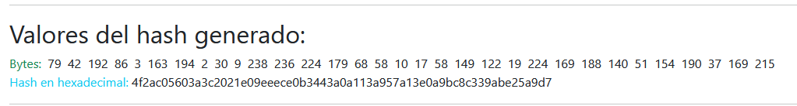
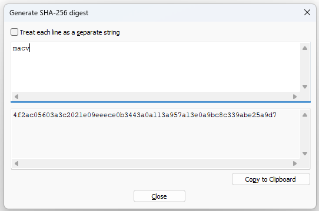

# SHA256

## PARTE 1. PRUEBAS

:hammer: Se realizarán pruebas del algoritmo SHA256 antes de realizar la aplicación práctica en el proceso de autenticación (OPCIONAL)

### En la clase PruebaController, agregue la siguiente importación:

```csharp
using System.Security.Cryptography;
```

### En la función Index de PruebaController, agregue el siguiente segmento de código

```csharp
SHA256 mySHA256 = SHA256.Create();
byte[] datos = new byte[] { 109, 97, 99, 118 }; // macv
byte[] hashValue = mySHA256.ComputeHash(datos);
string hashValueHexadecimal = BitConverter.ToString(hashValue).Replace("-", "").ToLower();
ViewBag.HashValue = hashValue;
ViewBag.HashValueHexadecimal = hashValueHexadecimal;
```

El código anterior, genera un `hash` a partir de la cadena `"macv"` que se ha escrita utilizando los valores **ASCII** `109, 97, 99 y 188`.

:hash: El hash generado es **4f2ac05603a3c2021e09eeece0b3443a0a113a957a13e0a9bc8c339abe25a9d7**

Para hacer más dinámico el ejemplo anterior, es mejor cambiar la línea `byte[] datos = new byte[] { 109, 97, 99, 118 }; // macv` por `byte[] datos = Encoding.UTF8.GetBytes("macv");"macv"`. Las dos instrucciones son equivalentes; pero la segunda tiene la ventaja de obtener automáticamente los valores **ASCII** que forman la palaba `macv` en lugar de buscar los valores manualmente en la tabla.   

### Modifique la vista Index que corresponde a PruebaController.
Agregue este bloque de instrucciones al final de la vista Index

```html
<hr />
<h2>Valores del hash generado:</h2>
<span class="text-success">Bytes: </span>
@foreach (byte b in ViewBag.HashValue)
{
    <span class="ms-1">@b</span>
}
<br />
<span class="text-info">Hash en hexadecimal:</span> @ViewBag.HashValueHexadecimal
<hr />
```

Ejecute la aplicación para mostrar una salida como la siguiente:  

  

## PARTE 2. APLICACIÓN PRÁCTICA

### Autenticación de usuarios

#### Estructura de las tablas

Estas son las tablas que se usarán para registrar usuarios y roles.  

```sql
IF OBJECT_ID(N'Usuarios', N'U') IS NULL
CREATE TABLE Usuarios(
	Id INT IDENTITY(1,1) NOT NULL,
	Login CHAR(20) NOT NULL,
	Password VARCHAR(64) NOT NULL
)
GO
IF OBJECT_ID(N'Roles', N'U') IS NULL
CREATE TABLE Roles(
	Id INT IDENTITY(1,1) NOT NULL,
	Nombre VARCHAR(30) NOT NULL
)
GO

IF OBJECT_ID(N'RolesAsignados', N'U') IS NULL
CREATE TABLE RolesAsignados(
	Id INT IDENTITY(1,1) NOT NULL,
	UsuarioId INT NOT NULL,
	RolId INT NOT NULL,
)
GO

ALTER TABLE Usuarios
	ADD CONSTRAINT PrimaryKeyUsuarios PRIMARY KEY (Id);
GO

ALTER TABLE Roles
	ADD CONSTRAINT PrimaryKeyRoles PRIMARY KEY (Id);
GO

ALTER TABLE RolesAsignados
	ADD CONSTRAINT ForeignKeyRolesAsignadosIdRol
	FOREIGN KEY (RolId) REFERENCES Roles(Id);
GO

ALTER TABLE RolesAsignados
	ADD CONSTRAINT ForeignKeyRolesAsignadosIdUsuario
	FOREIGN KEY (UsuarioId) REFERENCES Usuarios(Id);
GO

```

#### Cifrando datos con SHA-256 en Notepad++
:books: El hash ha sido creado con Notepad++. Tools > SHA-256 > Generate > Escriba el texto plano que quiere cifrar, por ejemplo `macv`. El hash generado con `SHA-256` se muestra automáticamente a medida escribe el texto plano.  

  
<hr >

#### Agregue un usuario a la tabla

```sql
insert into Usuarios(Login,Password) values('miguel','4f2ac05603a3c2021e09eeece0b3443a0a113a957a13e0a9bc8c339abe25a9d7')
```

#### Haga una consulta para ver la información del usuario agregado (opcional)  

```sql
select * from Usuarios
```


#### Código agregado en la autenticación

:zap: Este código se utilizará en el proceso de autenticación de usuarios en AccesoController. Aún falta hacer funcional la gestión de roles.

```csharp
[HttpPost]
public async Task<IActionResult> Index(InfoLogin infoLogin)
{
    if (infoLogin != null)
    {
        // AQUÍ COMIENZA EL BLOQUE PARA OBTENER LA INFORMACIÓN DEL USUARIO QUE SE QUIERE AUTENTICAR
        SHA256 mySHA256 = SHA256.Create();
        //byte[] datos = new byte[] { 109, 97, 99, 118 }; // macv
        byte[] datos = Encoding.UTF8.GetBytes(infoLogin.Password);
        byte[] hashValue = mySHA256.ComputeHash(datos);
        string hash = BitConverter.ToString(hashValue).Replace("-", "").ToLower();
        string sql = String.Format("select Id, Login, Password from Usuarios a where Login='{0}' and Password='{1}'", infoLogin.Login, hash);
        Usuario? usuario = _context.Usuarios.FromSqlRaw<Usuario>(sql).FirstOrDefault<Usuario>();
        // AQUÍ FINALIZA EL BLOQUE PARA OBTENER LA INFORMACIÓN DEL USUARIO QUE SE QUIERE AUTENTICAR
        if (usuario != null)
        {
            var claims = new List<Claim> {
                new Claim(ClaimTypes.Name,usuario.Login),
                new Claim("Otro","otro dato")
            };
            /*
            List<Role> lista = (from rls in _context.Roles
                join rlsa in _context.RolesAsignados
                on rls.Id equals rlsa.IdRol
                where rlsa.IdUsuario == usuario.Id
                select rls).ToList();
            */
            List<string> lista = new List<string>();
            foreach (string rol in lista)
            {
                claims.Add(new Claim(ClaimTypes.Role, "administrador")); // rol.Nombre
            }
            var claimsIdentity = new ClaimsIdentity(claims, CookieAuthenticationDefaults.AuthenticationScheme);

            await HttpContext.SignInAsync(CookieAuthenticationDefaults.AuthenticationScheme, new ClaimsPrincipal(claimsIdentity));

            return RedirectToAction("Index", "Home");
        }
        else
        {
            return View();
        }
    }
    else
    {
        return View();
    }
}
```

#### Agregue una opción para salir de la aplicación

:books: En `AccesoController` ya tiene una función `Salir`, por lo tanto, lo único que tiene que hacer es llamar esa opción desde un botón de la aplicación o desde una opción de menú.  
