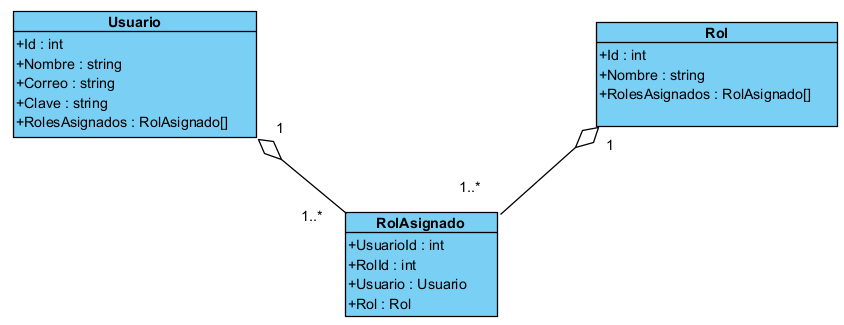

# Guía para autenticación y autorización

## 1. En la carpeta `Models` cree las tres clases `Usuario`, `Rol` y `UsuarioRol`

**Diagrama de clases**  

  


<details>
<summary>using requeridos en las tres clases</summary>
using Microsoft.EntityFrameworkCore;
using System.ComponentModel;
using System.ComponentModel.DataAnnotations;
using System.ComponentModel.DataAnnotations.Schema;
</details>

### Usuario 
```cs
namespace InventaMeCF.Models
{
    public class Usuario
    {
        [Key]
        [DatabaseGenerated(DatabaseGeneratedOption.Identity)]
        public int Id { get; set; }
        [Column("Nombre", TypeName = "varchar(80)")]
        [Required(ErrorMessage = "El nombre es obligatorio.")]
        [StringLength(80, ErrorMessage = "El nombre del usuario debe tener una longitud mínima de 3 caracteres y como máximo 80",
            MinimumLength = 3)]
        public string? Nombre { get; set; }

        [Column("Correo", TypeName = "varchar(100)")]
        [Required(ErrorMessage = "El correo es obligatorio.")]
        [StringLength(100, ErrorMessage = "El correo debe tener entre 10 y 100 caracteres",
            MinimumLength = 10)]
        public string? Correo { get; set; }

        [Required(ErrorMessage = "La clave es obligatoria")]
        [Column("Clave", TypeName = "varchar(64)")]
        public string? Clave { get; set; }
        public virtual ICollection<RolAsignado> RolesAsignados { get; set; }
    }
}
```

### Rol

```cs
    public class Rol
    {
        [Key]
        [DatabaseGenerated(DatabaseGeneratedOption.Identity)]
        public int Id { get; set; }
        [Column("Nombre", TypeName = "varchar(50)")]
        [DisplayName("Nombre del rol")]
        [Required(ErrorMessage = "El nombre del rol es requerido.")]
        [StringLength(50, ErrorMessage = "El nombre del rol debe tener una longitud mínima de 3 caracteres y como máximo 50",
            MinimumLength = 3)]
        public string? Nombre { get; set; }
        public virtual ICollection<RolAsignado> RolesAsignados { get; set; }
    }
```

### RolAsignado

```cs
    public class RolAsignado
    {
        [Key]
        [DatabaseGenerated(DatabaseGeneratedOption.Identity)]
        public int Id { get; set; }
        public int UsuarioId { get; set; }
        [ForeignKey("UsuarioId")]
        public int RolId { get; set; }
        [ForeignKey("RolId")]
        public virtual Usuario? Usuario { get; set; }
        public virtual Rol? Rol { get; set; }
    }
```

## 2. Agregue las tres líneas siguientes a la clase de contexto

```cs
        public DbSet<Usuario> Usuarios { get; set; }
        public DbSet<Rol> Roles { get; set; }
        public DbSet<RolAsignado> RolesAsignados { get; set; }
```

## 3. Cree una migración

```bash
Add-Migration AddTablesAAA
```

## 4. Actualice la base de datos

```bash
Update-Database
```