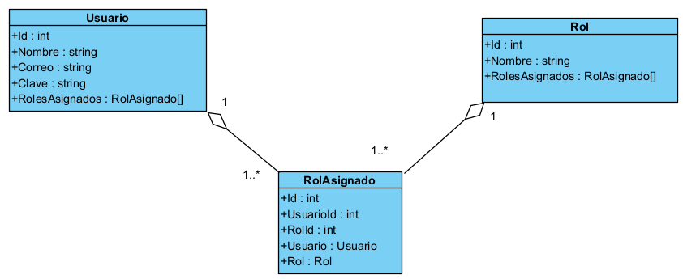

# Guía para autenticación y autorización

## 1. En la carpeta `Models` cree las tres clases `Usuario`, `Rol` y `RolAsignado`

**Diagrama de clases**  

  


<details>
<summary>using requeridos en las tres clases</summary>
using Microsoft.EntityFrameworkCore;
using System.ComponentModel;
using System.ComponentModel.DataAnnotations;
using System.ComponentModel.DataAnnotations.Schema;
</details>

### Usuario 
```cs
    public class Usuario
    {
        [Key]
        [DatabaseGenerated(DatabaseGeneratedOption.Identity)]
        public int Id { get; set; }
        [Column("Nombre", TypeName = "varchar(80)")]
        [Required(ErrorMessage = "El nombre es obligatorio.")]
        [StringLength(80, ErrorMessage = "El nombre del usuario debe tener una longitud mínima de 3 caracteres y como máximo 80",
            MinimumLength = 3)]
        public string? Nombre { get; set; }

        [Column("Correo", TypeName = "varchar(100)")]
        [Required(ErrorMessage = "El correo es obligatorio.")]
        [StringLength(100, ErrorMessage = "El correo debe tener entre 10 y 100 caracteres",
            MinimumLength = 10)]
        public string? Correo { get; set; }

        [Required(ErrorMessage = "La clave es obligatoria")]
        [Column("Clave", TypeName = "varchar(64)")]
        public string? Clave { get; set; }
        public virtual ICollection<RolAsignado> RolesAsignados { get; set; }
    }
```

### Rol

```cs
    public class Rol
    {
        [Key]
        [DatabaseGenerated(DatabaseGeneratedOption.Identity)]
        public int Id { get; set; }
        [Column("Nombre", TypeName = "varchar(50)")]
        [DisplayName("Nombre del rol")]
        [Required(ErrorMessage = "El nombre del rol es requerido.")]
        [StringLength(50, ErrorMessage = "El nombre del rol debe tener una longitud mínima de 3 caracteres y como máximo 50",
            MinimumLength = 3)]
        public string? Nombre { get; set; }
        public virtual ICollection<RolAsignado> RolesAsignados { get; set; }
    }
```

### RolAsignado

```cs
    public class RolAsignado
    {
        [Key]
        [DatabaseGenerated(DatabaseGeneratedOption.Identity)]
        public int Id { get; set; }

        public int UsuarioId { get; set; }
        public int RolId { get; set; }


        [ForeignKey("UsuarioId")] // 👈 Por convención  es opcional escribir esta línea. EF ya sabe que UsuarioId es el atributo para relacionar las entidades RolAsignado con Usuario.
        public virtual Usuario? Usuario { get; set; }

// 👈 Por convención  es opcional escribir esta línea. EF ya sabe que RolId es el atributo para relacionar a las entidades RolAsignado y Rol.
        [ForeignKey("RolId")]
        public virtual Rol? Rol { get; set; }
    }
```

## 2. Agregue las tres líneas siguientes a la clase de contexto

```cs
    public DbSet<Usuario> Usuarios { get; set; }
    public DbSet<Rol> Roles { get; set; }
    public DbSet<RolAsignado> RolesAsignados { get; set; }
```

## 3. Cree una migración

```bash
Add-Migration AddTablesAAA
```

## 4. Actualice la base de datos

```bash
Update-Database
```

## 6. en la clase de contexto agregue los seeder para insertar usuarios, roles y asignación de roles.


```cs
            modelBuilder.Entity<Usuario>().HasData(
                new Usuario { Id = 1, Nombre = "miguel", Correo = "miguel.cortez@itcha.edu.sv", Clave = "8c6976e5b5410415bde908bd4dee15dfb167a9c873fc4bb8a81f6f2ab448a918" },
                new Usuario { Id = 2, Nombre = "andrea", Correo = "andrea@gmail.com", Clave = "5994471abb01112afcc18159f6cc74b4f511b99806da59b3caf5a9c173cacfc5" },
                new Usuario { Id = 3, Nombre = "daniel", Correo = "daniel@gmail.com", Clave = "5994471abb01112afcc18159f6cc74b4f511b99806da59b3caf5a9c173cacfc5" }
            );
            modelBuilder.Entity<Rol>().HasData(
                new Rol { Id = 1, Nombre = "adminitrador" },
                new Rol { Id = 2, Nombre = "estándar" }
            );
            modelBuilder.Entity<RolAsignado>().HasData(
                new RolAsignado { Id = 1, UsuarioId = 1, RolId = 1 },
                new RolAsignado { Id = 2, UsuarioId = 2, RolId = 2 },
                new RolAsignado { Id = 3, UsuarioId = 3, RolId = 2 }
            );
```

## 7. Cree una nueva migración

```cs
Add-Migration UsuariosRoles
```

## 8. Actualice la base de datos.

```cs
Update-Database
```

## 9. Modifique la clase `AccesoController` 

```cs
using InventaMeCF.Models;
using Microsoft.AspNetCore.Authentication;
using Microsoft.AspNetCore.Authentication.Cookies;
using Microsoft.AspNetCore.Mvc;
using System.Security.Claims;
using System.Security.Cryptography;
using System.Text;
namespace InventaMeCF.Controllers
{
    public class AccesoController : Controller
    {
        private readonly InventaMeCFContext _context;
        public AccesoController(InventaMeCFContext context)
        {
            _context = context;
        }
        public IActionResult Index()
        {
            return View();
        }
        [HttpPost]
        public async Task<IActionResult> Index(InfoLogin infoLogin)
        {
            if (infoLogin != null)
            {
                SHA256 mySHA256 = SHA256.Create();
                byte[] datos = Encoding.UTF8.GetBytes(infoLogin.Password);
                byte[] hashValue = mySHA256.ComputeHash(datos);
                string hashValueHexadecimal = BitConverter.ToString(hashValue).Replace("-", "").ToLower();

                var usuario =  _context.Usuarios.Where(a => a.Correo == infoLogin.Login && a.Clave == hashValueHexadecimal).FirstOrDefault();

                if (usuario != null)
                {
                    var claims = new List<Claim> {
                        new Claim(ClaimTypes.Name,infoLogin.Login),
                    };

                    List<Rol> lista = (from rls in _context.Roles
                                        join rlsa in _context.RolesAsignados
                                        on rls.Id equals rlsa.RolId
                                        where rlsa.UsuarioId == usuario.Id
                                        select rls).ToList();
                    
                    foreach (Rol rol in lista)
                    {
                        claims.Add(new Claim(ClaimTypes.Role, rol.Nombre));
                    }
                    
                    var claimsIdentity = new ClaimsIdentity(claims, CookieAuthenticationDefaults.AuthenticationScheme);

                    await HttpContext.SignInAsync(CookieAuthenticationDefaults.AuthenticationScheme, new ClaimsPrincipal(claimsIdentity));

                    return RedirectToAction("Index", "Home");
                }
                else
                {
                    return View();
                }
            }
            else
            {
                return View();
            }
        }
        public async Task<IActionResult> Salir()
        {
            await HttpContext.SignOutAsync(CookieAuthenticationDefaults.AuthenticationScheme);
            return RedirectToAction("Index", "Acceso");
        }
    }
}
```

## 10. Ejecute la aplicación

Hasta este punto, ya se debe poder autenticar.  

