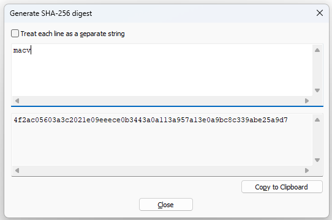

# SHA256

## Importación del espacio de nombre necesario para el cifrado.
```csharp
using System.Security.Cryptography;
```

## Código de ejemplo para cifrar

```csharp
SHA256 mySHA256 = SHA256.Create();
byte[] datos = new byte[] { 77, 65, 67, 86 }; // MACV infoLogin.Password
byte[] hashValue = mySHA256.ComputeHash(datos);
string hash = BitConverter.ToString(hashValue).Replace("-", "").ToLower();
```

## Insertar un usuario en la base de datos
:books: El hash ha sido creado con Notepad++. Tools > SHA-256 > Generate > Escribir la clave que se quiere asignar.

  

## Esta es la estructura de tablas que se usará:

```sql
IF OBJECT_ID(N'Usuarios', N'U') IS NULL
CREATE TABLE Usuarios(
	Id INT IDENTITY(1,1) NOT NULL,
	Login CHAR(20) NOT NULL,
	Password VARCHAR(64) NOT NULL
)
GO
IF OBJECT_ID(N'Roles', N'U') IS NULL
CREATE TABLE Roles(
	Id INT IDENTITY(1,1) NOT NULL,
	Nombre VARCHAR(30) NOT NULL
)
GO

IF OBJECT_ID(N'RolesAsignados', N'U') IS NULL
CREATE TABLE RolesAsignados(
	Id INT IDENTITY(1,1) NOT NULL,
	UsuarioId INT NOT NULL,
	RolId INT NOT NULL,
)
GO
```

:zap: Se recomienda que agregue las relaciones entre las tablas Usuarios - RolesAsignados.


```sql
insert into Usuarios(Login,Password) values('miguel','4f2ac05603a3c2021e09eeece0b3443a0a113a957a13e0a9bc8c339abe25a9d7')
select * from Usuarios
```