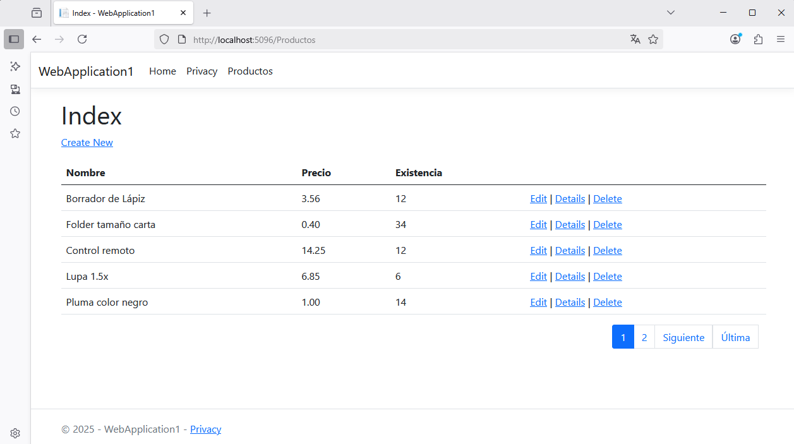

# PAGINACIÓN DE RESULTADOS

## 1. En WebApplication1, cree una carpeta

La carpeta se llamará :file_folder: `Utilidades`

## Agregue una nueva clase en la carpeta :file_folder: Utilidades

La nueva clase se llamará `Paginacion`


## 2. Agregue el código fuente a la clase Paginacion  

```csharp
namespace WebApplication1.Utilidades
{
    public class Paginacion
    {
        public int TotalRegistros { get; private set; }
        public int PaginaActual { get; private set; }
        public int RegistrosPagina { get; private set; }
        public int TotalPaginas { get; private set; }
        public int PaginaInicio { get; private set; }
        public int UltimaPagina { get; private set; }
        public string Controlador { get; private set; }
        public string Accion { get; private set; }
        public int Salto { get; private set; }
        public Paginacion() { }
        public Paginacion(int totalRegistros, int pagina, int registrosPagina = 10, string controlador = "Home", string accion = "Index")
        {
            int totalPaginas = (int)Math.Ceiling((decimal)totalRegistros / (decimal)registrosPagina);
            int paginaActual = (pagina < 1) ? 1 : pagina;
            int paginaInicio = paginaActual - 5;
            int ultimaPagina = paginaActual + 4;
            int salto = (paginaActual - 1) * registrosPagina;
            if (paginaInicio <= 0)
            {
                ultimaPagina = ultimaPagina - (paginaInicio - 1);
                paginaInicio = 1;
            }
            if (ultimaPagina > totalPaginas)
            {
                ultimaPagina = totalPaginas;
                if (ultimaPagina > 10)
                {
                    paginaInicio = ultimaPagina - 9;
                }
            }
            TotalRegistros = totalRegistros;
            PaginaActual = paginaActual;
            RegistrosPagina = registrosPagina;
            TotalPaginas = totalPaginas;
            PaginaInicio = paginaInicio;
            UltimaPagina = ultimaPagina;
            Controlador = controlador;
            Accion = accion;
            Salto = salto;
        }
    }
}
```

:information_source: ***Información.***  La clase `Paginacion` contiene las propiedades y la lógica necesaria para gestionar la paginación. Luego, esta clase se utiliza en la plantilla `_Paginacion.cshtml` que genera los controles visuales (botones para mosverse entre diferentes páginas). La clase `Paginacion` también se utiliza en las funciones del controlador que requieren del proceso de paginación, como mostrar una `lista de clientes`, por ejemplo (en la función `Index`).  


## 3. En la carpeta :file_folder: `Shared`  agregue una nueva vista de Razor vacía.

El nombre de la nueva vista será `_Paginacion.cshtml`

## 4. Agregue el código a la vista _Paginacion.cshtml  

```html
@model WebApplication1.Utilidades.Paginacion;

<div class="container">
    @if (Model.TotalPaginas > 0)
    {
        <ul class="pagination justify-content-end">
            @if (Model.PaginaActual > 1)
            {
                <li class="page-item">
                    <a class="page-link" asp-controller="@(Model.Controlador)" asp-action="@(Model.Accion)" asp-route-pg="1">Primera</a>
                </li>
                <li>
                    <a class="page-link" asp-controller="@(Model.Controlador)" asp-action="@(Model.Accion)" asp-route-pg="@(Model.PaginaActual - 1)">Anterior</a>
                </li>
            }
            @for (var pge = Model.PaginaInicio; pge <= Model.UltimaPagina; pge++)
            {
                <li class="page-item @(pge == Model.PaginaActual ? "active" : "")">
                    <a class="page-link" asp-controller="@(Model.Controlador)" asp-action="@(Model.Accion)" asp-route-pg="@pge">@pge</a>
                </li>
            }
            @if (Model.PaginaActual < Model.TotalPaginas)
            {
                <li class="page-item">
                    <a class="page-link" asp-controller="@(Model.Controlador)" asp-action="@(Model.Accion)" asp-route-pg="@(Model.PaginaActual + 1)">Siguiente</a>
                </li>
                <li>
                    <a class="page-link" asp-controller="@(Model.Controlador)" asp-action="@(Model.Accion)" asp-route-pg="@(Model.TotalPaginas)">Última</a>
                </li>
            }
        </ul>
    }
</div>
```

## 5. Modifique la función Index de ProductosController  

:warning: La función `Index` ya está programada. Lo único que tiene que hacer es modificarla para que implemente el proceso de paginación. Abajo se presenta la programación actual de la función `Index` y la nueva programación.  

:orange_book: Esta es la programación actual de la función `Index` de `ProductosController`:  

```csharp
// GET: Productos
public async Task<IActionResult> Index()
{
    return View(await _context.Productos.ToListAsync());
}
```

:white_check_mark: Luego de aplicar el proceso de paginación,  el código de la función `Index` será el siguiente:  

```csharp
// GET: Productos
public async Task<IActionResult> Index(int pg)
{
    var lista = await _context.Productos.ToListAsync();
    // Inicio paginación.
    var paginacion = new Paginacion(lista.Count, pg, 5, "Productos");
    var data = lista.Skip(paginacion.Salto).Take(paginacion.RegistrosPagina).ToList();
    this.ViewBag.Paginacion = paginacion;
    // fin paginación.
    return View(data);
}
```

:books: **Notas:**  

* El valor `5` indica la cantidad de registros que se quiere ver por página.  
* `"Productos"` se refiere al controlador que tiene la función `Index` por ejemplo. Esto indica que cuando haga clic en un botón del compoente de paginación, ejecutará una función del controlador, que en este caso es `ProductosController` 

## 6. Implemente la paginación en la vista `Index` que corresponde a `ProductosController` 

A continuación se presenta el código de `Index.cshtml` sin paginación:  

```csharp
@model IEnumerable<WebApplication1.Models.Producto>

@{
    ViewData["Title"] = "Index";
}

<h1>Index</h1>

<p>
    <a asp-action="Create">Create New</a>
</p>
<table class="table">
    <thead>
        <tr>
            <th>
                @Html.DisplayNameFor(model => model.Nombre)
            </th>
            <th>
                @Html.DisplayNameFor(model => model.Precio)
            </th>
            <th>
                @Html.DisplayNameFor(model => model.Existencia)
            </th>
            <th></th>
        </tr>
    </thead>
    <tbody>
@foreach (var item in Model) {
        <tr>
            <td>
                @Html.DisplayFor(modelItem => item.Nombre)
            </td>
            <td>
                @Html.DisplayFor(modelItem => item.Precio)
            </td>
            <td>
                @Html.DisplayFor(modelItem => item.Existencia)
            </td>
            <td>
                <a asp-action="Edit" asp-route-id="@item.Id">Edit</a> |
                <a asp-action="Details" asp-route-id="@item.Id">Details</a> |
                <a asp-action="Delete" asp-route-id="@item.Id">Delete</a>
            </td>
        </tr>
}
    </tbody>
</table>
```

Una vez implementada la paginación, el código de `Index.cshtml` será el siguiente:  

```csharp
@model IEnumerable<WebApplication1.Models.Producto>
@using WebApplication1.Utilidades; // ESTA LINEA FUE AGREGADA

@{
    ViewData["Title"] = "Index";
    // A PARTIR DE AQUÍ SE AGREGARON ESTAS LÍNEAS
    Paginacion paginacion = new Paginacion();
    int paginaActual = 0;
    if (ViewBag.Paginacion != null)
    {
        paginacion = ViewBag.Paginacion;
        paginaActual = paginacion.PaginaActual;
    }
    // HASTA AQUÍ  
}

<h1>Index</h1>

<p>
    <a asp-action="Create">Create New</a>
</p>
<table class="table">
    <thead>
        <tr>
            <th>
                @Html.DisplayNameFor(model => model.Nombre)
            </th>
            <th>
                @Html.DisplayNameFor(model => model.Precio)
            </th>
            <th>
                @Html.DisplayNameFor(model => model.Existencia)
            </th>
            <th></th>
        </tr>
    </thead>
    <tbody>
@foreach (var item in Model) {
        <tr>
            <td>
                @Html.DisplayFor(modelItem => item.Nombre)
            </td>
            <td>
                @Html.DisplayFor(modelItem => item.Precio)
            </td>
            <td>
                @Html.DisplayFor(modelItem => item.Existencia)
            </td>
            <td>
                <a asp-action="Edit" asp-route-id="@item.Id">Edit</a> |
                <a asp-action="Details" asp-route-id="@item.Id">Details</a> |
                <a asp-action="Delete" asp-route-id="@item.Id">Delete</a>
            </td>
        </tr>
}
    </tbody>
</table>
<partial name="_paginacion" model="@paginacion" /> // ESTA ES LA LINEA QUE FINALMENTE MUESTRA LOS BOTONES DEL COMPONENTE DE PAGINACIÓN.  
```

## 7. Ejecute la aplicación  

Este es el resultado del proceso de paginación:  

  

