# Creación de una Aplicación Web ASP.NET Core 8 (finalmente ASP.NET Core 9) - MySQL

:no_entry: Durante este proceso se presentaron errores a la hora de generar el modelo a partir de la base de datos utilizando el paquete MySql.EntityFrameworkCore 9.0.6.  

:no_entry: Después de intentar algunas alternativas fallidas, procedí a crear un nuevo proyecto del tipo `Aplicación Web ASP.NET Core` pero cuando pide la versión del framework cambié a `NET 9` y funcionó correctamente. Si no quiere ver los problemas presentados, pase a la segunda parte.  

:warning: Utilizar `Pomelo.EntityFrameworkCore.MySql` en lugar de `MySql.EntityFrameworkCore` es una buena alternativa, pero el problema por ahora es que obliga bajar la versión de `Microsoft.EntityFrameworkCore` y `Microsoft.EntityFrameworkCore.Tools`    

## PRIMERA PARTE

Tipo: **Aplicación web de ASP.NET Core (Modelo-Vista-Controlador)**  

## Instale los paquetes
1. Microsoft.EntityFrameworkCore
2. Microsoft.EntityFrameworkCore.Tools
3. MySql.EntityFrameworkCore

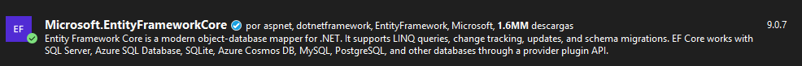  
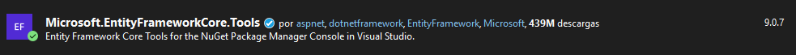  
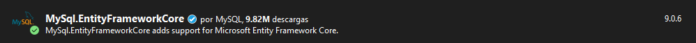  

## Cree en PostgreSQL una base de datos y una tabla.

Base de datos: **bd1**  
Tabla: **empleados**  


```sql
CREATE TABLE IF NOT EXISTS empleados(
	id INT NOT NULL AUTO_INCREMENT,
	codigo CHAR(10) NULL,
	nombre VARCHAR(50) NOT NULL,
	apellido VARCHAR(50) NOT NULL,
	telefono VARCHAR(15) NULL,
	correo VARCHAR(100) NULL,
	CONSTRAINT empleados_pk PRIMARY KEY (id)
)Engine=InnoDb;
```

## Insertar un registro en la tabla empleados  

```sql
INSERT INTO empleados(codigo,nombre,apellido,telefono,correo) VALUES('macv','Miguel Ángel','Cortez Vásquez','+503 77229900','mcortez_vasquez@yahoo.com');
```

## (Opcional) Muestre los registros de la tabla empleados

```sql
SELECT * FROM empleados
```

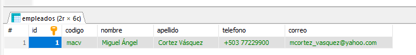  


## Cree el modelo de datos a partir de las tablas de la base de datos

```sql
Scaffold-DbContext "Server=localhost;Database=bd1;Uid=root;Pwd=admin;" Mysql.EntityFrameworkCore -OutputDir Models
```

Error. No se pudo generar el contexto.  

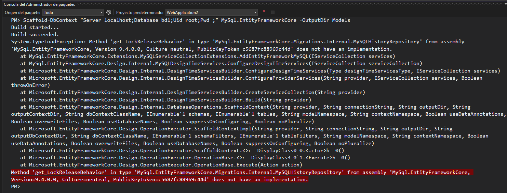  

Información del paquete `MySql.EntityFrameworkCore`  

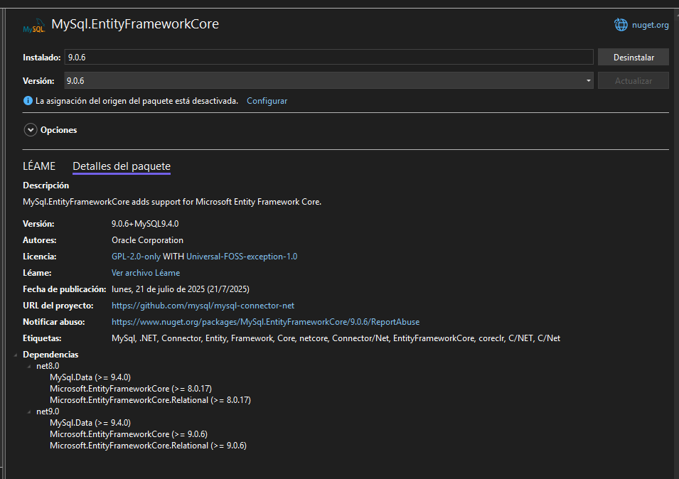  

:orange_book: Creo que no se puede generar el contexto por la versión de `MySql` 

Esta es la versión de `MySql` que estoy utilizando:  

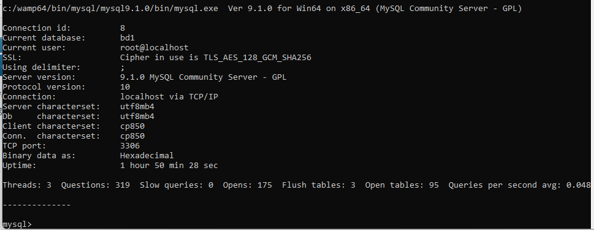  

La versión que tengo instalada es `MySQL 9.1.0` y la versión mínima requerida para `MySql.EntityFrameworkCore 9.0.6` es `MySql 9.4.0` 

Paquete de instalación de MySql 9.4.0  

  

Esta es la información de la nueva versión instalada:  

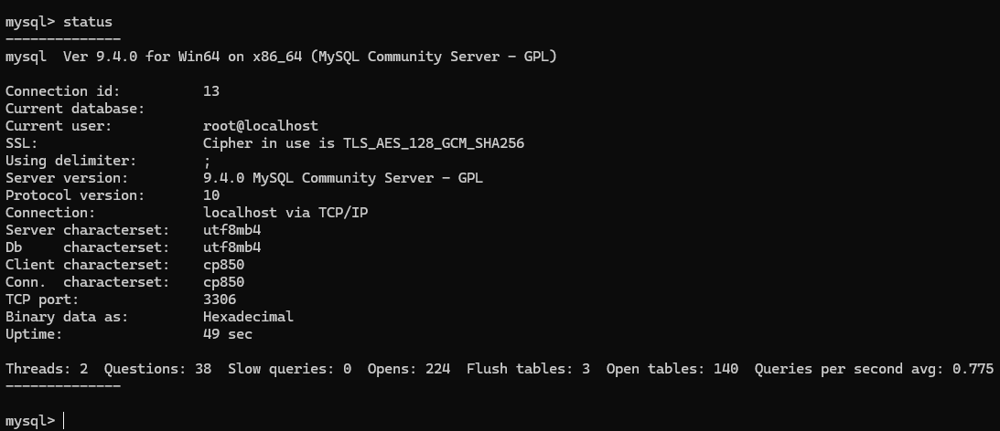  


:star: El problema aún persiste.

## SEGUNDA PARTE  

**FINALMENTE, LA SOLUCIÓN**. Lo que hice fue crear un nuevo proyecto pero de NET 9.0 en lugar de NET 8.0 (Esto se puede cambiar en el momento que crea el proyecto.)  

:collision: NET 8.0 (proyecto original).  

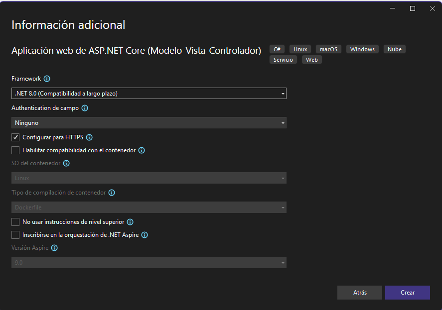  

:ghost: NET 9.0 (nuevo proyecto)

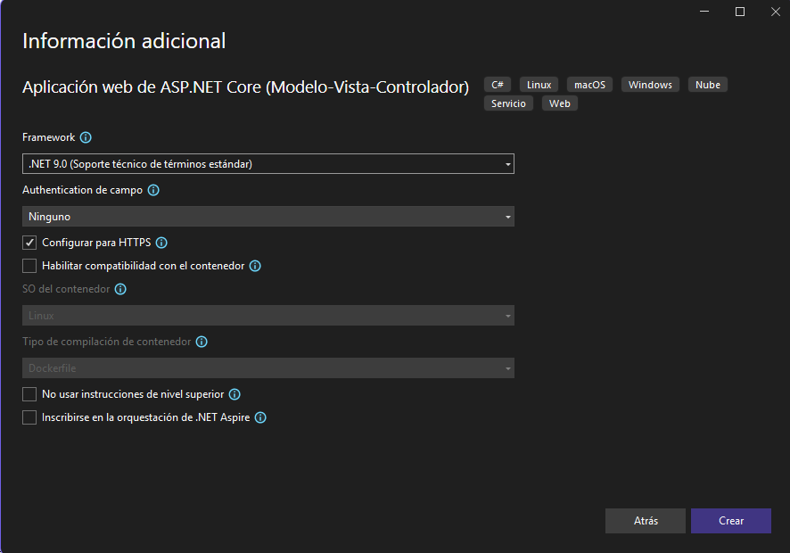  

Instalé siempre los mismos paquetes y ahora si funciona el proceso de creación del modelo

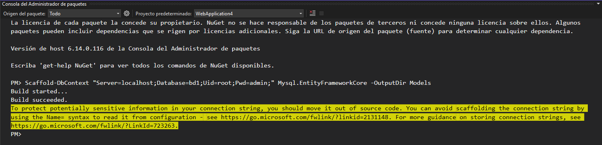  

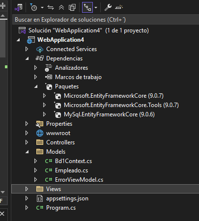  


A continuación se presenta la información del contexto generado:  

```csharp
using System;
using System.Collections.Generic;
using Microsoft.EntityFrameworkCore;

namespace WebApplication4.Models;

public partial class Bd1Context : DbContext
{
    public Bd1Context()
    {
    }

    public Bd1Context(DbContextOptions<Bd1Context> options)
        : base(options)
    {
    }

    public virtual DbSet<Empleado> Empleados { get; set; }

    protected override void OnConfiguring(DbContextOptionsBuilder optionsBuilder)
#warning To protect potentially sensitive information in your connection string, you should move it out of source code. You can avoid scaffolding the connection string by using the Name= syntax to read it from configuration - see https://go.microsoft.com/fwlink/?linkid=2131148. For more guidance on storing connection strings, see https://go.microsoft.com/fwlink/?LinkId=723263.
        => optionsBuilder.UseMySQL("Server=localhost;Database=bd1;Uid=root;Pwd=admin;");

    protected override void OnModelCreating(ModelBuilder modelBuilder)
    {
        modelBuilder.Entity<Empleado>(entity =>
        {
            entity.HasKey(e => e.Id).HasName("PRIMARY");

            entity.ToTable("empleados");

            entity.Property(e => e.Id).HasColumnName("id");
            entity.Property(e => e.Apellido)
                .HasMaxLength(50)
                .HasColumnName("apellido");
            entity.Property(e => e.Codigo)
                .HasMaxLength(10)
                .IsFixedLength()
                .HasColumnName("codigo");
            entity.Property(e => e.Correo)
                .HasMaxLength(100)
                .HasColumnName("correo");
            entity.Property(e => e.Nombre)
                .HasMaxLength(50)
                .HasColumnName("nombre");
            entity.Property(e => e.Telefono)
                .HasMaxLength(15)
                .HasColumnName("telefono");
        });

        OnModelCreatingPartial(modelBuilder);
    }

    partial void OnModelCreatingPartial(ModelBuilder modelBuilder);
}
```


## Configuración de appsettings.json

```csharp
{
  "Logging": {
    "LogLevel": {
      "Default": "Information",
      "Microsoft.AspNetCore": "Warning"
    }
  },
  "AllowedHosts": "*",
  "ConnectionStrings": {
    "DefaultConnection": "Host=localhost;Database=bd1;Username=postgres;Password=admin"
  }
}
```

:green_book: Las líneas que se agregaron son:  

```csharp
,
"ConnectionStrings": {
  "DefaultConnection": "Host=localhost;Database=bd1;Username=postgres;Password=admin"
}
```

## Modifique el archivo Program.cs

```csharp
using Microsoft.EntityFrameworkCore;
using WebApplication4.Models;

var builder = WebApplication.CreateBuilder(args);

// Add services to the container.
builder.Services.AddControllersWithViews();

var conString = builder.Configuration.GetConnectionString("DefaultConnection") ??
     throw new InvalidOperationException("Connection string 'DbContext'" +
    " not found.");

builder.Services.AddDbContext<Bd1Context>(options =>
{
    options.UseMySQL(conString);
});

var app = builder.Build();

// Configure the HTTP request pipeline.
if (!app.Environment.IsDevelopment())
{
    app.UseExceptionHandler("/Home/Error");
    // The default HSTS value is 30 days. You may want to change this for production scenarios, see https://aka.ms/aspnetcore-hsts.
    app.UseHsts();
}

app.UseHttpsRedirection();
app.UseRouting();

app.UseAuthorization();

app.MapStaticAssets();

app.MapControllerRoute(
    name: "default",
    pattern: "{controller=Home}/{action=Index}/{id?}")
    .WithStaticAssets();


app.Run();
```

## Agregue un EmpleadosController

:green_book: Utilice el asistente para la generación de un CRUD básico. Un controlador que utiliza el modelo `Empleado` 

## Agregue una opción en el menú para acceder a Index de ProductosController

```html
<li class="nav-item">
  <a class="nav-link text-dark" asp-area="" asp-controller="Empleados" asp-action="Index">Empleados</a>
</li>
```

## Ejecute la aplicación y acceda a la opción Empleados

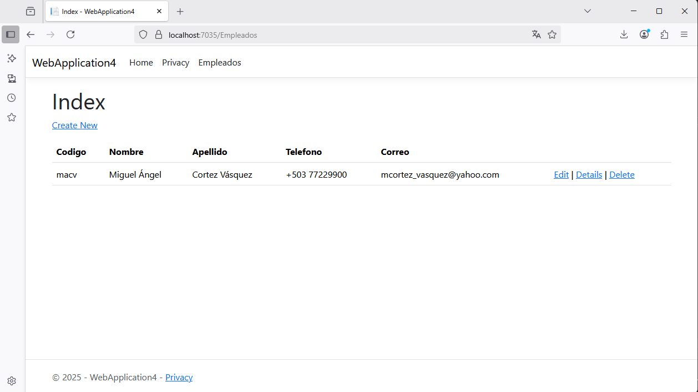   

