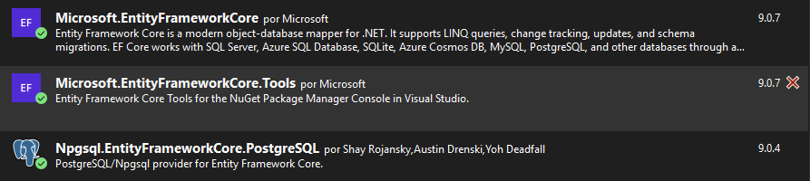
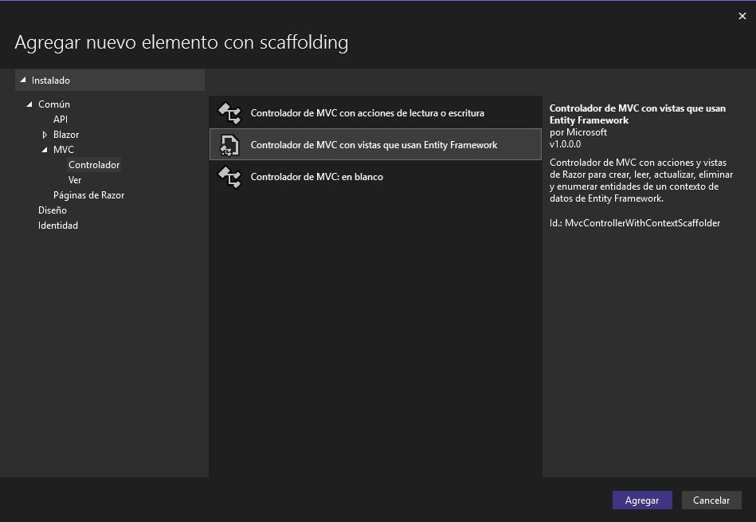
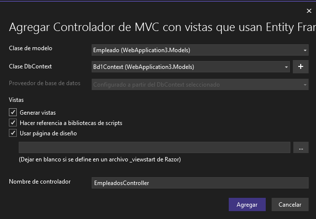
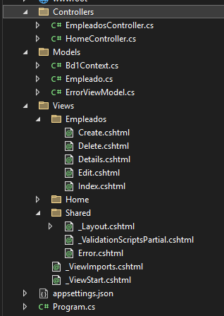
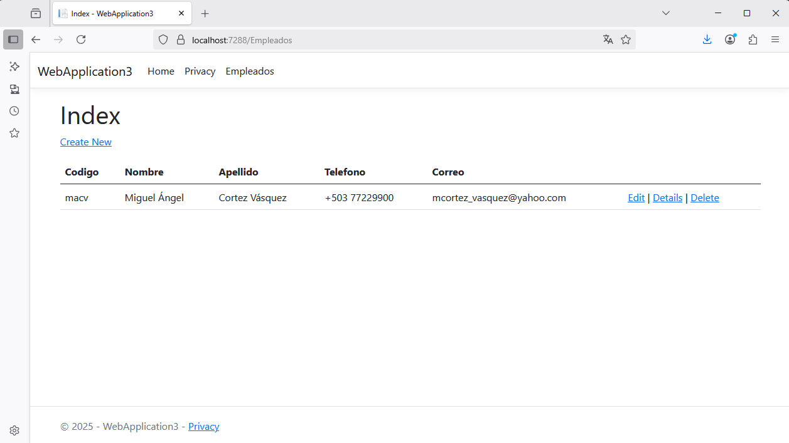

# Creación de una Aplicación Web ASP.NET Core 8 - PostgreSQL

  

Tipo: **Aplicación web de ASP.NET Core (Modelo-Vista-Controlador)**  

## Instale los paquetes
1. Microsoft.EntityFrameworkCore
2. Microsoft.EntityFrameworkCore.Tools
3. Npgsql.EntityFrameworkCore.PostgreSQL


  

## Cree en PostgreSQL una base de datos y una tabla.

Base de datos: **bd1**  
Tabla: **empleados**  


```sql
CREATE TABLE IF NOT EXISTS empleados(
	id SERIAL NOT NULL,
	codigo CHAR(10) NULL,
	nombre CHARACTER VARYING(50) NOT NULL,
	apellido CHARACTER VARYING(50) NOT NULL,
	telefono CHARACTER VARYING(15) NULL,
	correo CHARACTER VARYING(100) NULL,
	CONSTRAINT empleados_pk PRIMARY KEY (id)
);
```

## Insertar un registro en la tabla empleados  

```sql
INSERT INTO empleados(codigo,nombre,apellido,telefono,correo) VALUES('macv','Miguel Ángel','Cortez Vásquez','+503 77229900','mcortez_vasquez@yahoo.com');
```

## Cree el modelo de datos a partir de las tablas de la base de datos

```sql
Scaffold-DbContext "Host=localhost;Database=bd1;Username=postgres;Password=admin" Npgsql.EntityFrameworkCore.PostgreSQL -output Models
```

A continuación se presenta la información del contexto generado:  

```csharp
using System;
using System.Collections.Generic;
using Microsoft.EntityFrameworkCore;

namespace WebApplication3.Models;

public partial class Bd1Context : DbContext
{
    public Bd1Context()
    {
    }

    public Bd1Context(DbContextOptions<Bd1Context> options)
        : base(options)
    {
    }

    public virtual DbSet<Empleado> Empleados { get; set; }

    protected override void OnConfiguring(DbContextOptionsBuilder optionsBuilder)
#warning To protect potentially sensitive information in your connection string, you should move it out of source code. You can avoid scaffolding the connection string by using the Name= syntax to read it from configuration - see https://go.microsoft.com/fwlink/?linkid=2131148. For more guidance on storing connection strings, see https://go.microsoft.com/fwlink/?LinkId=723263.
        => optionsBuilder.UseNpgsql("Host=localhost;Database=bd1;Username=postgres;Password=admin");

    protected override void OnModelCreating(ModelBuilder modelBuilder)
    {
        modelBuilder.Entity<Empleado>(entity =>
        {
            entity.HasKey(e => e.Id).HasName("empleados_pk");

            entity.ToTable("empleados");

            entity.Property(e => e.Id).HasColumnName("id");
            entity.Property(e => e.Apellido)
                .HasMaxLength(50)
                .HasColumnName("apellido");
            entity.Property(e => e.Codigo)
                .HasMaxLength(10)
                .IsFixedLength()
                .HasColumnName("codigo");
            entity.Property(e => e.Correo)
                .HasMaxLength(100)
                .HasColumnName("correo");
            entity.Property(e => e.Nombre)
                .HasMaxLength(50)
                .HasColumnName("nombre");
            entity.Property(e => e.Telefono)
                .HasMaxLength(15)
                .HasColumnName("telefono");
        });

        OnModelCreatingPartial(modelBuilder);
    }

    partial void OnModelCreatingPartial(ModelBuilder modelBuilder);
}
```


## Configuración de appsettings.json

```csharp
{
  "Logging": {
    "LogLevel": {
      "Default": "Information",
      "Microsoft.AspNetCore": "Warning"
    }
  },
  "AllowedHosts": "*",
  "ConnectionStrings": {
    "DefaultConnection": "Host=localhost;Database=bd1;Username=postgres;Password=admin"
  }
}
```

:green_book: Las líneas que se agregaron son:  

```csharp
,
"ConnectionStrings": {
  "DefaultConnection": "Host=localhost;Database=bd1;Username=postgres;Password=admin"
}
```

## Modifique el archivo Program.cs

```csharp
using WebApplication3.Models; // LINEA AGREGADA
using Microsoft.EntityFrameworkCore; // LINEA AGREGADA
var builder = WebApplication.CreateBuilder(args);

// Add services to the container.
builder.Services.AddControllersWithViews();

// AGREGAR DESDE AQUÍ
builder.Services.AddDbContext<Bd1Context>(o =>
{
    o.UseNpgsql(builder.Configuration.GetConnectionString("DefaultConecction"));
});
// HASTA AQUÍ

var app = builder.Build();

// Configure the HTTP request pipeline.
if (!app.Environment.IsDevelopment())
{
    app.UseExceptionHandler("/Home/Error");
    // The default HSTS value is 30 days. You may want to change this for production scenarios, see https://aka.ms/aspnetcore-hsts.
    app.UseHsts();
}

app.UseHttpsRedirection();
app.UseStaticFiles();

app.UseRouting();

app.UseAuthorization();

app.MapControllerRoute(
    name: "default",
    pattern: "{controller=Home}/{action=Index}/{id?}");

app.Run();
```

## Agregue un EmpleadosController

  

  

  

## Agregue una opción en el menú para acceder a Index de ProductosController

```html
<li class="nav-item">
  <a class="nav-link text-dark" asp-area="" asp-controller="Empleados" asp-action="Index">Empleados</a>
</li>
```

## Ejecute la aplicación y acceda a la opción Empleados

  

