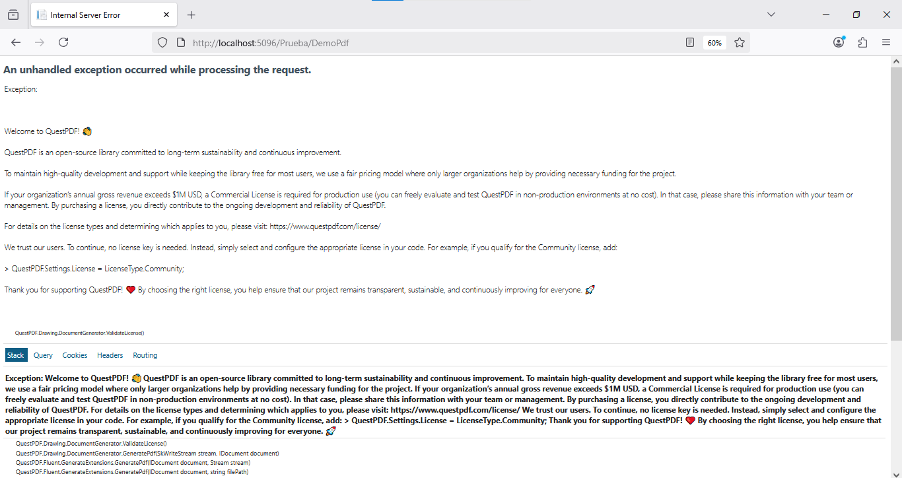
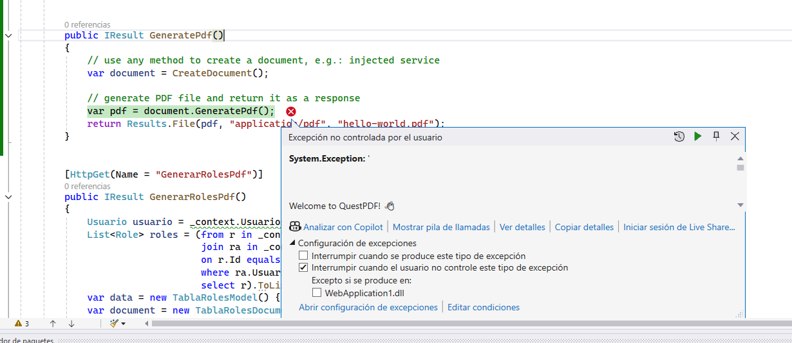
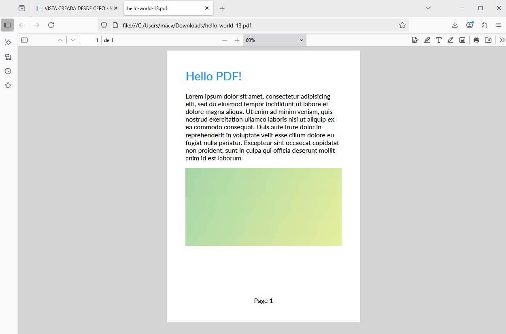

# QuestPDF

QuestPdf es una librería para programadores de C#. Esta librería permite diseñar, implementar y generar documentos PDF, según la documentación oficial disponible en [https://www.questpdf.com/](https://www.questpdf.com/)


**EJEMPLO**.  Diseño de un Pdf de ejemplo (tomando de la documentación oficial de QuestPdf)


## Paso 1. Instale QuestPdf

[https://www.questpdf.com/quick-start.html](https://www.questpdf.com/quick-start.html)  

## Paso 2. En la documentación de QuestPdf localice la sección Integration with ASP.NET

### Ingrese a la documentación de QuestPdf
El sitio oficial es [https://www.questpdf.com/quick-start.html](https://www.questpdf.com/quick-start.html)  

### Localice la sección Implementación con ASP.NET

Luego de ingresar al sitio web de QuestPdf, en la parte izquierda vaya hasta el final (hacia abajo). Al final encontrará un link titulado [Integration with ASP.NET](https://www.questpdf.com/examples/aspnet-integration.html). Allí está la codificación básica para generar y desplegar un archivo PDF con ASP.NET.  

## Paso 3. En PruebaController, agregue una función llamada GeneratePdf

El nombre de la función será `GeneratePdf`. La función `GeneratePdf` también ejecuta otra función llamada `CreateDocument()`, que es quien finalmente genera la estructura del documento PDF.  

:green_book: El código fuente de la función puede ser copiado del sitio oficial de QuestPdf y pegado en el controlador `PruebaController` 

```csharp
[HttpGet(Name = "GeneratePdf")]
public IResult GeneratePdf()
{
    // use any method to create a document, e.g.: injected service
    var document = CreateDocument();
    
    // generate PDF file and return it as a response
    var pdf = document.GeneratePdf();
    return Results.File(pdf, "application/pdf", "hello-world.pdf");
}
```

## Paso 4. En PruebaController, agregue una función llamada CreateDocument

:green_book: Igual como hizo con la función `GenerartePdf` el código fuente puede ser copiado del sitio web oficial de QuestPdf.  

```csharp
QuestPDF.Infrastructure.IDocument CreateDocument()
{
    return Document.Create(container =>
    {
        container.Page(page =>
        {
            page.Size(PageSizes.A4);
            page.Margin(2, Unit.Centimetre);
            page.PageColor(Colors.White);
            page.DefaultTextStyle(x => x.FontSize(20));

            page.Header()
                .Text("Hello PDF!")
                .SemiBold().FontSize(36).FontColor(Colors.Blue.Medium);

            page.Content()
                .PaddingVertical(1, Unit.Centimetre)
                .Column(x =>
                {
                    x.Spacing(20);
                    x.Item().Text(Placeholders.LoremIpsum());
                    x.Item().Image(Placeholders.Image(200, 100));
                });

            page.Footer()
                .AlignCenter()
                .Text(x =>
                {
                    x.Span("Page ");
                    x.CurrentPageNumber();
                });
            });
        });
    }
```

## Paso 5. Agregue un link para visualizar el archivo PDF.

El link puede ser agreguardo en la vista `Index` de `PruebaController` 

Esta es la instrucción para agregar el link `<a asp-controller="Prueba" asp-action="GeneratePdf">Generar PDF</a>`  

## Paso 6. Ejecute la aplicación

:orange_book: A la hora de hacer clic en el link para genear el archivo PDF seguramente verá un mensaje de error que se debe porque no hemos especificado la licencia de QuestPdf. Entonces, será necesario que agregue esta instrucción `QuestPDF.Settings.License = LicenseType.Community;`. Para este ejemplo, yo agregué la línea en el constructor de `PruebaController`.  

*Captura del error*  

  

  

**Especificando la licencia de QuestPdf**    

```csharp
public PruebaController(Bd1Context context)
{
    _context = context;
    QuestPDF.Settings.License = LicenseType.Community; // APLICA LA LICENCIA DE QUESTPDF
}
```

Después de aplicada la licencia, ejecute nuevamente la aplicación.  


*Haga clic en el link para generar el PDF*  


*Resultado obtenido*  



