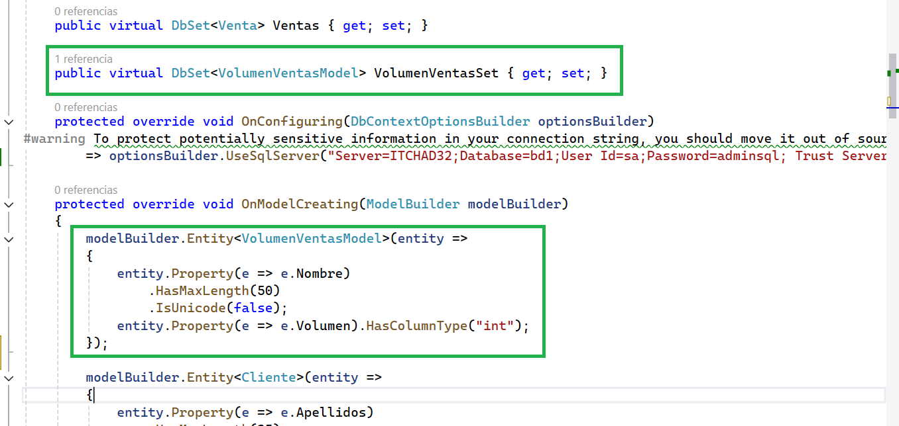
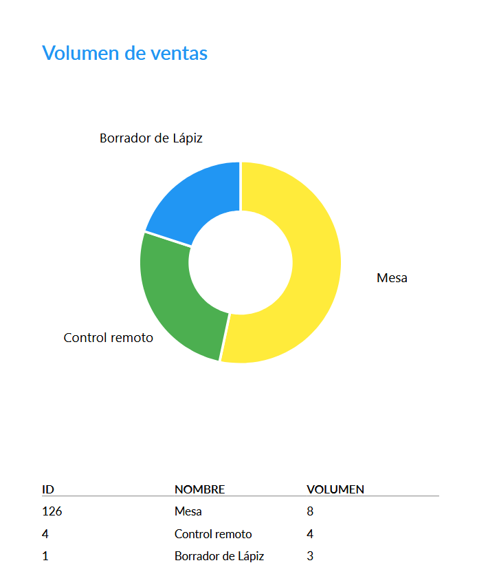

# Creación de gráfico en PDF


## Script para crear las nuevas tablas de base de datos.  

:green_book: Para este ejemplo necesitará las tablas Ventas y DetalleVentas. Aquí está el script para crear las tablas.  

```sql
IF OBJECT_ID(N'Ventas',N'U') IS NULL
CREATE TABLE Ventas(
	Id INT NOT NULL IDENTITY(1,1),
	NumeroComprobante VARCHAR(25) NULL,
	Fecha DATE NOT NULL,
	SubTotal MONEY NOT NULL,
	Iva MONEY NOT NULL,
	Total MONEY NOT NULL,
	ClienteId INT NOT NULL,
	UsuarioId INT NOT NULL,
	CONSTRAINT VentasPk PRIMARY KEY(Id),
	CONSTRAINT VentasFk1 FOREIGN KEY (ClienteId) REFERENCES Clientes(Id),
	CONSTRAINT VentasFk2 FOREIGN KEY (UsuarioId) REFERENCES Usuarios(Id)
)
GO

IF OBJECT_ID(N'DetalleVentas',N'U') IS NULL
CREATE TABLE DetalleVentas(
	Id INT NOT NULL IDENTITY(1,1),
	Cantidad SMALLINT NOT NULL,
	PrecioUnitario MONEY NOT NULL,
	Monto MONEY NOT NULL,
	VentaId INT NOT NULL,
	ProductoId INT NOT NULL,
	CONSTRAINT DetalleVentasPk PRIMARY KEY(Id),
	CONSTRAINT DetalleVentasFk1 FOREIGN KEY (VentaId) REFERENCES Ventas(Id),
	CONSTRAINT DetalleVentasFk2 FOREIGN KEY (ProductoId) REFERENCES Productos(Id)
)
GO
```


## En la carpeta Pdf, agregue las clases VolumenVentasModel y VolumenVentasDocument

Abajo está el código fuente para que lo copie y pegue.  


```csharp
namespace WebApplication1.Pdf
{
    public class VolumenVentasModel
    {
        public int Id { get; set; }
        public string? Nombre { get; set; }
        public int? Volumen { get; set; }
    }
}
```

```csharp
using Microsoft.CodeAnalysis.CSharp.Syntax;
using QuestPDF.Fluent;
using QuestPDF.Helpers;
using QuestPDF.Infrastructure;
using ScottPlot;
using ScottPlot.Plottables;
using Colors = QuestPDF.Helpers.Colors;
namespace WebApplication1.Pdf
{
    public class VolumenVentasDocument : IDocument
    {
        private List<VolumenVentasModel> Model { get; }
        public VolumenVentasDocument(List<VolumenVentasModel> model)
        {
            Model = model;
        }
        public void Compose(IDocumentContainer container)
        {
            container.Page(page =>
            {
                page.Size(PageSizes.A4);
                page.Margin(2, Unit.Centimetre);
                page.PageColor(Colors.White);
                page.DefaultTextStyle(x => x.FontSize(14));

                page.Header()
                    .Text("Volumen de ventas")
                    .SemiBold().FontSize(24).FontColor(Colors.Blue.Medium);

                page.Content()
                    .Column(column =>
                    {
                        column.Spacing(20);

                        column.Item().Column(column =>
                        {
                            column.Spacing(10);

                            column.Item()
                                .AspectRatio(1)
                                .Svg(size =>
                                {
                                    ScottPlot.Plot plot = new();
                                    PieSlice [] slices = new PieSlice[3];
                                    int i = 0;
                                    ScottPlot.Color[] cl = new ScottPlot.Color[] { new ScottPlot.Color(Colors.Yellow.Medium.Hex), new ScottPlot.Color(Colors.Green.Medium.Hex), new ScottPlot.Color(Colors.Blue.Medium.Hex) };
                                    foreach (var item in Model)
                                    {
                                        slices[i] = new() { Value = (double)item.Volumen, FillColor = cl[i], Label = item.Nombre };
                                        i++;
                                    }

                                    var pie = plot.Add.Pie(slices);
                                    pie.DonutFraction = 0.5;
                                    pie.SliceLabelDistance = 1.5;
                                    pie.LineColor = ScottPlot.Colors.White;
                                    pie.LineWidth = 3;

                                    foreach (var pieSlice in pie.Slices)
                                    {
                                        pieSlice.LabelStyle.FontName = "Lato";
                                        pieSlice.LabelStyle.FontSize = 16;
                                    }

                                    plot.Axes.Frameless();
                                    plot.HideGrid();

                                    return plot.GetSvgXml((int)size.Width, (int)size.Height);
                                });
                        });
                        column.Item().Table(table =>
                        {
                            table.ColumnsDefinition(columns =>
                            {
                                columns.RelativeColumn(2); // Id
                                columns.RelativeColumn(2); // Nombre
                                columns.RelativeColumn(2); // Volumen
                            });
                            // Header
                            table.Header(header =>
                            {
                                header.Cell().Element(CellStyle).Text("ID");
                                header.Cell().Element(CellStyle).Text("NOMBRE");
                                header.Cell().Element(CellStyle).Text("VOLUMEN");
                                static IContainer CellStyle(IContainer container) =>
                                    container.DefaultTextStyle(x => x.SemiBold()).PaddingVertical(5).BorderBottom(1).BorderColor(Colors.Grey.Medium);
                            });

                            // Rows
                            foreach (var item in Model)
                            {
                                table.Cell().Element(CellStyle).Text(item.Id.ToString());
                                table.Cell().Element(CellStyle).Text(item.Nombre);
                                table.Cell().Element(CellStyle).Text(item.Volumen.ToString());
                                static IContainer CellStyle(IContainer container) =>
                                        container.PaddingVertical(5);
                            }
                        });
                    });

                page.Footer()
                    .AlignCenter()
                    .Text(x =>
                    {
                        x.Span("Página ");
                        x.CurrentPageNumber();
                    });

            });
        }
    }
}
```

## Agregue la siguiente función a ProductosController.

```csharp
[HttpGet(Name = "GraficoVolumenVentasPdf")]
public IResult GraficoVolumenVentasPdf(int n)
{
    string sql = "select a.Id,a.Nombre,sum(b.Cantidad) as Volumen from Productos a inner join DetalleVentas b on a.Id = b.ProductoId group by a.Id,a.Nombre order by Volumen desc";

    List<VolumenVentasModel> data = _context.VolumenVentasSet
        .FromSqlRaw(sql)
        .ToList();
        var document = new VolumenVentasDocument(data);
        var pdfStream = document.GeneratePdf();
        return Results.File(pdfStream, "application/pdf", "volumen_ventas.pdf");
}
```

## Agregue el siguiente Link en Index que corresponde a ProductosController.

```html
<a asp-controller="Productos" asp-action="GraficoVolumenVentasPdf" asp-route-n="3">Volumen de ventas</a>
```

  

## Agregue la entidad VolumenVentasModel en Bd1Context

:green_book: Primero actualice el contexto con las nuevas tabla de la base de datos.  


***Definmiendo la colección de volumen de ventas***
```csharp
public virtual DbSet<VolumenVentasModel> VolumenVentasSet { get; set; }
```

***Definiendo la entidad VolumenVentasModel en el contexto***
```csharp
modelBuilder.Entity<VolumenVentasModel>(entity =>
{
    entity.Property(e => e.Nombre)
        .HasMaxLength(50)
        .IsUnicode(false);
        entity.Property(e => e.Volumen).HasColumnType("int");
});
```


*Así verá las instrucciones agregradas*


  

## Vista del gráfico generado.

  

