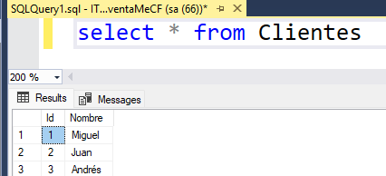
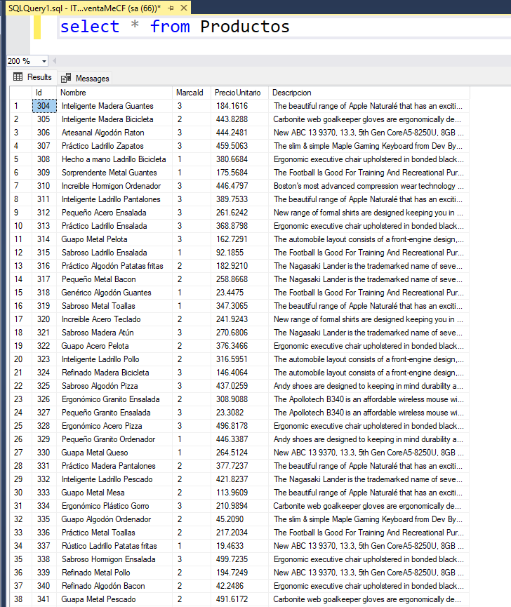
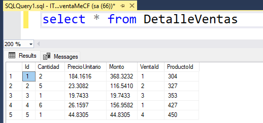
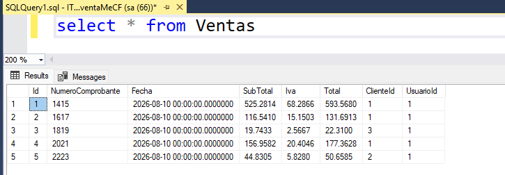

# Creación de gráfico en PDF (con migraciones)


## 1. Agregue tres clases: Cliente, Venta, DetalleVenta

### Clase `Cliente` 
```cs
    public class Cliente
    {
        [Key]
        [DatabaseGenerated(DatabaseGeneratedOption.Identity)]
        public int Id { get; set; }

        [Column("Nombre", TypeName = "varchar(80)")]
        public string? Nombre { get; set; }

        public virtual ICollection<Venta> Ventas { get; set; }
    }
```

### Clase `Venta` 
```cs
    public class Venta
    {
        [Key]
        [DatabaseGenerated(DatabaseGeneratedOption.Identity)]
        public int Id { get; set; }

        [Column("NumeroComprobante", TypeName = "varchar(25)")]
        public string? NumeroComprobante { get; set; }
        
        public DateTime ? Fecha { get; set; }

        [Precision(10, 4)]
        public decimal SubTotal { get; set; }

        [Precision(10, 4)]
        public decimal Iva { get; set; }

        [Precision(10, 4)]
        public decimal Total { get; set; }

        public int ClienteId { get; set; }

        [ForeignKey("ClienteId")]
        public virtual Cliente? Cliente { get; set; }

        public int UsuarioId { get; set; }

        [ForeignKey("UsuarioId")]
        public virtual Usuario? Usuario { get; set; }
    }
```

### Clase `DetalleVenta` 
```cs
    public class DetalleVenta
    {
        [Key]
        [DatabaseGenerated(DatabaseGeneratedOption.Identity)]
        public int Id { get; set; }


        public int Cantidad { get; set; }

        [Precision(10, 4)]
        public decimal PrecioUnitario { get; set; }

        [Precision(10, 4)]
        public decimal Monto { get; set; }

        public int VentaId { get; set; }

        [ForeignKey("VentaId")]
        public virtual Venta? Venta { get; set; }

        public int ProductoId { get; set; }

        [ForeignKey("ProductoId")]
        public virtual Producto? Producto { get; set; }
    }
```

## 2. Modifique la clase `Usuario`

:books: La clase usuario va a permitir navegar en la colección de ventas registradas.

```cs
    public class Usuario
    {
        // ✂️ código omitido
        public virtual ICollection<Venta> Ventas { get; set; } // Línea agregada.
    }
```

## 3. Modifique la clase de contexto

```cs
    public class InventaMeCFContext:DbContext
    {
        public InventaMeCFContext(DbContextOptions<InventaMeCFContext> options) : base(options)
        {

        }
        // ✂️ código omitido

        public DbSet<Cliente> Clientes { get; set; } // Línea agregada
        public DbSet<Venta> Ventas { get; set; } // Línea agregada
        public DbSet<DetalleVenta> DetalleVentas { get; set; } // Línea agregada

        protected override void OnModelCreating(ModelBuilder modelBuilder)
        {
            // ✂️ código omitido
        }
    }
```

## 4. Cree una nueva migración

```bash
Add-Migration AddTablesVentas
```

## 5. Actualice la base de datos

```bash
Update-Database
```

## 6. Agregue datos de 5 ventas

:books: Para ello será necesario que registre Clientes (por lo menos 3), registre detalles de ventas y ventas.

### Agregue clientes


### Consulte la lista de productos para ver `ID` y `PrecioUnitario`



### Registre detalle de ventas


### Registre entas
