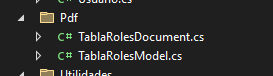
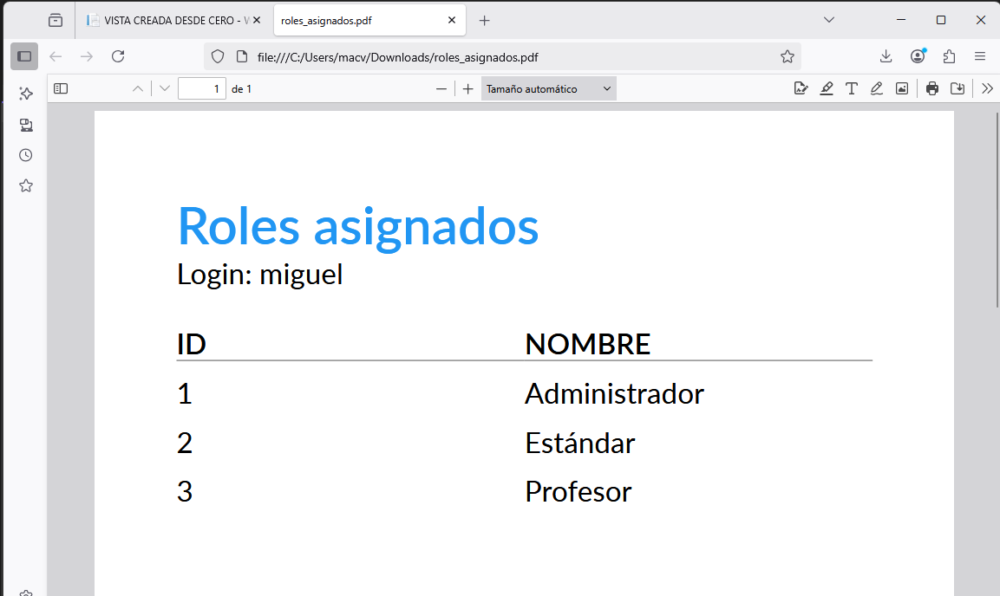

# Ejercicio práctico de QuestPDF

Diseñe un documento en formato PDF para mostrar el Login de un usuario específico y los roles que han sido asigandos a dicho usuario.

## Paso 1. Instale QuestPDF
[https://website-name.com](https://www.questpdf.com/quick-start.html#installation)  

## Paso 2. Agregue la licencia de QuestPDF en el controlador de PruebaController
```chsarp
        public PruebaController(Bd1Context context)
        {
            _context = context;
            QuestPDF.Settings.License = LicenseType.Community;
        }
```
## Paso 3. Agregue una carpeta para guardar los modelos y los documentos.

:green_book: Nota. En la carpeta del proyecto, agregue una subcarpeta llamada `Pdf`. En esta carpeta se agregará cualquier modelo requerido para crear los archivos PDF y además, la estructura de cada documento PDF.

## Paso 4. En la carpeta `Pdf` recién creada agregue dos clases.  

  

Primera clase: `TablaRolesModel` 

```chsarp
using WebApplication1.Models;
namespace WebApplication1.Pdf
{
    public class TablaRolesModel
    {
        public Usuario? Usuario { get; set; }
        public List<Role>? Roles { get; set; }
    }
}
```

Segunda clase: `TablaRolesDocument`  

```chsarp
using QuestPDF.Fluent;
using QuestPDF.Helpers;
using QuestPDF.Infrastructure;
using WebApplication1.Models;
namespace WebApplication1.Pdf
{
    public class TablaRolesDocument : IDocument
    {
        private TablaRolesModel Model { get; }
        public TablaRolesDocument(TablaRolesModel model)
        {
            Model = model;
        }
        public void Compose(IDocumentContainer container)
        {
            container.Page(page =>
            {
                page.Size(PageSizes.A4);
                page.Margin(2, Unit.Centimetre);
                page.PageColor(Colors.White);
                page.DefaultTextStyle(x => x.FontSize(20));

                page.Header()
                    .Text("Roles asignados")
                    .SemiBold().FontSize(36).FontColor(Colors.Blue.Medium);

                page.Content()
                    .Column(column =>
                    {
                        column.Spacing(20);

                        column.Item().Text("Login: " + Model.Usuario.Login);

                        column.Item().Table(table =>
                         {
                             table.ColumnsDefinition(columns =>
                             {
                                 columns.RelativeColumn(2); // Id
                                 columns.RelativeColumn(2); // Nombre
                             });

                             // Header
                             table.Header(header =>
                             {
                                 header.Cell().Element(CellStyle).Text("ID");
                                 header.Cell().Element(CellStyle).Text("NOMBRE");

                                 static IContainer CellStyle(IContainer container) =>
                                     container.DefaultTextStyle(x => x.SemiBold()).PaddingVertical(5).BorderBottom(1).BorderColor(Colors.Grey.Medium);
                             });

                             // Rows
                             foreach (var item in Model.Roles)
                             {
                                 table.Cell().Element(CellStyle).Text(item.Id.ToString());
                                 table.Cell().Element(CellStyle).Text(item.Nombre);

                                 static IContainer CellStyle(IContainer container) =>
                                     container.PaddingVertical(5);
                             }
                         });
                    });

                page.Footer()
                    .AlignCenter()
                    .Text(x =>
                    {
                        x.Span("Página ");
                        x.CurrentPageNumber();
                    });

            });
        }
    }
}
```

## Paso 5. Agregue una nueva función en PruebaController

:star: Nota. Durante la clase se realizó un ejemplo que puede conservar o si usted prefiere puede borrarlo. El caso es que este es otro ejemplo básico de cómo crear un documento PDF pero accediendo a base de datos. Durante la clase hicimos un ejemplo; pero con datos estáticos.  

```chsarp
        [HttpGet(Name = "GenerarRolesPdf")]
        public IResult GenerarRolesPdf()
        {
            Usuario usuario = _context.Usuarios.Find(1);
            List<Role> roles = (from r in _context.Roles
                                join ra in _context.RolesAsignados
                                on r.Id equals ra.RolId
                                where ra.UsuarioId == 1
                                select r).ToList();
            var data = new TablaRolesModel() { Usuario = usuario, Roles = roles };
            var document = new TablaRolesDocument(data);
            var pdfStream = document.GeneratePdf();
            return Results.File(pdfStream, "application/pdf", "roles_asignados.pdf");
        }
```

## Paso 6. Agregue un link en Index de PruebaController

```html
<a asp-controller="Prueba" asp-action="GenerarRolesPdf">Generar Roles PDF</a>
```

## Paso 7. Ejecute la aplicación.

Luego de acceder al link que se muestra en la vista `Index` de `PruebaController` usted podrá ver el login del usuario con ID `1` y los roles asignados.

:books: Nota. Por el momento, en el controlador puede cambiar el ID `1` por otro ID para ver los roles de otro usaurio.

:books: Si usted prefiere, mejore el ejemplo para no tener necesidad de estar cambiando el ID en el controlador.  

### Este es un ejemplo del resultado final:  

  

