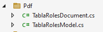

# Ejercicio práctico de QuestPDF

Diseñe un documento en formato PDF para mostrar el Login de un usuario específico y los roles que han sido asigandos a dicho usuario.

## Paso 1. Instale el paquete QuestPDF

* Quizá ya lo instaló para mostrar documentos Pdf con datos estáticos. De ser así, salte este paso.

* Si aún no no ha instalado, es necesario que lo haga; pero puede hacerlo de forma gráfica si no quiere utilizar comandos.  

[https://website-name.com](https://www.questpdf.com/quick-start.html#installation)  

## Paso 2. Agregue la licencia de QuestPDF en el controlador de PruebaController

[https://website-name.com](https://www.questpdf.com/license/configuration.html)

```csharp
public PruebaController(Bd1Context context)
{
    _context = context;
    QuestPDF.Settings.License = LicenseType.Community; // ESTA ES LA LINEA PARA ESPECIFICAR LA LICENCIA.  
}
```
## Paso 3. Agregue una carpeta para guardar los modelos y los documentos.

* La carpeta puede tener cualquier nombre, pero se pide que le llame `Pdf`. La carpeta `Pdf` estará ubicada dentro de la carpeta `WebApplication1`; es decir, en la carpeta principal de su proyecto.  

* En la carepta `Pdf` vamos a agregar clases representar modelos de datos que no provienen de forma directa de tablas de bases de datos, pero que son necearios para diseñar los informes PDF. Además, vamos a agregar aquí las clases que definen la estructura completa de los documentos PDF que serán creados.  

## Paso 4. En la carpeta `Pdf` recién creada agregue dos clases.  

Las clases se llamarán: `TablaRolesDocument` y `TablaRolesModel` 

  

Primera clase: `TablaRolesModel` 

```csharp
using WebApplication1.Models;
namespace WebApplication1.Pdf
{
    public class TablaRolesModel
    {
        public Usuario? Usuario { get; set; }
        public List<Role>? Roles { get; set; }
    }
}
```

Segunda clase: `TablaRolesDocument`  

```csharp
using QuestPDF.Fluent;
using QuestPDF.Helpers;
using QuestPDF.Infrastructure;
using WebApplication1.Models;
namespace WebApplication1.Pdf
{
    public class TablaRolesDocument : IDocument
    {
        private TablaRolesModel Model { get; }
        public TablaRolesDocument(TablaRolesModel model)
        {
            Model = model;
        }
        public void Compose(IDocumentContainer container)
        {
            container.Page(page =>
            {
                page.Size(PageSizes.A4);
                page.Margin(2, Unit.Centimetre);
                page.PageColor(Colors.White);
                page.DefaultTextStyle(x => x.FontSize(20));

                page.Header()
                    .Text("Roles asignados")
                    .SemiBold().FontSize(36).FontColor(Colors.Blue.Medium);

                page.Content()
                    .Column(column =>
                    {
                        column.Spacing(20);

                        column.Item().Text("Login: " + Model.Usuario.Login);

                        column.Item().Table(table =>
                         {
                             table.ColumnsDefinition(columns =>
                             {
                                 columns.RelativeColumn(2); // Id
                                 columns.RelativeColumn(2); // Nombre
                             });

                             // Header
                             table.Header(header =>
                             {
                                 header.Cell().Element(CellStyle).Text("ID");
                                 header.Cell().Element(CellStyle).Text("NOMBRE");

                                 static IContainer CellStyle(IContainer container) =>
                                     container.DefaultTextStyle(x => x.SemiBold()).PaddingVertical(5).BorderBottom(1).BorderColor(Colors.Grey.Medium);
                             });

                             // Rows
                             foreach (var item in Model.Roles)
                             {
                                 table.Cell().Element(CellStyle).Text(item.Id.ToString());
                                 table.Cell().Element(CellStyle).Text(item.Nombre);

                                 static IContainer CellStyle(IContainer container) =>
                                     container.PaddingVertical(5);
                             }
                         });
                    });

                page.Footer()
                    .AlignCenter()
                    .Text(x =>
                    {
                        x.Span("Página ");
                        x.CurrentPageNumber();
                    });

            });
        }
    }
}
```

## Paso 5. Agregue una nueva función en PruebaController

En `PruebaController` se agregará una función llamada `GenerarRolesPdf`. Vea a continuación el código fuente de la función.  

```csharp
[HttpGet(Name = "GenerarRolesPdf")]
public IResult GenerarRolesPdf()
{
    Usuario usuario = _context.Usuarios.Find(1);
    List<Role> roles = (from r in _context.Roles
                        join ra in _context.RolesAsignados
                        on r.Id equals ra.RolId
                        where ra.UsuarioId == 1
                        select r).ToList();
    var data = new TablaRolesModel() { Usuario = usuario, Roles = roles };
    var document = new TablaRolesDocument(data);
    var pdfStream = document.GeneratePdf();
    return Results.File(pdfStream, "application/pdf", "roles_asignados.pdf");
}
```

:warning: Durante la clase se agregó a PruebaController por lo menos una función para generar un archivo PDF con datos estáticos. Usted decide si borra o conserva la función desarrollada durante la clase; pero para este ejemplo, es necesario que haga la función mostrada arriba.  
:green_book:  La instrucción `List<Role> roles = (from r in _context.Roles...` tiene un valor `1` asignado de forma estática, este valor debería recibirse como parámetro para hacer dinámica la consulta (quizá posteriormente mejoremos esta función). El valor `1` es el ID del usuario.  

## Paso 6. Agregue un link para generar el archivo PDF

Se sugiere que agregue este link en la vista `Index` correspondiente a `PruebaController` 

```html
<a asp-controller="Prueba" asp-action="GenerarRolesPdf">Generar Roles PDF</a>
```

## Paso 7. Ejecute la aplicación.

Luego de acceder al link que se muestra en la vista `Index` de `PruebaController` usted podrá ver el login del usuario con ID `1` y los roles asignados.


***Este es un ejemplo del resultado final:***

  

