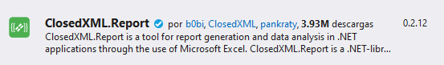

# ClosedXML.Report

El paquete **ClosedXML.Report** se utiliza para generar archivos en formato de Excel (*.xmls).

## Paso 1. Instale el paquete ClosedXML.Report
Nota: Se utilizará el paquete `ClosedXML.Report 0.2.12` 


  

Puede consultar información en los siguientes link:  

[https://closedxml.io/](https://closedxml.io/)

[https://github.com/ClosedXML/ClosedXML](https://github.com/ClosedXML/ClosedXML)  

## Paso 2. Agregue un formulario para generar el documento .XLSX
En la vista `Index` de `PruebaController` agregue un formulario para acceder ejecutar la función que se encargará de generar el archivo .XLSX.  

Código de ejemplo:  

```html
    <div class="shadow-none p-3 mb-5 bg-light rounded">
        @{
            using (Html.BeginForm("ExportAlmacenXLSX", "ArticulosAlmacenes", FormMethod.Post))
            {
                <input type="hidden" name="id" value=@ViewBag.IdAlmacen />
                <button type="submit" class="btn btn-success"><i class="bi bi-filetype-xlsx" style="width: 1em;">&nbsp;Exportar XLSX</i></button>
            }
            Html.EndForm();
        }
    </div>
```

Vista del formulario:  

  

## Paso 3. Agregue una función para generar el archivo XLSX

En el controlador `PruebaController` vamos a agregar una función para generar el archivo .xlsx.

Código de ejemplo:  

```csharp
        [HttpPost]
        public FileResult ExportarXLSX()
        {
            long id = Convert.ToInt32(Request.Form["id"]);
            using (XLWorkbook wb = new XLWorkbook())
            {
                // obtener datos des de la base de datos
                // (código omitido)

                IXLWorksheet ws = wb.Worksheets.Add();

                ws.Range("A1").Value = DateTime.Now.ToShortDateString() + " " + DateTime.Now.ToShortTimeString();
                ws.Range("A1").Style.Font.Bold = true;
                ws.Range("A1").Style.Font.FontSize = 14;
                ws.Range("A1").Style.Alignment.Horizontal = XLAlignmentHorizontalValues.Left;

                ws.Range("A2").Value = "CÓDIGO:";
                ws.Range("A3").Value = "ALMACÉN:";
                if (alma != null)
                {
                    ws.Range("B2").Value = alma.Codigo.ToUpper();
                    ws.Range("B2").Style.Font.Bold = true;
                    ws.Range("B3").Value = alma.Nombre.ToUpper();
                    ws.Range("B3").Style.Font.Bold = true;
                }
                ws.Range("B3:C3").Merge();

                ws.Range("A5").Value = "ID";
                ws.Range("A5").Style.Font.Bold = true;
                ws.Range("C5").Value = "NOMBRE";
                ws.Range("C5").Style.Font.Bold = true;
                ws.Range("D5").Value = "EXISTENCIA";
                ws.Range("D5").Style.Font.Bold = true;
                ws.Range("H5").Style.Font.Bold = true;

                int row = 6;
                foreach (Producto item in productos)
                {
                    ws.Cell(row, 1).Value = item.Id;
                    ws.Cell(row, 3).Value = item.Nombre;
                    ws.Cell(row, 4).Value = item.Existencia;
                    ws.Cell(row, 4).Style.NumberFormat.Format = "#,##0.00";
                    row++;
                }
                ws.Column(1).AdjustToContents();
                ws.Column(2).AdjustToContents();
                ws.Column(3).AdjustToContents();
                ws.Column(4).AdjustToContents();
                ws.Column(5).AdjustToContents();
                ws.Column(6).AdjustToContents();
                ws.Column(7).AdjustToContents();
                ws.Column(8).AdjustToContents();
                using (MemoryStream stream = new MemoryStream())
                {
                    wb.SaveAs(stream);
                    return File(stream.ToArray(), "application/vnd.openxmlformats-officedocument.spreadsheetml.sheet", "Productos.xlsx");
                }
            }
        }
```