# Guía inicial para crear un proyecto Code First

## Paso 1. Creación de proyectos

### Paso 1.1 Creación de un proyecto del tipo ASP.NET Core Web API

Después de iniciar **Visual Studio Code 2022** seleccione la opción **Crear un proyecto**  
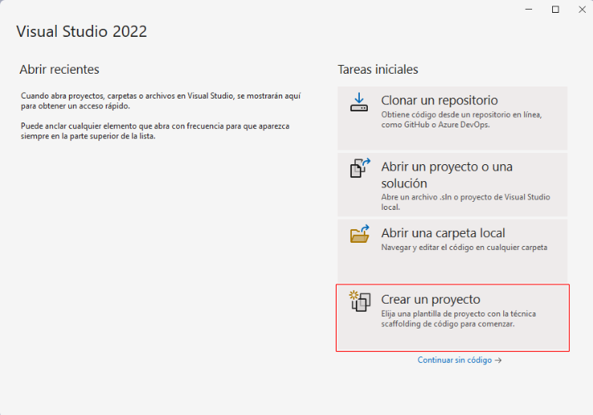  

Seleccione el tipo de proyecto **ASP.NET Core Web API**  

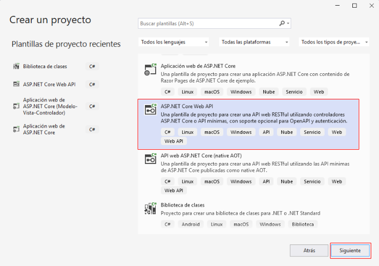  

Escriba el nombre para el nuevo proyecto y haga clic en **Siguiente**  

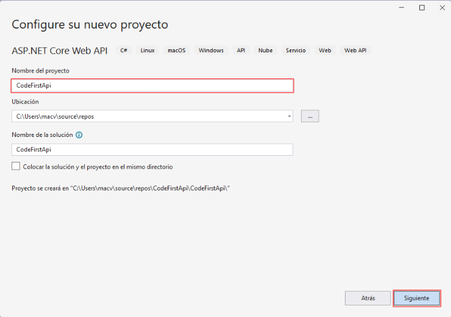  

En el cuadro de diálogo de Información adicional, haga clic en el botón **Crear**  

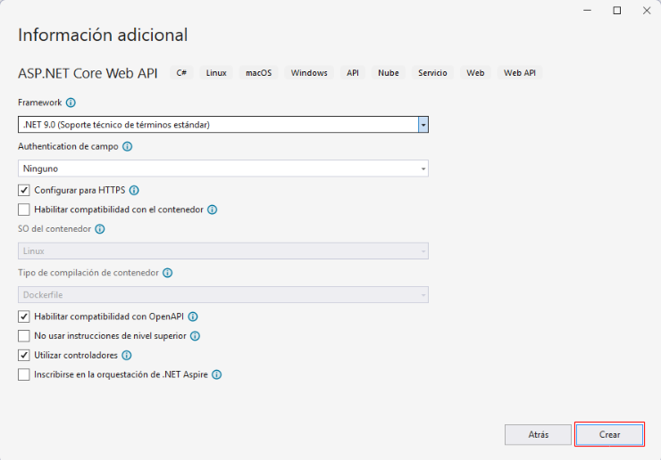  

La siguiente imagen muestra el primer proyecto creado  

  


### Paso 1.2 Agregar un nuevo proyecto de tipo Biblioteca de clases

:sunrise: El proyecto de tipo **Biblioteca de clases** va a contener las clases que representan a los **modelos de datos** y el **DbContext** correspondiente.  

Haga clic drecho sobre **Solución "CodeFirstApi" (1 de 1 proyecto)**  

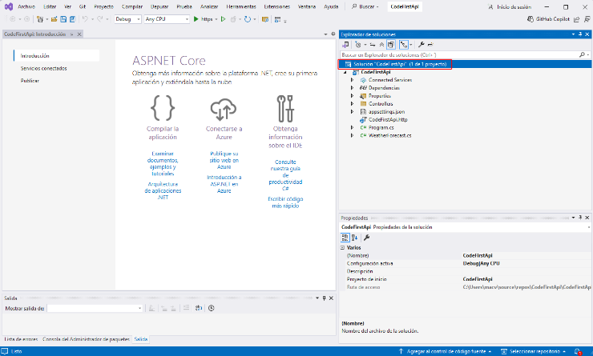  

Seleccione la opción **Agregar** y elija la opción **Nuevo Proyecto**  

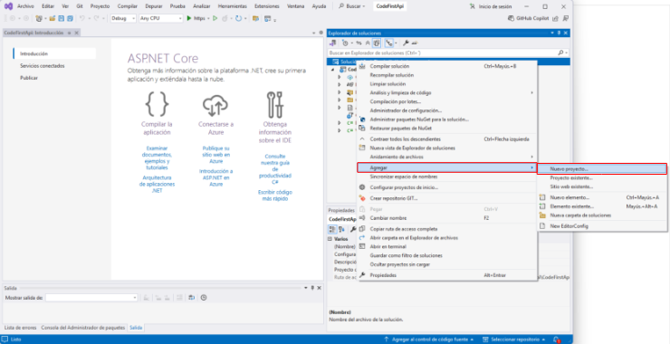  

Seleccione la opción **Biblioteca de clases** y haga clic en **Siguiente**  
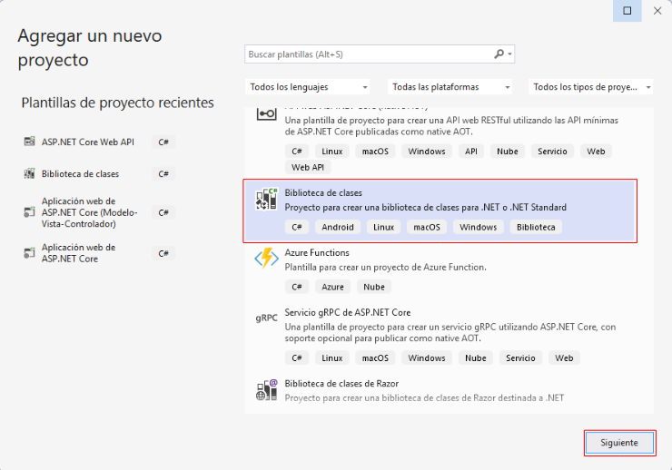  

Escriba un nombre para el proyecto y haga clic en **Siguiente**  

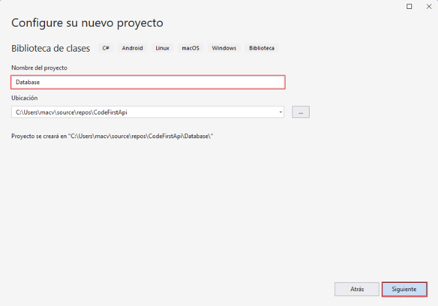  

Haga clic en **Crear**  

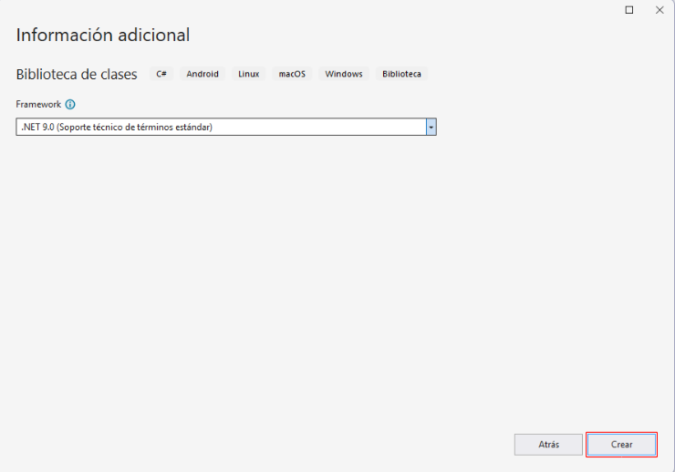  

La siguiente imagen muestra los dos proyectos creados   

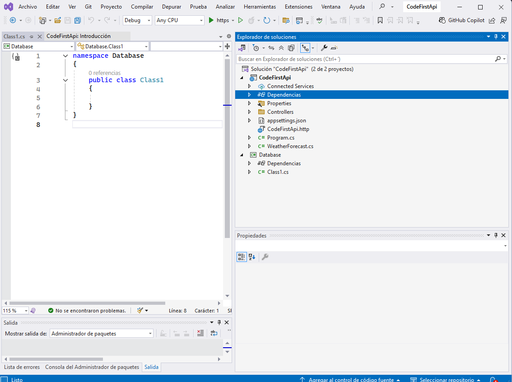  

## Paso 2. Instalación de paquetes

### Paso 2.1 Instalación de paquetes en el proyecto de tipo Biblioteca de clases

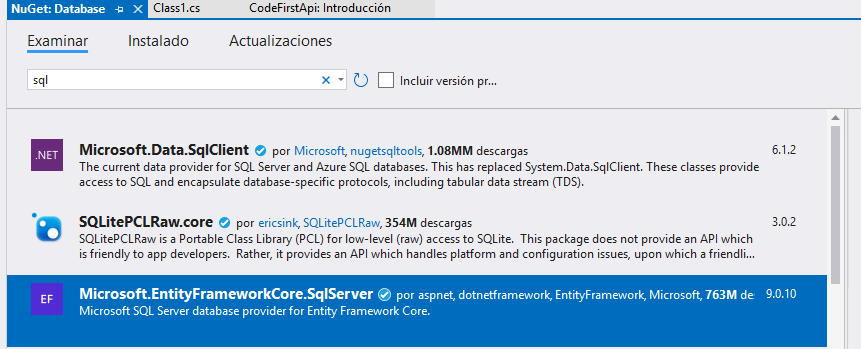  

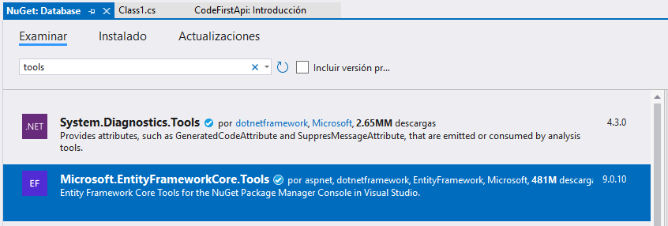 

### Paso 2.2 Instalación de paquete en el proyecto de tipo ASP.NET Core Web API

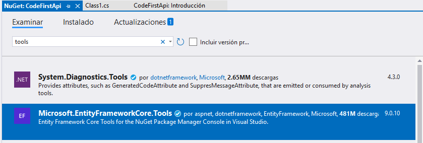  

## Paso 3. Configurar el DbContext

:books: El Contexto es una pieza central de comunicación entre la aplicación y la base de datos. Esta configuración se realizará en el proyecto de tipo `Biblioteca de clases`, que este ejemplo se llama **Database**.  

## Paso 3.1 Agregar una clase para el contexto

Debido a que ya se dispone de una clase llamada **Class1.cs** vamos a cambiar el nombre a esta clase. El nuevo nombre será **InventarioContext.cs**. Luego configura la clase como sigue:  

:books:  Nota. La clase **InventarioContext** va a heredar las características de la clase **DbContext** que pertenece al espacio de nombres **Microsoft.EntityFrameworkCore** y en el constructor va a recibir un objeto de tipo **DbContextOptions<InventarioContext>** mediante inyección de dependencias.  

```cs
using Microsoft.EntityFrameworkCore;

namespace Database
{
    public class InventarioContext:DbContext
    {
        public InventarioContext(DbContextOptions<InventarioContext> options):base(options)
        {
            
        }
    }
}
```

### Paso 3.2 Agregar clases para los modelos

:books:  Nota. Las clases del modelo van a importar dos espacios de nombres `using System.ComponentModel.DataAnnotations` y `using System.ComponentModel.DataAnnotations.Schema;`,  


- **using System.ComponentModel.DataAnnotations;** En este namespace se encuentran las anotaciones ***Key, ForeignKey, etc***.  
- **using System.ComponentModel.DataAnnotations.Schema;** En este namespace se encuentra las anotaciones ***DatabaseGenerated, DatabaseGeneratedOption, etc.***  

#### Paso 3.2.1 Agregar la clase Marca

```cs
using System;
using System.Collections.Generic;
using System.ComponentModel.DataAnnotations;
using System.ComponentModel.DataAnnotations.Schema;
using System.Linq;
using System.Text;
using System.Threading.Tasks;

namespace Database
{
    public class Marca
    {
        [Key] // Indica que la propiedad Id será la Primary Key
        [DatabaseGenerated(DatabaseGeneratedOption.Identity)] // Indica que Id va a tener un valor autogenerado: 1,2,3,..., n
        public int Id { get; set; }
        public string Nombre { get; set; }
        public virtual ICollection<Producto> Productos { get; set; } // Crea en la marca una colección de productos.
    }
}
```

#### Paso 3.2.2 Agregar la clase Producto

```cs
using System;
using System.Collections.Generic;
using System.ComponentModel.DataAnnotations;
using System.ComponentModel.DataAnnotations.Schema;
using System.Linq;
using System.Text;
using System.Threading.Tasks;

namespace Database
{
    public class Producto
    {
        [Key]
        [DatabaseGenerated(DatabaseGeneratedOption.Identity)]
        public int Id { get; set; }
        public string Nombre { get; set; }
        public int MarcaId { get; set; }

        [ForeignKey("MarcaId")] // Esta anotación corresponde a la propiedad Marca y permite vincular al objeto Marca mediante la propiedad MarcaId.
        public virtual Marca Marca { get; set; } // Permite obtener la marca de un producto.
    }
}
```

#### Paso 3.2.3 Agregar la clase Cliente

```cs
using System;
using System.Collections.Generic;
using System.ComponentModel.DataAnnotations;
using System.ComponentModel.DataAnnotations.Schema;
using System.Linq;
using System.Text;
using System.Threading.Tasks;

namespace Database
{
    public class Cliente
    {
        [Key]
        [DatabaseGenerated(DatabaseGeneratedOption.Identity)]
        public int Id { get; set; }
        [MaxLength(50)]
        public string Nombre { get; set; }
        [MaxLength(15)]
        public string Telefono { get; set; }
        [MaxLength(100)]
        public string Correo { get; set; }
        [MaxLength(200)]
        public string Direccion { get; set; }
    }
}
```

#### Paso 3.2.4 Agregar la clase Usuario

```cs
using System;
using System.Collections.Generic;
using System.ComponentModel.DataAnnotations;
using System.ComponentModel.DataAnnotations.Schema;
using System.Linq;
using System.Text;
using System.Threading.Tasks;

namespace Database
{
    public class Usuario
    {
        [Key]
        [DatabaseGenerated(DatabaseGeneratedOption.Identity)]
        public int Id { get; set; }
        [Required]
        [MaxLength(75)]
        public string Nombre { get; set; }
        [Required]
        [MaxLength(150)]
        public string Email { get; set; }
        [MaxLength(64)]
        public string Clave { get; set; }
    }
}
```

### Paso 3.3 Agregar las entidades a la clase de contexto  

```cs
using Microsoft.EntityFrameworkCore;

namespace Database
{
    public class InventarioContext:DbContext
    {
        public InventarioContext(DbContextOptions<InventarioContext> options):base(options)
        {
            
        }
        public DbSet<Producto> Productos { get; set; }
        public DbSet<Marca> Marcas { get; set; }
        public DbSet<Cliente> Clientes { get; set; }
        public DbSet<Usuario> Usuarios { get; set; }
    }
}
```

### Paso 3.3 (Opcional) Sobrescribir el método OnModelCreating

:books: En este método se pueden realizar varias configuraciones opcionales, como por ejemplo especificar los nombres reales que tendrán las tablas en la base de datos. Como ya se mencionó este proceso es opcional.

```cs
using Microsoft.EntityFrameworkCore;

namespace Database
{
    public class InventarioContext:DbContext
    {
        // ✂️ CÓDIGO OMITIDO
        protected override void OnModelCreating(ModelBuilder modelBuilder)
        {
            modelBuilder.Entity<Producto>().ToTable("Productos");
            modelBuilder.Entity<Marca>().ToTable("Marcas");
            modelBuilder.Entity<Cliente>().ToTable("Clientes");
            modelBuilder.Entity<Usuario>().ToTable("Usuarios");
        }
    }
}
```

## Paso 4. Agregar referencia entre proyectos.  

:books: En el proyecto de tipo `ASP.NET Core Web API` que es el proyecto llamado **CodeFirst**, agregue una referencia al proyecto de tipo `Biblioteca de clases` llamado **Database**.  

Haga clic derecho en **Dependencias** y luego, haga clic en la opción **Agregar referencia del proyecto...**  

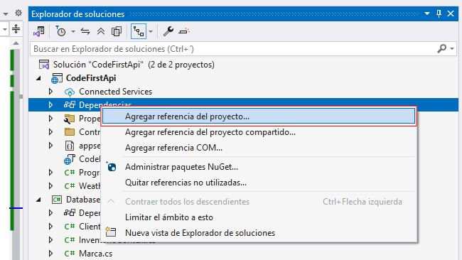  

Seleccione el proyecto **Database** y haga clic en **Aceptar**  

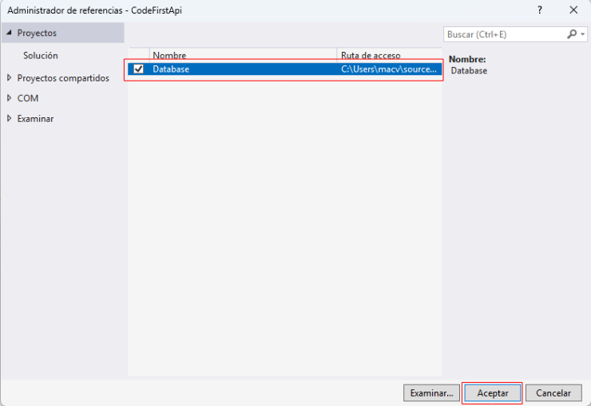  

## Paso 5. Agregar la cadena de conexión 

:books: La cadena de conexión se agregará al proyecto de tipo `ASP.NET Core Web API` que se llama **CodeFirst**. La cadena de conexión se agrega en el archivo `appsettings.json`  

El archivo `appsettings.json` original tiene el siguiente contenido:  

```cs
{
  "Logging": {
    "LogLevel": {
      "Default": "Information",
      "Microsoft.AspNetCore": "Warning"
    }
  },
  "AllowedHosts": "*"
}
```

El archivo `appsettings.json` modificado tendrá el siguiente contenido:  

```cs
{
  "Logging": {
    "LogLevel": {
      "Default": "Information",
      "Microsoft.AspNetCore": "Warning"
    }
  },
  "AllowedHosts": "*" /* se agregó desde aquí */,
  "ConnectionStrings": {
    "CodeFirstConnection": "Server=ITCHAD32;Database=Inventario;Uid=sa;Pwd=adminsql;Trust Server Certificate=true;MultipleActiveResultSets=true;"
  }
  /*hasta aquí*/
}
```

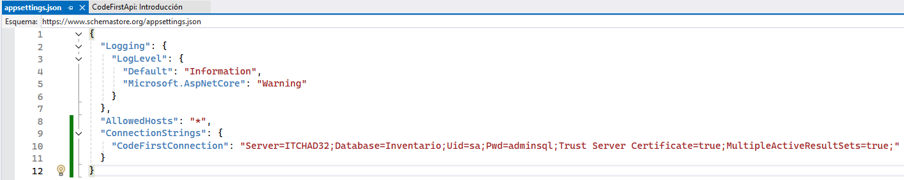  