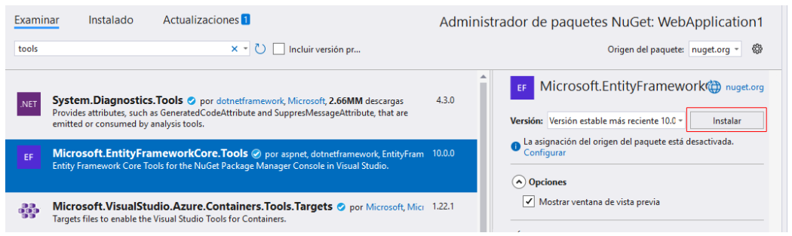
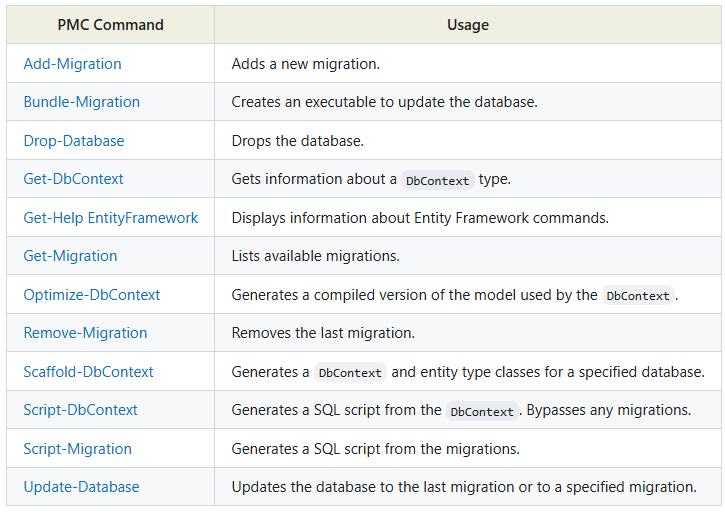
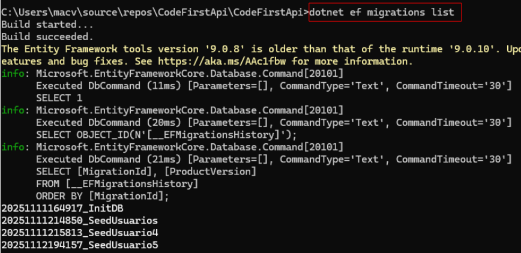
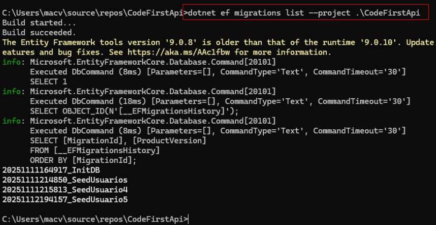
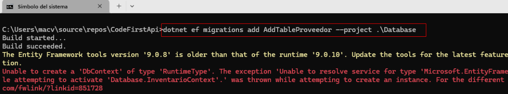
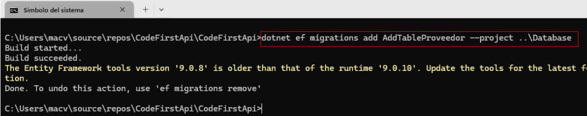

# Herramientas para trabajar con migraciones en Entity Framework Core
## Contexto

En la siguiente imagen se presenta un diagrama que permite comprender cuál es la configuración de la aplicación que se ha tomado como base para explicar este documento.  


### Para trabajar con migraciones se tienen dos formas posibles que se listan a continuación. 

:one: Usar la **Consola del Administrador de paquetes (NuGet)**  

:two: Usar **dotnet ef** mediante la **Terminal del sistema operativo (CMD)**. Ver más adelante el proceso de instalación.    


# Sección 1. Instalación de herramientas

## Instalación de `Microsoft.EntityFrameworkCore.Tools`  

Esta opción permitirá trabajar con `Consola del Administrador de paquetes (NuGet)` 

```bash
Install-Package Microsoft.EntityFrameworkCore.Tools
```

El mismo paque se puede instalar mediante la interfaz gráfica  

  

Con la instalación del paquete `Microsoft.EntityFrameworkCore.Tools` se podrán utilizar los siguientes comandos:  

  

## Instalación de `dotnet-ef`

### Opción 1. Instalar `dotnet-ef` globalmente.  

La instalación global significa que el comando `dotnet ef` estará disponible a nivel del sistema operativo, no solo en el proyecto actual.  

```bash
dotnet tool install --global dotnet-ef
```

### Opción 2. Instalar `dotnet-ef` como herramienta local en el proyecto.

Antes de instalar `dotnet-ef` debes tener un archivo de manimiesto en la carpeta **:file_folder: .config**. Si aún no existe, debes ejecutar el siguiente comando:  

#### Crear archivo de manifiesto

```bash
dotnet new tool-manifest
```

#### Instalación de `dotnet-ef`

```
dotnet tool install dotnet-ef
```

### Ver la versión de `dotnet-ef` instalado

Para investigar la versión de `dotnet-ef` instalado ejecute el siguiente comando:  

```bash
dotnet ef --version
```

El comando `dotnet new tool-manifest` creó dentro del proyecto (en la ubicación del archivo **.csproj**) una nueva carpeta llamada **.config** y dentro creó un archivo llamado `dotnet-tools.json` con el siguiente contenido:  
```json
{
  "version": 1,
  "isRoot": true,
  "tools": {}
}
```

## Desinstalación de `dotnet-ef`
### Si `dotnet-ef` se instaló de forma global en el equipo

```bash
dotnet tool uninstall --global dotnet-ef
```

### Si `dotnet-ef` se instaló localmente en un proyecto.

```bash
dotnet tool uninstall dotnet-ef
```

**:books:** Nota Si quieres borrar completamente cualquier configuración local relacionada elimina el archivo `dotnet-tools.json` si ya no necesitas ninguna otra herramienta local, borra la carpeta `.store` o `.dotnet/tools` (en el home) si necesitas limpiar caché global/local manualmente.

### Listar las herramientas instaladas a nivel global

```bash
dotnet tool list --global
```

### Listar las herramientas instaladas a nivel de proyecto

```bash
dotnet tool list
```

# Sección 2. Uso de comandos para migraciones


## Crear la migración inicial

### NuGet

```bash
Add-Migration MigracionInicial
```

📚 Como proyecto de inicio debe estar `MacvCodeFirstAPI` y como proyecto de destino para las migraciones debe estar configurado `MacvDatabase`. El proyecto `MacvCodeFirstApi` debe tener la cadena de conexión.   

### Terminal

```
dotnet ef migrations add MigracionInicial --project ..\MacvDatabase
```

Donde MacvDatabase es el proyecto de destino, no es el proyecto donde está instalado dotnet-ef (Digo porque en mi caso tengo un proyecto para API y otro para DB donde están las clases y los archivos de migraciones). No especifico el proyecto API que es donde tengo el archivo appsettings.json de la cadena de conexión sino el proyecto donde están las clases.

El paquete dotnet-ef localmente puede ser instalado en cualquier directorio de la aplicación. Lo que se instala en directorio he visto que no afecta a otros directorios, es decir que no hay problema que se instale en diferentes directorios pero tampoco tiene sentido hacerlo.

  

📚 Después de `--project` se debe apuntar al directorio que tiene el archivo con extensión `.csproj` que es un archivo XML con la información necesaria para compilar el proyecto.  

📚 Donde `MacvDatabase` es el proyecto de destino, no es el proyecto donde está instalado `dotnet-ef`. No especifico el proyecto API que es donde tengo el archivo `appsettings.json` de la cadena de conexión sino el proyecto donde están las clases.

📚 El paquete `dotnet-ef` localmente puede ser instalado en cualquier directorio de la aplicación. Lo que se instala en directorio he visto que no afecta a otros directorios, es decir que no hay problema que se instale en diferentes directorios pero tampoco tiene sentido hacerlo.

📚 No hay diferencia entre usar `Add-Migration` o `dotnet ef migrations add` porque internamente ambas herramientas utilizan el mismo sistema de `Entity Framework Core` 

⚠️ No se puede agregar más de una migración con el mismo nombre. Vea la siguiente imagen  

  

Es claro que no se puede agregar una nueva migración con un identificador existente.


#### Listar las migraciones
```
dotnet ef migrations list
```

  

Note como el comando cambia si se ubica en otro directorio:  

  

Otros ejemplos que demuestran que la ubicación para ejecutar el comando sí afecta.  

  

  

#### Ejecutar las migraciones

 ```
 dotnet ef database update
 ```

## Ejecutar nuevas migraciones

:warning: Nunca debe cambiar una migración ya desplegada (ya ejecutada) porque Entity Framework no lo permite (pendiente de comprobar). Lo que tiene que hacer es crear una nueva migración aún cuando solo se haya cambiado el tipo de dato de un campo.  

📚 Nota. Si hace modificaciones en las entidades será necesario crear una nueva migración para actualizar la base de datos.  

El comando será el mismo; pero se debe cambiar la identificación de **MigracionInicial** a cualquier otro identificador que describa las modificaicones realizadas.  

Las migraciones posteriores a la inicial son para funcionalidades concretas, por lo que será necesario agregar un identificador específico. En cambio la primera migración tienen muchas funcionalidades en una misma migración y por ello la identificamos como MigracionInicial por ejemplo.

### Terminal

```
dotnet ef migrations add AddEmailToUser --project .\MacvCodeFirst\
```

Cuando se crean migraciones, revertir una migración no se hace borrando los archivos de migraciones, sino por línea de comandos porque las migraciones llevan un historial que ser rompería si solo borramos archivos.  

## Revertir la última migracion

El siguiente comando solo elimina la última migración (del proyecto)

```
dotnet ef migrations remove --project ..\MacvDatabase
```

:warning: El comando anterior NO FUNCIONA si la migración (en este caso la última migración) ya fue aplicada en la base de datos, en caso contrario, se presentará un error como el siguiente:  

```
The migration '20250830163846_AddClienteTable' has already been applied to the database. Revert it and try again. If the migration has been applied to other databases, consider reverting its changes using a new migration instead.
```

Para eliminar de la base de datos las últimas migraciones y volver a una versión específica se puede utilizar `dotnet ef database update` de la siguiente manera 

```
dotnet ef database update InitDB --project ..\MacvDatabase
```

Después de revertir de la base de dato las migraciones ya se pueden eliminar los archivos de las migraciones correspondientes.

```
dotnet ef migrations remove --project ..\MacvDatabase
```

así se mueve la última migración definida en el proyecto (archivo de la última migración).

Si a la hora de agregar una migración se presenta algún error, posiblemente el comando `dotnet build` le ayude porque ejecuta el comando de forma tal que se muestran las operaciones que va realizando e información de los errores. A continuación presento un caso.

  


### Por Package Manager


```
Update-Database InitDB
```

Donde `InitDB` sería el nombre de la migración a la cual se quiere actualizar.

### Terminal

```
dotnet ef database update MigracionInicial --project .\MacvCodeFirst\
```

donde MigracionInicial es la migración a la cual queremos saltar. Esto va eliminando todas las migraciones desde la última hasta llegar a la migración que queremos saltar.

NOTAS:
1. En relaciones entre entidades podemos utilizar IEnumerable o ICollection para representar colecciones de datos
2. ICollection permite agregar, eliminar o actualizar elementos mientras que IEnumerable NO PERMITE. por eso se recomienta usar ICollection.

NOTA:
Cuando ejecutas dotnet --version y ves una versión válida, significa que el SDK de .NET está correctamente instalado. Sin embargo, si dotnet ef no funciona, es probable que falte la herramienta de Entity Framework Core CLI (Command Line Interface).
