# Herramientas para trabajar con migraciones en Entity Framework Core
## Generalidades

- El paquete `Microsoft.EntityFrameworkCore` contiene el núcleo del `ORM`: Las clases base como `DbContext`, `DbSet`, `el sistema de seguimiento de cambios`, `LINQ`, `migraciones`, etc. Pero este paquete :x: **NO sabe cómo conectarse a una base de datos específica**.  

- `Entity Framework Core` es agnóstico al motor; necesita un proveedor para permitir:
  - Conectarse a SQL Server / MySQL / PostgreSQL, etc.

  - Traducir expresiones LINQ a SQL específico.  

  - Usar tipos de datos propios de SQL del gestor de bases de datos.  

  - Ejecutar migraciones adaptadas a SQL del gestor de bases de datos.
  
  - Manejar comportamiento propio del motor (ejemplo: IDENTITY, GETDATE(), NEWID(), etc.)  

- ¿Por qué es necesario el paquete `Microsoft.EntityFrameworkCore.SqlServer`?. Es necesario porque incluye el proveedor de base de datos `SQL Server` y el método de extensión `UseSqlServer()`. Esto aplica para Microsoft SQL Server.    

- `Entity Framework Core` requiere un proveedor específico para el gestor de base de datos que se vaya a utilizar, por ejemplo, ***Microsoft.EntityFrameworkCore.SqlServer***, ***Npgsql.EntityFrameworkCore.PostgreSQL***, ***Microsoft.EntityFrameworkCore.Sqlite***   

### Aclarando dudas acerca de `dotnet` y `dotnet-ef`  

### :white_check_mark: ¿Qué es `dotnet`?  

`dotnet` es la **CLI (línea de comandos)** general del **.NET SDK**.  

Es la herramienta principal para **crear, compilar, ejecutar y publicar** proyectos .NET.  

* Crear proyecto: `dotnet new console`  

* Restaurar dependencias: `donet restore`  

* Compilar: `dotnet build` 

* Ejecutar: `dotnet run` 

* Gestionar paquete NuGet: `dotnet add package` 

* :star: Viene instalado con `.NET SDK` 

### :white_check_mark: ¿Qué es `dotnet-ef`?  

`dotnet-ef` es una extensión de la herramienta `dotnet` 

Se utiliza para realizar las siguientes actividades:  

* Crear migraciones: `dotnet ef migrations add` 

* Aplicar migraciones a la base de datos: `dotnet ef database update`  

* Ver información del modelo: `dotnet ef dbcontext info`  

* :collision: No viene instalado automáticamente.  


## Contexto

En este documento se explican algunas configuraciones y comandos para trabajar con Entity Framework Core. En las tres imágenes siguientes se presentan dos configuraciones posibles para trabajar con Entity Framework Core y el gestor de bases de datos `Microsoft SQL Server`. Si se pretende usar otro gestor de base de datos deberá cambiar el paquete del proveedor de datos, es decir, `Microsoft.EntityFrameworkCore.SqlServer` por el gestor de base de datos equivalente para el gestor que usará.  

## Primer esquema de configuración

En la siguiente imagen puede ver los paquetes instalados de forma explícita, estos están enmarcados con un rectángulo de color rojo. El resto de paquetes fueron instalados automáticamente durante la creación del proyecto.  

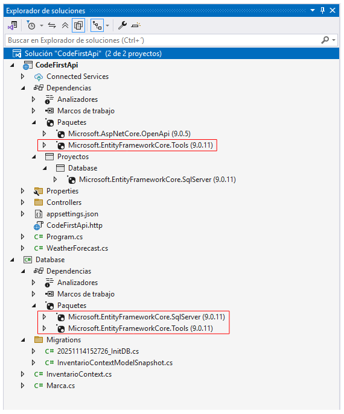  

Cuando en el proyecto `Database` (la biblioteca de clases) se instala `Microsoft.EntityFrameworkCore.Tools` :white_check_mark: se pueden ejecutar comandos como `Add-Migration`, `Update-Database`, etc. en la `Consola del Administrador de paquetes` 

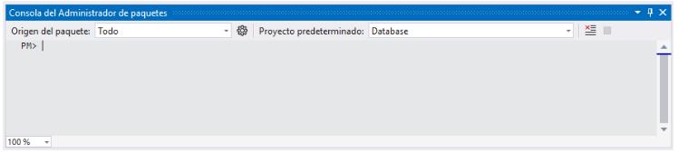  

## Segundo esquema de configuración

Si en el proyecto `Database` (biblioteca de clases) se instala `Microsoft.EntityFrameworkCore` en lugar de `Microsoft.EntityFrameworkCore.Tools` :x: no se pueden ejecutar los comandos como `Add-Migration`, `Update-Database`, etc. en la `Consola del Administrador de paquetes`.   

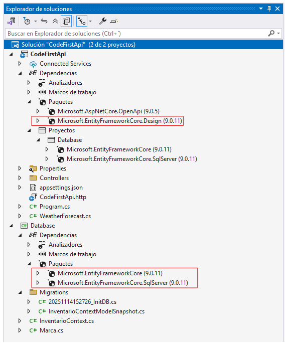  

Podemos utilizar `dotnet ef` para interactuar con la base de datos como se muestra en la siguiente imagen

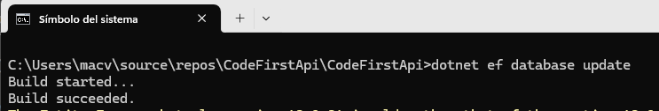  

### Diagrama de ejemplo

En la siguiente imagen se presenta un diagrama que permite comprender cuál es la configuración de la aplicación que se ha tomado como base para explicar este documento.  


**Para trabajar con migraciones se tienen dos formas posibles que se listan a continuación:**

:one: Usar la **Consola del Administrador de paquetes (NuGet)**  

:two: Usar **dotnet ef** mediante la **Terminal del sistema operativo (CMD)**. Ver más adelante el proceso de instalación.    


# Sección 1. Instalación y desinstalación de herramientas

## :white_check_mark: Instalación de `Microsoft.EntityFrameworkCore.Tools`  

Esta opción permitirá trabajar con `Consola del Administrador de paquetes (NuGet)` 

```bash
Install-Package Microsoft.EntityFrameworkCore.Tools
```

El mismo paquete se puede instalar mediante la interfaz gráfica  

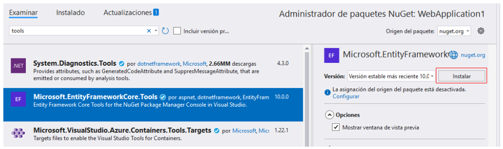  

Con la instalación del paquete `Microsoft.EntityFrameworkCore.Tools` se podrán utilizar los siguientes comandos:  

<table style="color:darkgray;border:1px solid white;">
<tr>
<th>PMC Command</th>
<th>Usage</th>
</tr>
<tr>
<td><strong>Add-Migration</strong></td>
<td>Adds a new migration.</td>
</tr>
<tr>
<td><strong>Bundle-Migration</strong></td>
<td>Creates and executable to updata database.</td>
</tr>
<tr>
<td><strong>Drop-Database</strong></td>
<td>Drops the database.</td>
</tr>
<tr>
<td><strong>Get-DbContext</strong></td>
<td>Gets information about a <span style="color:lightblue;">DbContext</span> type.</td>
</tr>
<tr>
<td><strong>Get-Help EntityFramework</strong></td>
<td>Displays information about <span style="color:lightblue;">Entity Framework</span> commands.</td>
</tr>
<tr>
<td><strong>Get-Migration</strong></td>
<td>Lists available migrations.</td>
</tr>
<tr>
<td><strong>Optimize-DbContext</strong></td>
<td>Generates a compiled version of the model used by the <span style="color:lightblue;">DbContext</span></td>
</tr>
<tr>
<td><strong>Remove-Migration</strong></td>
<td>Remove the last migration.</td>
</tr>
<tr>
<td><strong>Scaffold-DbContext</strong></td>
<td>Generates a <span style="color:lightblue;">DbContext</span> and entity type classes for a specified database.</td>
</tr>
<tr>
<td><strong>Script-DbContext</strong></td>
<td>Generates a SQL script from the <span style="color:lightblue;">DbContext</span>. Bypasses any migrations.</td>
</tr>
<tr>
<td><strong>Script-Migration</strong></td>
<td>Generates a SQL script from the migrations.</td>
</tr>
<tr>
<td><strong>Update-Database</strong></td>
<td>Updates the database to the last migration or to specified migration.</td>
</tr>
</table>


### :no_entry: Desinstalación de `Microsoft.EntityFrameworkCore.Tools`  

```bash
dotnet remove package Microsoft.EntityFrameworkCore.Tools
```

## :white_check_mark: Instalación de `dotnet-ef` globalmente

La instalación global significa que el comando `dotnet ef` estará disponible a nivel del sistema operativo, no solo en el proyecto actual.  

```bash
dotnet tool install --global dotnet-ef
```

Instalar una versión específica:  

```bash
dotnet tool install --global dotnet-ef --version 9.0.6
```

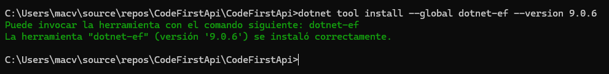  

### :no_entry: Desinstalación de `dotnet-ef` globalmente  

Ejecuta el siguiente comando. Si se muestra información indica que **dotnet-ef** está instalado globalmente.  

```bash
dotnet tool list -g
```

o 

```bash
dotnet tool list --global
```

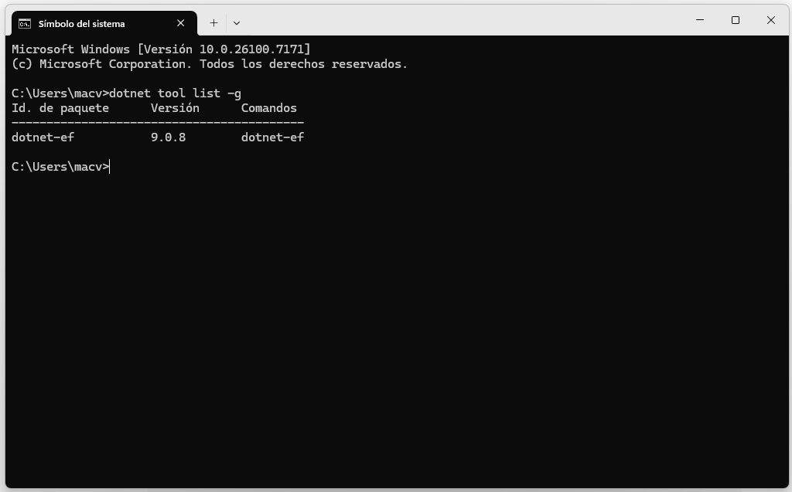  


```bash
dotnet tool uninstall --global dotnet-ef
```


## :white_check_mark: Instalación de `dotnet-ef` como herramienta local en el proyecto.

Antes de instalar `dotnet-ef` debes tener un archivo de manimiesto en la carpeta **:file_folder: .config**. Si aún no existe, debes ejecutar el siguiente comando:  

### Crear archivo de manifiesto

```bash
dotnet new tool-manifest
```

### Instalación de `dotnet-ef`

```
dotnet tool install dotnet-ef
```

### Ver la versión de `dotnet-ef` instalado

Para investigar la versión de `dotnet-ef` instalado ejecute el siguiente comando:  

```bash
dotnet ef --version
```

El comando `dotnet new tool-manifest` creó dentro del proyecto (en la ubicación del archivo **.csproj**) una nueva carpeta llamada **.config** y dentro creó un archivo llamado `dotnet-tools.json` con el siguiente contenido:  
```json
{
  "version": 1,
  "isRoot": true,
  "tools": {}
}
```

:information_source: En una próxima ejecución del comando `dotnet new tool-manifest` observé que la carpeta `.config` se crea en el directorio donde se ejecuta el comando. La primera vez que lo instalé se creó la carpeta `.config` en la ubicación del archivo con extensión `.csproj` porque allí ejecuté el comando.  


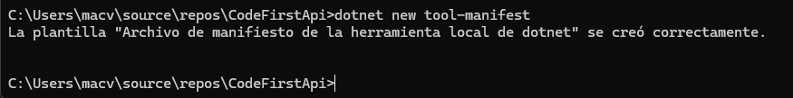  

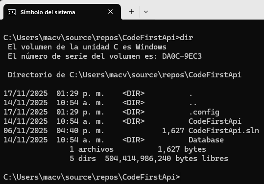  


### :no_entry: Desinstalación de `dotnet-ef` instalado localmente en un proyecto.

Ver si `dotnet-ef` está instalado localmente

```bash
dotnet tool list
```

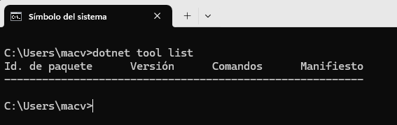  

Desinstalar  

```bash
dotnet tool uninstall dotnet-ef
```

**:books:** Nota Si quieres borrar completamente cualquier configuración local relacionada elimina el archivo `dotnet-tools.json` si ya no necesitas ninguna otra herramienta local, borra la carpeta `.store` o `.dotnet/tools` (en el home) si necesitas limpiar caché global/local manualmente.

### Listar las herramientas instaladas a nivel global

```bash
dotnet tool list --global
```

### Listar las herramientas instaladas a nivel de proyecto

```bash
dotnet tool list
```

# Sección 2. Uso de comandos para migraciones


## Crear la migración inicial

### NuGet

```bash
Add-Migration MigracionInicial
```

📚 Como proyecto de inicio debe estar `MacvCodeFirstAPI` y como proyecto de destino para las migraciones debe estar configurado `MacvDatabase`. El proyecto `MacvCodeFirstApi` debe tener la cadena de conexión.   

### Terminal

```
dotnet ef migrations add MigracionInicial --project ..\MacvDatabase
```

Donde `MacvDatabase` es el proyecto de destino, no es el proyecto donde está instalado dotnet-ef (Digo porque en mi caso tengo un proyecto para API y otro para DB donde están las clases y los archivos de migraciones). No especifico el proyecto API que es donde tengo el archivo appsettings.json de la cadena de conexión sino el proyecto donde están las clases.

El paquete `dotnet-ef` localmente puede ser instalado en cualquier directorio de la aplicación. Lo que se instala en directorio he visto que no afecta a otros directorios, es decir que no hay problema que se instale en diferentes directorios pero tampoco tiene sentido hacerlo.

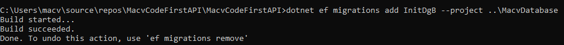  

:books: Notas  

- Después de `--project` se debe apuntar al directorio que tiene el archivo con extensión `.csproj` que es un archivo XML con la información necesaria para compilar el proyecto destino.  

- Donde `MacvDatabase` es el proyecto de destino, no es el proyecto donde está instalado `dotnet-ef`. No especifico el proyecto API que es donde tengo el archivo `appsettings.json` de la cadena de conexión sino el proyecto donde están las clases equivalentes a la base de datos.

- El paquete `dotnet-ef` localmente puede ser instalado en cualquier :file_folder: directorio de la aplicación. Lo que se instala en directorio he visto que no afecta a otros directorios, es decir que no hay problema que se instale en diferentes directorios pero tampoco tiene sentido hacerlo.

- No hay diferencia entre usar `Add-Migration` o `dotnet ef migrations add` porque internamente ambas herramientas utilizan el mismo sistema de `Entity Framework Core` 

⚠️ No se puede agregar más de una migración con el mismo nombre. Vea la siguiente imagen  

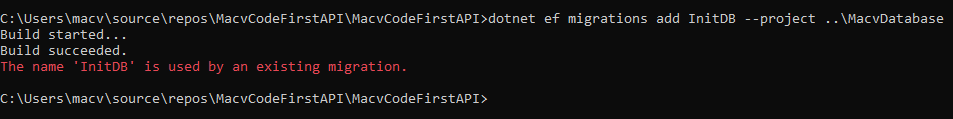  

Es claro que no se puede agregar una nueva migración con un identificador existente.


#### Listar las migraciones

### NuGet  
```
Get-Migration
```

### Terminal  
```
dotnet ef migrations list
```

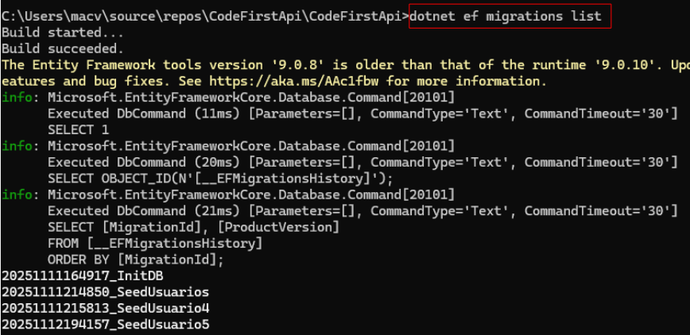  

Note como el comando cambia si se ubica en otro directorio:  

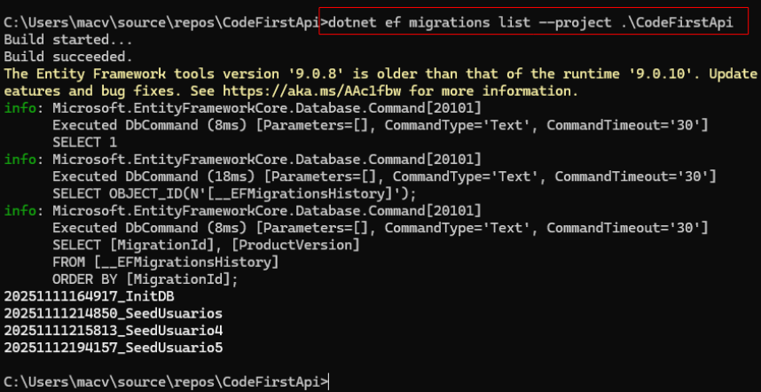  

Otros ejemplos que demuestran que la ubicación para ejecutar el comando sí afecta.  

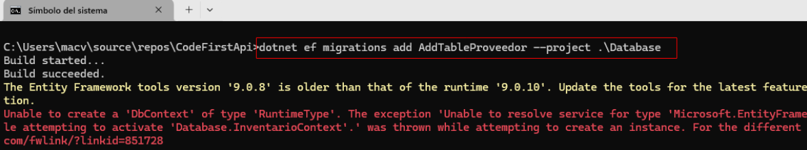  

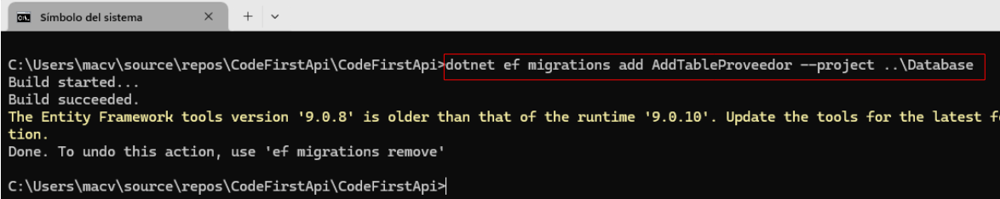  

#### Ejecutar las migraciones

 ```
 dotnet ef database update
 ```

## Ejecutar nuevas migraciones

:warning: Nunca debe cambiar una migración ya desplegada (ya ejecutada) porque Entity Framework no lo permite (pendiente de comprobar). Lo que tiene que hacer es crear una nueva migración aún cuando solo se haya cambiado el tipo de dato de un campo.  

📚 Nota. Si hace modificaciones en las entidades será necesario crear una nueva migración para actualizar la base de datos.  

El comando será el mismo; pero se debe cambiar la identificación de **MigracionInicial** a cualquier otro identificador que describa las modificaicones realizadas.  

Las migraciones posteriores a la inicial son para funcionalidades concretas, por lo que será necesario agregar un identificador específico. En cambio la primera migración tienen muchas funcionalidades en una misma migración y por ello la identificamos como MigracionInicial por ejemplo.

### Terminal

```
dotnet ef migrations add AddEmailToUser --project .\MacvCodeFirst\
```

Cuando se crean migraciones, revertir una migración no se hace borrando los archivos de migraciones, sino por línea de comandos porque las migraciones llevan un historial que ser rompería si solo borramos archivos.  

## Revertir la última migracion

El siguiente comando solo elimina la última migración (del proyecto)

```
dotnet ef migrations remove --project ..\MacvDatabase
```

:warning: El comando anterior NO FUNCIONA si la migración (en este caso la última migración) ya fue aplicada en la base de datos, en caso contrario, se presentará un error como el siguiente:  

```
The migration '20250830163846_AddClienteTable' has already been applied to the database. Revert it and try again. If the migration has been applied to other databases, consider reverting its changes using a new migration instead.
```

Para eliminar de la base de datos las últimas migraciones y volver a una versión específica se puede utilizar `dotnet ef database update` de la siguiente manera 

```
dotnet ef database update InitDB --project ..\MacvDatabase
```

Después de revertir de la base de dato las migraciones ya se pueden eliminar los archivos de las migraciones correspondientes.

```
dotnet ef migrations remove --project ..\MacvDatabase
```

Así se mueve la última migración definida en el proyecto (archivo de la última migración).

Si a la hora de agregar una migración se presenta algún error, posiblemente el comando `dotnet build` le ayude porque ejecuta el comando de forma tal que se muestran las operaciones que va realizando e información de los errores. A continuación presento un caso.

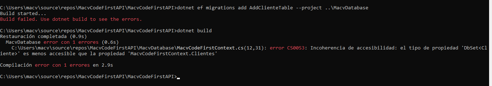  


### Package Manager


```
Update-Database InitDB
```

Donde `InitDB` sería el nombre de la migración a la cual se quiere actualizar.

### Terminal

```
dotnet ef database update MigracionInicial --project .\MacvCodeFirst\
```

Donde `MigracionInicial` es la migración a la cual queremos saltar. Esto va eliminando todas las migraciones desde la última hasta llegar a la migración que queremos saltar.  


:books: Notas  
1. En las relaciones entre entidades podemos utilizar `IEnumerable` o `ICollection` para representar colecciones de datos.  
2. `ICollection` permite agregar, eliminar o actualizar elementos mientras que `IEnumerable` **NO PERMITE**. por eso se recomienta usar `ICollection`.
3. Cuando ejecutas `dotnet --version` y ves una versión válida, significa que el `SDK` de `.NET` está correctamente instalado. Sin embargo, `si dotnet ef` no funciona, es probable que falte la herramienta de `Entity Framework Core CLI` (Command Line Interface).
