# Creación de una aplicación - Entity Framework Core - Code Fist

## Paso 1. Creación de proyectos

### Paso 1.1 Creación de un proyecto del tipo ASP.NET Core Web API

Después de iniciar **Visual Studio Code 2022** seleccione la opción **Crear un proyecto**  
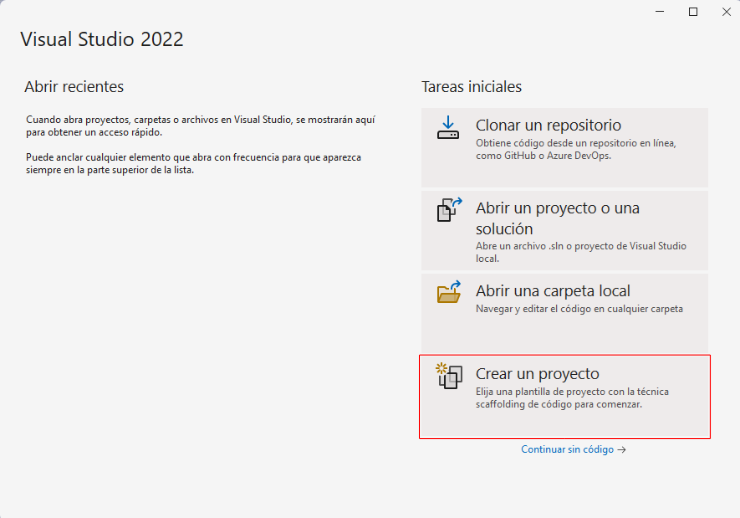  

Seleccione el tipo de proyecto **ASP.NET Core Web API**  

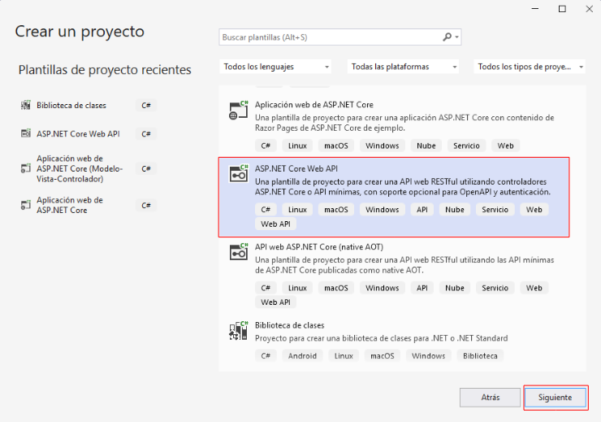  

Escriba el nombre para el nuevo proyecto y haga clic en **Siguiente**  

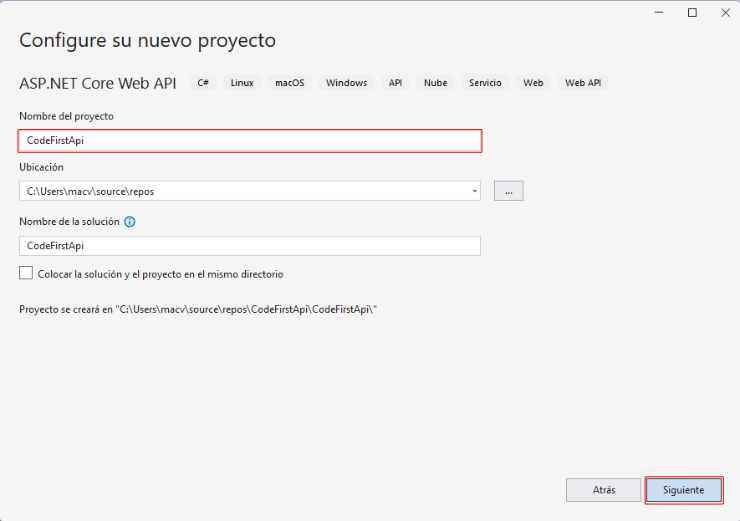  

En el cuadro de diálogo de Información adicional, haga clic en el botón **Crear**  

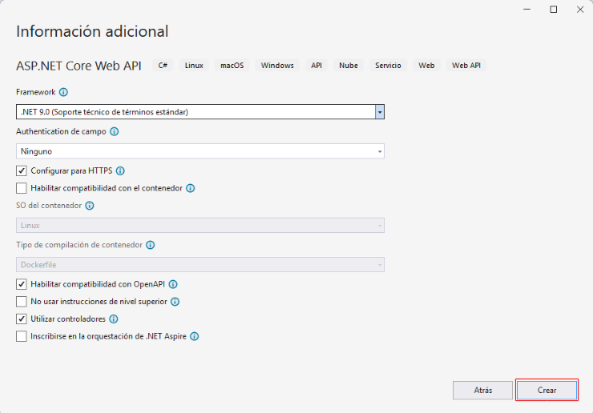  

La siguiente imagen muestra el primer proyecto creado  

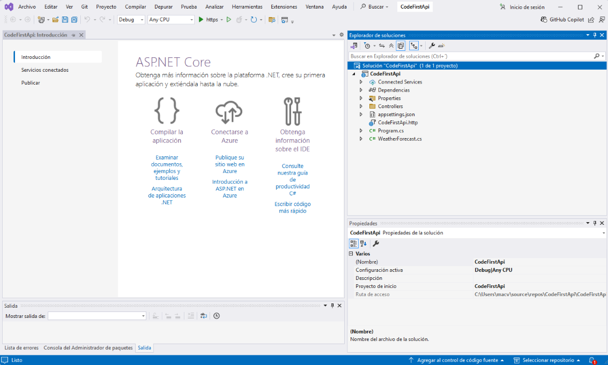  


### Paso 1.2 Agregar un nuevo proyecto de tipo Biblioteca de clases

:sunrise: El proyecto de tipo **Biblioteca de clases** va a contener las clases que representan a los **modelos de datos** y el **DbContext** correspondiente.  

Haga clic drecho sobre **Solución "CodeFirstApi" (1 de 1 proyecto)**  

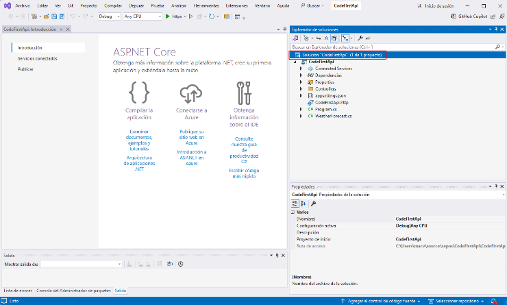  

Seleccione la opción **Agregar** y elija la opción **Nuevo Proyecto**  

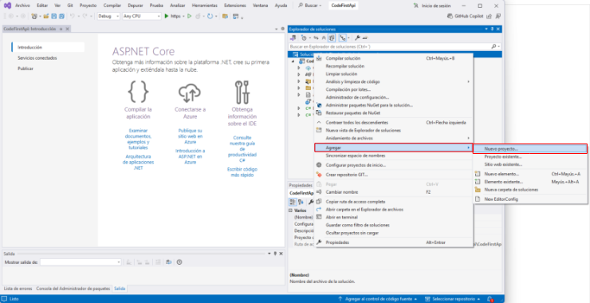  

Seleccione la opción **Biblioteca de clases** y haga clic en **Siguiente**  
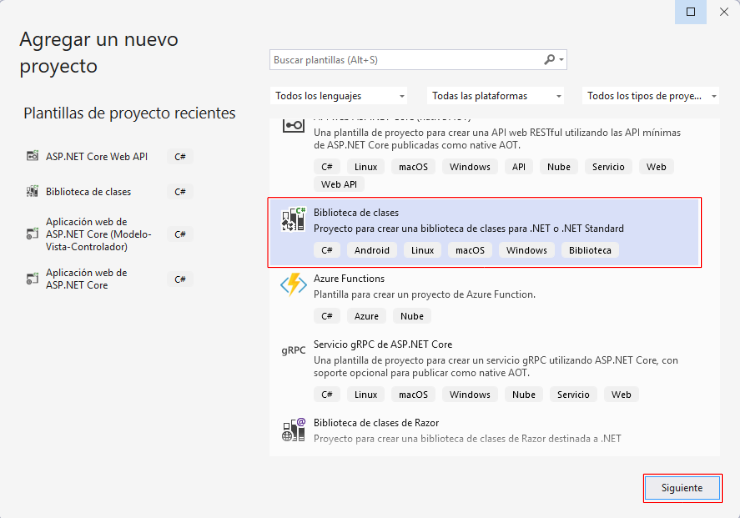  

Escriba un nombre para el proyecto y haga clic en **Siguiente**  

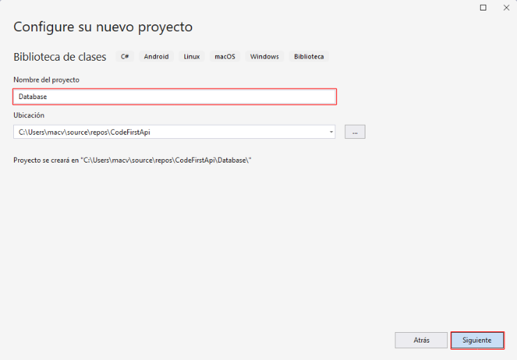  

Haga clic en **Crear**  

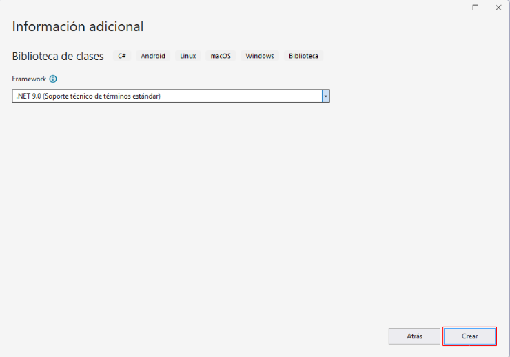  

La siguiente imagen muestra los dos proyectos creados   

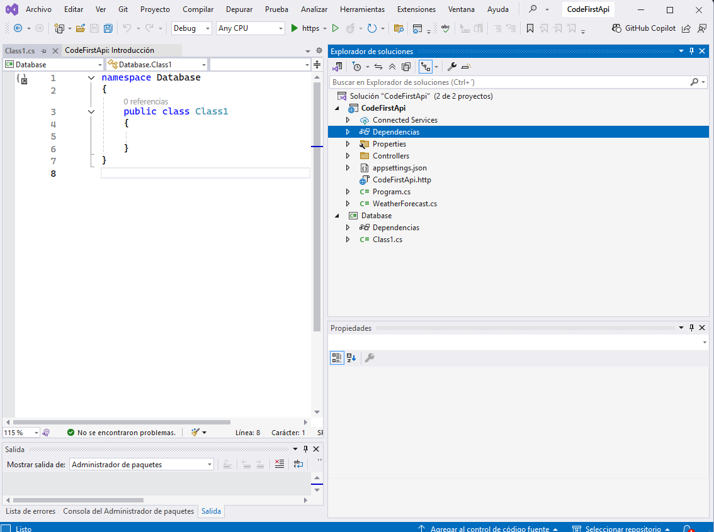  

## Paso 2. Instalación de paquetes

### Paso 2.1 Instalación de paquetes en el proyecto de tipo Biblioteca de clases

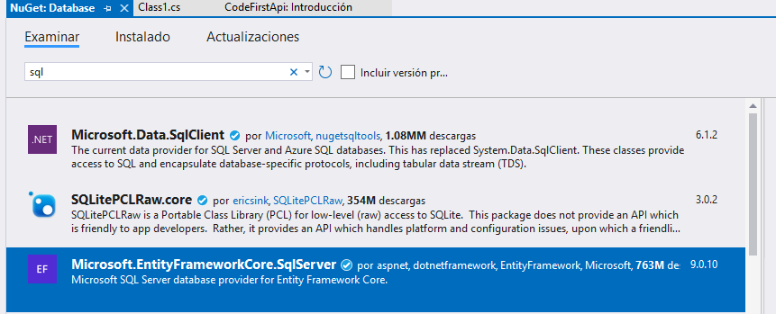  

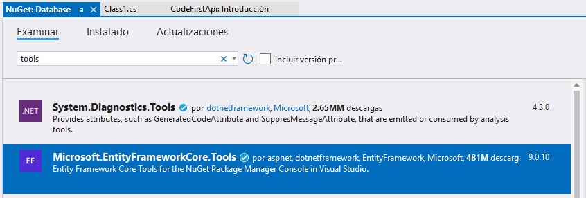 

### Paso 2.2 Instalación de paquete en el proyecto de tipo ASP.NET Core Web API

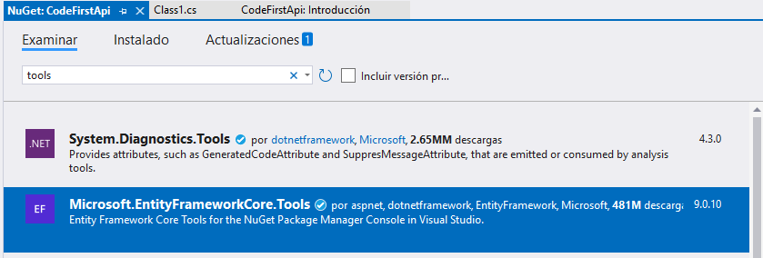  

## Paso 3. Configurar el DbContext

:books: El Contexto es una pieza central de comunicación entre la aplicación y la base de datos. Esta configuración se realizará en el proyecto de tipo `Biblioteca de clases`, que este ejemplo se llama **Database**.  

## Paso 3.1 Agregar una clase para el contexto

Debido a que ya se dispone de una clase llamada **Class1.cs** vamos a cambiar el nombre a esta clase. El nuevo nombre será **InventarioContext.cs**. Luego configura la clase como sigue:  

:books:  Nota. La clase **InventarioContext** va a heredar las características de la clase **DbContext** que pertenece al espacio de nombres **Microsoft.EntityFrameworkCore** y en el constructor va a recibir un objeto de tipo **DbContextOptions<InventarioContext>** mediante inyección de dependencias.  

```cs
using Microsoft.EntityFrameworkCore;

namespace Database
{
    public class InventarioContext:DbContext
    {
        public InventarioContext(DbContextOptions<InventarioContext> options):base(options)
        {
            
        }
    }
}
```

### Paso 3.2 Agregar clases para los modelos

:books:  Nota. Las clases del modelo van a importar dos espacios de nombres `using System.ComponentModel.DataAnnotations` y `using System.ComponentModel.DataAnnotations.Schema;`,  


- **using System.ComponentModel.DataAnnotations;** En este namespace se encuentran las anotaciones ***Key, ForeignKey, etc***.  
- **using System.ComponentModel.DataAnnotations.Schema;** En este namespace se encuentra las anotaciones ***DatabaseGenerated, DatabaseGeneratedOption, etc.***  

#### Paso 3.2.1 Agregar la clase Marca

```cs
using System;
using System.Collections.Generic;
using System.ComponentModel.DataAnnotations;
using System.ComponentModel.DataAnnotations.Schema;
using System.Linq;
using System.Text;
using System.Threading.Tasks;

namespace Database
{
    public class Marca
    {
        [Key] // Indica que la propiedad Id será la Primary Key
        [DatabaseGenerated(DatabaseGeneratedOption.Identity)] // Indica que Id va a tener un valor autogenerado: 1,2,3,..., n
        public int Id { get; set; }
        public string Nombre { get; set; }
        public virtual ICollection<Producto> Productos { get; set; } // Crea en la marca una colección de productos.
    }
}
```

#### Paso 3.2.2 Agregar la clase Producto

```cs
using System;
using System.Collections.Generic;
using System.ComponentModel.DataAnnotations;
using System.ComponentModel.DataAnnotations.Schema;
using System.Linq;
using System.Text;
using System.Threading.Tasks;

namespace Database
{
    public class Producto
    {
        [Key]
        [DatabaseGenerated(DatabaseGeneratedOption.Identity)]
        public int Id { get; set; }
        public string Nombre { get; set; }
        public int MarcaId { get; set; }

        [ForeignKey("MarcaId")] // Esta anotación corresponde a la propiedad Marca y permite vincular al objeto Marca mediante la propiedad MarcaId.
        public virtual Marca Marca { get; set; } // Permite obtener la marca de un producto.
    }
}
```

#### Paso 3.2.3 Agregar la clase Cliente

```cs
using System;
using System.Collections.Generic;
using System.ComponentModel.DataAnnotations;
using System.ComponentModel.DataAnnotations.Schema;
using System.Linq;
using System.Text;
using System.Threading.Tasks;

namespace Database
{
    public class Cliente
    {
        [Key]
        [DatabaseGenerated(DatabaseGeneratedOption.Identity)]
        public int Id { get; set; }
        [MaxLength(50)]
        public string Nombre { get; set; }
        [MaxLength(15)]
        public string Telefono { get; set; }
        [MaxLength(100)]
        public string Correo { get; set; }
        [MaxLength(200)]
        public string Direccion { get; set; }
    }
}
```

#### Paso 3.2.4 Agregar la clase Usuario

```cs
using System;
using System.Collections.Generic;
using System.ComponentModel.DataAnnotations;
using System.ComponentModel.DataAnnotations.Schema;
using System.Linq;
using System.Text;
using System.Threading.Tasks;

namespace Database
{
    public class Usuario
    {
        [Key]
        [DatabaseGenerated(DatabaseGeneratedOption.Identity)]
        public int Id { get; set; }
        [Required]
        [MaxLength(75)]
        public string Nombre { get; set; }
        [Required]
        [MaxLength(150)]
        public string Email { get; set; }
        [MaxLength(64)]
        public string Clave { get; set; }
    }
}
```

### Paso 3.3 Agregar las entidades a la clase de contexto  

```cs
using Microsoft.EntityFrameworkCore;

namespace Database
{
    public class InventarioContext:DbContext
    {
        public InventarioContext(DbContextOptions<InventarioContext> options):base(options)
        {
            
        }
        public DbSet<Producto> Productos { get; set; }
        public DbSet<Marca> Marcas { get; set; }
        public DbSet<Cliente> Clientes { get; set; }
        public DbSet<Usuario> Usuarios { get; set; }
    }
}
```

### Paso 3.3 (Opcional) Sobrescribir el método OnModelCreating

:books: En este método se pueden realizar varias configuraciones opcionales, como por ejemplo especificar los nombres reales que tendrán las tablas en la base de datos. Como ya se mencionó este proceso es opcional.

```cs
using Microsoft.EntityFrameworkCore;

namespace Database
{
    public class InventarioContext:DbContext
    {
        // ✂️ CÓDIGO OMITIDO
        protected override void OnModelCreating(ModelBuilder modelBuilder)
        {
            modelBuilder.Entity<Producto>().ToTable("Productos");
            modelBuilder.Entity<Marca>().ToTable("Marcas");
            modelBuilder.Entity<Cliente>().ToTable("Clientes");
            modelBuilder.Entity<Usuario>().ToTable("Usuarios");
        }
    }
}
```

## Paso 4. Agregar referencia entre proyectos.  

:books: En el proyecto de tipo `ASP.NET Core Web API` que es el proyecto llamado **CodeFirst**, agregue una referencia al proyecto de tipo `Biblioteca de clases` llamado **Database**.  

Haga clic derecho en **Dependencias** y luego, haga clic en la opción **Agregar referencia del proyecto...**  

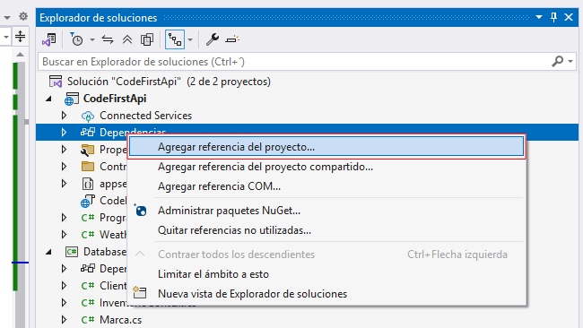  

Seleccione el proyecto **Database** y haga clic en **Aceptar**  

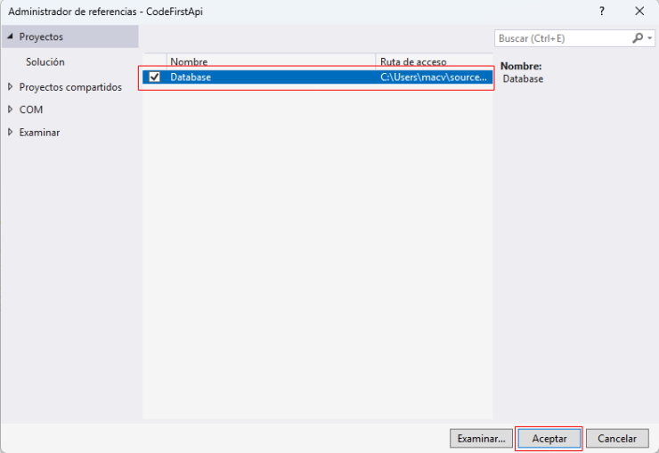  

## Paso 5. Agregar la cadena de conexión 

:books: La cadena de conexión se agregará al proyecto de tipo `ASP.NET Core Web API` que se llama **CodeFirst**. La cadena de conexión se agrega en el archivo `appsettings.json`  

El archivo `appsettings.json` original tiene el siguiente contenido:  

```cs
{
  "Logging": {
    "LogLevel": {
      "Default": "Information",
      "Microsoft.AspNetCore": "Warning"
    }
  },
  "AllowedHosts": "*"
}
```

El archivo `appsettings.json` modificado tendrá el siguiente contenido:  

```cs
{
  "Logging": {
    "LogLevel": {
      "Default": "Information",
      "Microsoft.AspNetCore": "Warning"
    }
  },
  "AllowedHosts": "*" /* se agregó desde aquí */,
  "ConnectionStrings": {
    "CodeFirstConnection": "Server=ITCHAD32;Database=Inventario;Uid=sa;Pwd=adminsql;Trust Server Certificate=true;MultipleActiveResultSets=true;"
  }
  /*hasta aquí*/
}
```

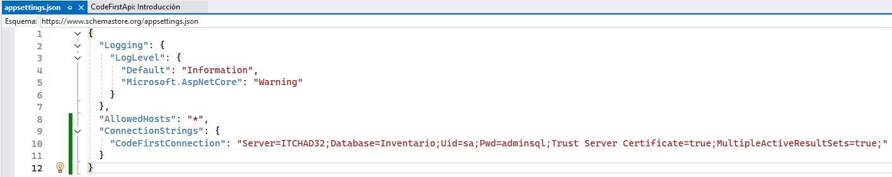  

## Paso 6. Configurar la inyección de dependencias y la ejecución de las migraciones.

:books: Nota. En este paso, se va a modificar el archivo `Program.cs` para delegar la creación de objetos mediante inyección de dependencias y además, se agregará un bloque de código para que cuando la aplicación de tipo `ASP.NET Core Web API` (CodeFirstApi) se ejecute por primera vez, se ejecuten también las migraciones iniciales.

:warning: Advertencia. El bloque de las migraciones solo debe estar activo para la primera ejecución del proyecto `ASP.NET Core Web API`.  Luego, estas líneas deben ser comentadas o borradas.  

Contenido original de ***Program.cs***  

```cs
var builder = WebApplication.CreateBuilder(args);

// Add services to the container.

builder.Services.AddControllers();
// Learn more about configuring OpenAPI at https://aka.ms/aspnet/openapi
builder.Services.AddOpenApi();

var app = builder.Build();

// Configure the HTTP request pipeline.
if (app.Environment.IsDevelopment())
{
    app.MapOpenApi();
}

app.UseHttpsRedirection();

app.UseAuthorization();

app.MapControllers();

app.Run();
```

Contenido modificado de ***Program.cs***  

```cs
using Database; // 👈 Línea agregada
using Microsoft.EntityFrameworkCore; // 👈 Línea agregada

var builder = WebApplication.CreateBuilder(args);

// Add services to the container.

builder.Services.AddControllers();
// Learn more about configuring OpenAPI at https://aka.ms/aspnet/openapi
builder.Services.AddOpenApi();

// 👇 BLOQUE 1 - Bloque agregado para la inyección de dependencias
builder.Services.AddDbContext<InventarioContext>(options =>
{
    options.UseSqlServer(builder.Configuration.GetConnectionString("CodeFirstConnection"));
});
// 👆 Bloque agregado para la inyección de dependencias

var app = builder.Build();


// 👇 BLOQUE 2. Bloque agregado para que se ejecute la migración inicial
using (var scope = app.Services.CreateScope())
{
    var context = scope.ServiceProvider.GetRequiredService<InventarioContext>();
    context.Database.Migrate();
}
// 👆 Bloque agregado para que se ejecute la migración inicial

// Configure the HTTP request pipeline.
if (app.Environment.IsDevelopment())
{
    app.MapOpenApi();
}

app.UseHttpsRedirection();

app.UseAuthorization();

app.MapControllers();

app.Run();

```

:books: **Notas**.  
- El objetivo del `BLOQUE 1` es aplicar inyección de dependencias, que consiste en la creación automática de los objetos a medida son requeridos en los controladores. Además, establece conectividad con la base de datos.  
- El objetivo del `BLOQUE 2` es ejecutar las `migraciones` la primera vez que se ejecute el proyecto de tipo `ASP.NET Core Web API`, es decir, el proyecto `CodeFirst`. :ant: Esto también se puede hacer con `Update-Database`  
- Hasta este punto (de la guía) las migraciones aún no están credas; pero luego se crearán, antes de ejecutar la aplicación.  
- El bloque de las migraciones (`BLOQUE 2`) debe ser comentado o borrado después de ejecutar la aplicación la primera vez.  

## Paso 7. Establezca el proyecto de inicio.


:books: Notas  

* Asegúrese que el proyecto de inicio sea `CodeFirstApi`. 🔅 Como el primer proyecto creado es el proyecto que queremos como proyecto de inicio, puede saltar este paso pero antes note que el nombre `CodeFirstApi` está en letras negrillas (ese es el proyecto de inicio).  
* Para establecer un proyecto como proyecto de inicio haga lo siguiente:  
    * Clic derecho en el nombre del proyecto.  
    * Clic en `Establecer como proyecto de inicio`  

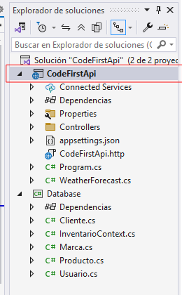  

## Paso 8. Agregue las migraciones iniciales.  

a) Clic en menú **Herramientas**  
b) Clic en **Administrador de paquetes NuGet**  
c) Clic en **Consola del Administrador de paquetes**  
d) Establezca al proyecto `Database` como proyecto de destino para las migraciones.

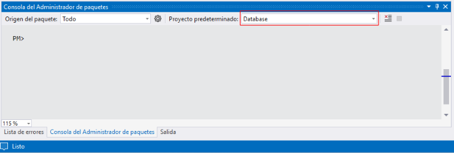  

e) Agregue las migraciones.  

```bash
Add-Migration InitDB
```

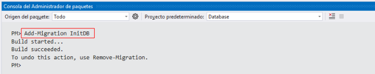  

Archivos creados con el comando `Add-Migration InitDB` 

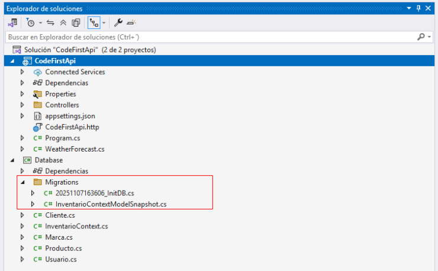  

:warning: En un proyecto del tipo `ASP.NET Core (Model-View-Controller) tuve problemas a la hora de ejecutar el comando para la migración inicial. Aparentemente no conocía los ensamblados de las referencias de Microsoft.EntityFrameworkCore, Microsoft.EntityFrameworkCore.Tools y Microsoft.EntityFrameworkCore.SqlServer. Finalmente, creo que el problema se debía a qué nunca había ejecutado la aplicación aún (pero no me refiero al proyecto ya configurado en su totalidad sino solo para que reconozca las instrucciones using Microsoft.EntityFrameworkCore; que se ha usado en Program.cs y en la clase del contexto).  

[Ver contenido de la migración inicial](./20251107163606_InitDB.cs)  

## Paso 9. Ejecutar solución.  

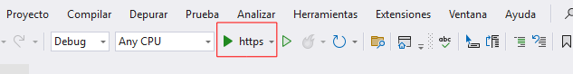    

:books: Cuando ejecute la solución, automáticamente se ejecutará el proyecto de tipo  `ASP.NET Core Web API` porque lo configuramos como proyecto de inicio.  

En la siguiente imagen se muestran las tablas creadas cuando se ejecutó la solución.  

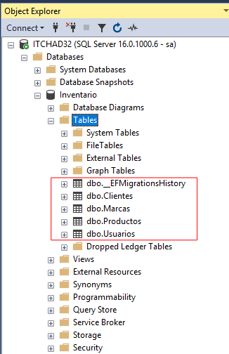  

:warning: Alterta. Ahora comente o borre del archivo `Program.cs` el `BLOQUE 2` que se encarga de ejecutar las migraciones iniciales para que la próxima vez que ejecute la solución yo no ejecute las migraciones iniciales.  


## Paso 10. Agregar un controllador

Haga clic derecho en **Controllers**  

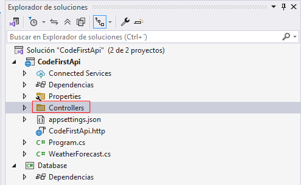  

Seleccione **Agregar**  

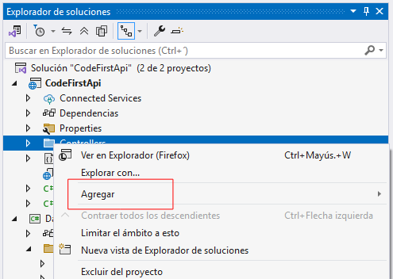  

Haga clic en **Controlador...**  

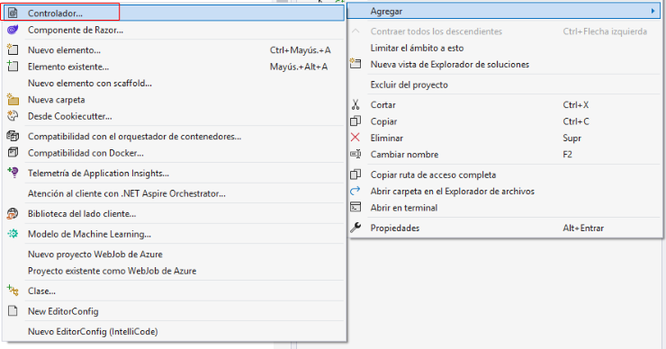  

Seleccione **Controlador de MVC:en blanco** y haga clic en **Agregar**  

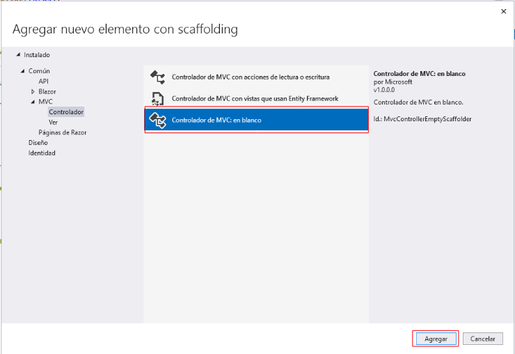  

Escriba un **Nombre** para el controlador y haga clic en **Agregar**  

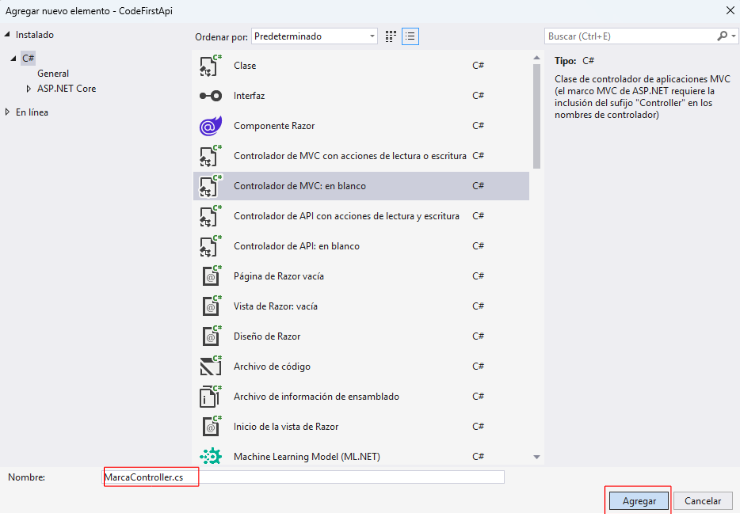  

Este es el código del controlador creado: 

```cs
using Microsoft.AspNetCore.Mvc;

namespace CodeFirstApi.Controllers
{
    public class MarcaController : Controller
    {
        public IActionResult Index()
        {
            return View();
        }
    }
}
```

Agrega métdos al controlador **MarcaController**  

```cs
using Database;
using Microsoft.AspNetCore.Mvc;

namespace CodeFirstApi.Controllers
{
    [ApiController]
    [Route("api/[controller]")]
    public class MarcaController : Controller
    {
        private InventarioContext _context;
        public MarcaController(InventarioContext context)
        {
            _context = context;
        }
        [HttpGet]
        public ActionResult<Marca> Index()
        {
            var data = _context.Marcas.ToList();
            return Ok(data);
        }
        [HttpGet("{id}")]
        public ActionResult<Marca> GetById(int id)
        {
            var marca = _context.Marcas.FirstOrDefault(a => a.Id == id);
            if (marca == null) return NotFound();
            return Ok(marca);
        }
    }
}
```

## Paso 11. Agregue datos a la tabla Marcas

:books: Para proba la aplicación será necesario agregar algunas marcas a la tabla **Marcas**.  

## Paso 12. Pruebe la aplicación.

Ejecute la aplicación.

 

Note en qué puerto está corriendo la aplicación para que haga las pruebas en Postman  

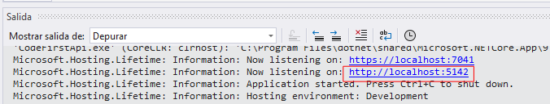 

***Ingrese a Postman y haga pruebas***

Ver todas las marcas:  

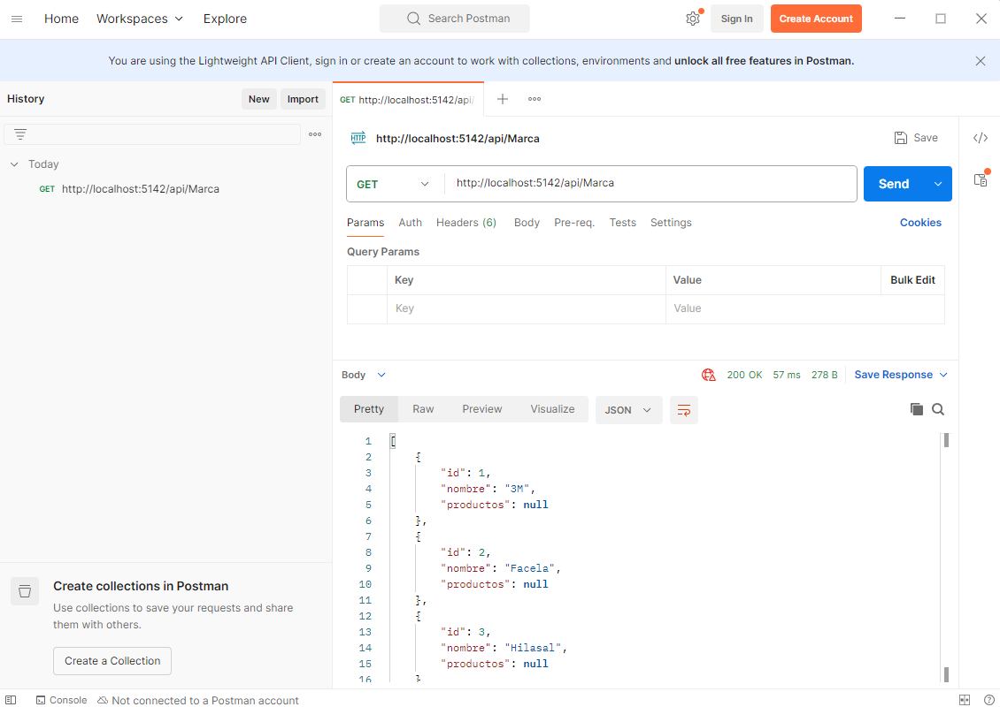 

Ver la marca con ID 1:  

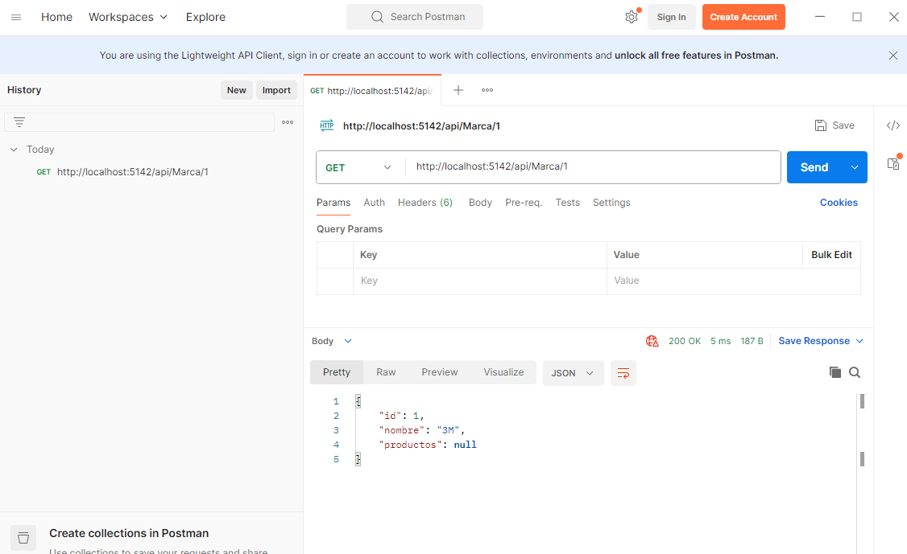 


## Referencia

https://youtu.be/x1zjZUZJ6UA
