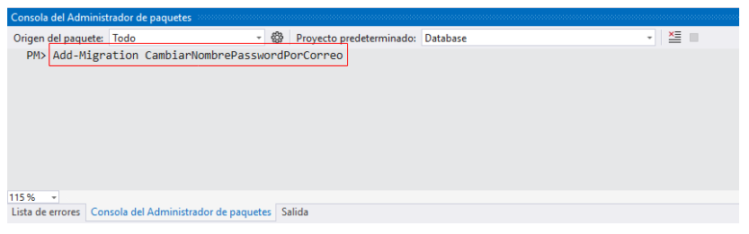

# Seeders


## 1. Modificando la clase Usuario

Se cambiará la propiedad `Email` por `Correo` para que todo se encuentre en español.

```csharp
// ✂️ código omitido

namespace Database
{
    public class Usuario
    {
        // ✂️ código omitido
        public string Correo { get; set; } // 👈 Cambié la palabra Email por Correo
        [MaxLength(64)]
        public string Clave { get; set; }
    }
}
```

2. Agregando una migración para el cambio de nombre.

```bash
Add-Migration CambiarNombrePasswordPorCorreo
```

  

Contenido de la migración creada:  

```csharp
using Microsoft.EntityFrameworkCore.Migrations;

#nullable disable

namespace Database.Migrations
{
    /// <inheritdoc />
    public partial class CambiarNombrePasswordPorCorreo : Migration
    {
        /// <inheritdoc />
        protected override void Up(MigrationBuilder migrationBuilder)
        {
            migrationBuilder.RenameColumn(
                name: "Email",
                table: "Usuarios",
                newName: "Correo");
        }

        /// <inheritdoc />
        protected override void Down(MigrationBuilder migrationBuilder)
        {
            migrationBuilder.RenameColumn(
                name: "Correo",
                table: "Usuarios",
                newName: "Email");
        }
    }
}
```

## 3. Actualizar la base de datos a la migración más reciente

:books: Nota. Con el siguiente comando se aplicará el cambio en la base de datos.

```
Update-Database
```

:information_source: Si se quiere actualizar la base de datos a una migración específica, se puede ejecutar un comando como el anterior; pero indicando el nombre de la migración a la cual se actualizar la base de datos, por ejemplo `Update-Database AddNewTables`. Otro ejemplo sería volver volver a la migración inicial con `Update-Database InitDB` y es totalmente funcional.   

## 4. Insertando datos iniciales

```cs
using Microsoft.EntityFrameworkCore;

namespace Database
{
    public class InventarioContext:DbContext
    {
        public InventarioContext(DbContextOptions<InventarioContext> options):base(options)
        {
            
        }
        public DbSet<Producto> Productos { get; set; }
        public DbSet<Marca> Marcas { get; set; }
        public DbSet<Cliente> Clientes { get; set; }
        public DbSet<Usuario> Usuarios { get; set; }
        protected override void OnModelCreating(ModelBuilder modelBuilder)
        {
            // ✂️ CÓDIGO OMITIDO
            modelBuilder.Entity<Usuario>().HasData(
                new Usuario { Nombre = "miguel", Correo = "mcortez_vasquez@yahoo.com", Clave="UnaClave"},
                new Usuario { Nombre = "andrea", Correo = "andrea@gmail.com", Clave = "UnaClave" },
                new Usuario { Nombre = "daniel", Correo = "daniel@gmail.com", Clave = "UnaClave" }
            );
        }
    }
}
```

  

:warning: Luego de investigar supe que ***en los seeders se deben enviar los valore para el ID*** auún cuando el `Id` ha sido definido como autogenerado y esto es normal en `Entity Framework Core` y sirve para hacer comparaciones, porque estos datos no se ingresan en tiempo de ejecución.  

:information_source: La solución es enviar un ID específico para cada usuario.  


```cs
using Microsoft.EntityFrameworkCore;

namespace Database
{
    public class InventarioContext:DbContext
    {
        public InventarioContext(DbContextOptions<InventarioContext> options):base(options)
        {
            
        }
        public DbSet<Producto> Productos { get; set; }
        public DbSet<Marca> Marcas { get; set; }
        public DbSet<Cliente> Clientes { get; set; }
        public DbSet<Usuario> Usuarios { get; set; }
        protected override void OnModelCreating(ModelBuilder modelBuilder)
        {
            // ✂️ CÓDIGO OMITIDO
            modelBuilder.Entity<Usuario>().HasData(
                new Usuario { Id=1, Nombre = "miguel", Correo = "mcortez_vasquez@yahoo.com", Clave="UnaClave"},
                new Usuario { Id=2, Nombre = "andrea", Correo = "andrea@gmail.com", Clave = "UnaClave" },
                new Usuario { Id=3, Nombre = "daniel", Correo = "daniel@gmail.com", Clave = "UnaClave" }
            );
        }
    }
}
```

:zap: Para insertar los datos en la base de datos se debe ejecutar la nueva migración. No existe un comando especial para los seeders.  

El siguiente comando insertará los datos en la base de datos:  

```
Update-Database
```

## Otras formas de hacer los seeds

### Forma 2

:books: Tal como se creé el seeder anterior es funcional; pero el problema puede aparecer si estamos trabajando para una empresa y necesita insertar muchos datos en elos seeders obteniendo al final un archivo demasiado grande.  

En esta segunda forma se creará una clase y luego se va a instanciar esta clase en el método `OnModelCreating` del `DbContext` (InventarioContext).  

La carpeta **:file_folder: Seeds** se creó manualmente con `Clic derecho > Agregar > Nueva carpeta` en el proyecto `Database`  

De igual forma, la clase **:cl: UsuarioSeed** se creó de forma manual.  

  

Contenido de la clase **:cl: UsuarioSeed**  

```cs
using Microsoft.EntityFrameworkCore;
using System;
using System.Collections.Generic;
using System.Linq;
using System.Text;
using System.Threading.Tasks;

namespace Database.Seeds
{
    public class UsuarioSeed
    {
        public UsuarioSeed(ModelBuilder modelBuilder)
        {
            modelBuilder.Entity<Usuario>().HasData(
                new Usuario { Id = 1, Nombre = "miguel", Correo = "mcortez_vasquez@yahoo.com", Clave = "UnaClave" },
                new Usuario { Id = 2, Nombre = "andrea", Correo = "andrea@gmail.com", Clave = "UnaClave" },
                new Usuario { Id = 3, Nombre = "daniel", Correo = "daniel@gmail.com", Clave = "UnaClave" }
            );
        }
    }
}
```

Modificación de **InventarioContext**  

```cs
using Database.Seeds;
using Microsoft.EntityFrameworkCore;

namespace Database
{
    public class InventarioContext:DbContext
    {
        public InventarioContext(DbContextOptions<InventarioContext> options):base(options)
        {
            
        }
        // ✂️| código omitido
        protected override void OnModelCreating(ModelBuilder modelBuilder)
        {
            // ✂️ código omitido
            new UsuarioSeed(modelBuilder); // 👈 línea agregada
        }
    }
}
```

Agregar la migración:  

```
Add-Migration AgregarUsuarioSeed
```

Ejecutar la migración:  

```
Update-Database
```

### :white_check_mark: Forma 3. Recomendada

  

:books: Lo que se hará siempre es crear una clase `UsuarioSeed`; pero esta clase va a heredar de `IEntityTypeConfiguration<Clase>`, donde ***Clase** será la clase `Usuario` que pasaremos al tipo genérico y luego, implementamos la interfaz para que genere el método `Configure` que es donde vamos a agregar los datos para el seeder.   

Contenido de la clase `UsuarioSeed` 

```cs
using Microsoft.EntityFrameworkCore;
using Microsoft.EntityFrameworkCore.Metadata.Builders;
using System;
using System.Collections.Generic;
using System.Linq;
using System.Reflection.Emit;
using System.Text;
using System.Threading.Tasks;

namespace Database.Seeds
{
    public class UsuarioSeed:IEntityTypeConfiguration<Usuario>
    {
        public void Configure(EntityTypeBuilder<Usuario> builder)
        {
            builder.HasData(
                new Usuario { Id = 1, Nombre = "miguel", Correo = "mcortez_vasquez@yahoo.com", Clave = "UnaClave" },
                new Usuario { Id = 2, Nombre = "andrea", Correo = "andrea@gmail.com", Clave = "UnaClave" },
                new Usuario { Id = 3, Nombre = "daniel", Correo = "daniel@gmail.com", Clave = "UnaClave" }
            );
        }
    }
}
```

Modificamos el `DbContext` (**InventarioContext**)  

```cs
using Database.Seeds;
using Microsoft.EntityFrameworkCore;

namespace Database
{
    public class InventarioContext:DbContext
    {
        public InventarioContext(DbContextOptions<InventarioContext> options):base(options)
        {
            
        }
        // ✂️ código omitido.
        protected override void OnModelCreating(ModelBuilder modelBuilder)
        {
            // ✂️ código omitido
            modelBuilder.ApplyConfiguration(new UsuarioSeed()); // 👈 línea para que se ejecute el seeder.
        }
    }
}
```

Agregar la migración:  

```
Add-Migration AgregarUsuarioSeed
```

Ejecutar la migración:  

```
Update-Database
```


:fallen_leaf: **Otra recomenadación**. Hay una forma más práctica que podría se de utilidad investigar y es utilizar `modelBuilder.ApplyConfigurationsFromAssembly(typeof(...).Assembly);`, por ejemplo `modelBuilder.ApplyConfigurationsFromAssembly(typeof(InventarioContext).Assembly);`   

