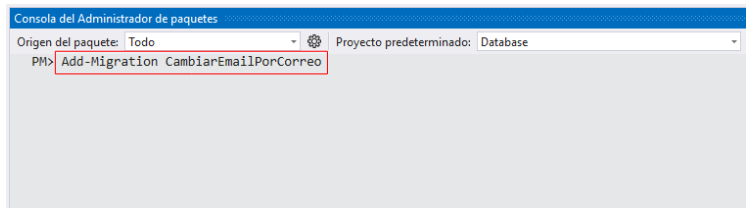

# Cambiar una propiedad mediante migraciones


## 1. Modificando la clase Usuario

Se cambiará la propiedad `Email` por `Correo`.    


```csharp
// ✂️ código omitido

namespace Database
{
    public class Usuario
    {
        // ✂️ código omitido
        public string Correo { get; set; } // 👈 Cambié la palabra Email por Correo
        [MaxLength(64)]
        public string Clave { get; set; }
    }
}
```

## 2. Agregando una migración para el cambio de nombre

```bash
Add-Migration CambiarEmailPorCorreo
```

   


Contenido de la migración creada:  

```csharp
using Microsoft.EntityFrameworkCore.Migrations;

#nullable disable

namespace Database.Migrations
{
    /// <inheritdoc />
    public partial class CambiarEmailPorCorreo : Migration
    {
        /// <inheritdoc />
        protected override void Up(MigrationBuilder migrationBuilder)
        {
            migrationBuilder.RenameColumn(
                name: "Email",
                table: "Usuarios",
                newName: "Correo");
        }

        /// <inheritdoc />
        protected override void Down(MigrationBuilder migrationBuilder)
        {
            migrationBuilder.RenameColumn(
                name: "Correo",
                table: "Usuarios",
                newName: "Email");
        }
    }
}
```

## 3. Actualizar la base de datos a la migración más reciente

:books: Nota. Con el siguiente comando se aplicará el cambio en la base de datos.

```
Update-Database
```

:information_source: Si quiere actualizar la base de datos a una migración específica, puede ejecutar un comando como el anterior; pero indicando el nombre de la migración a la cual se actualizará la base de datos.  

Ejemplos:  

`Update-Database AddNewTables`  

`Update-Database InitDB`  
