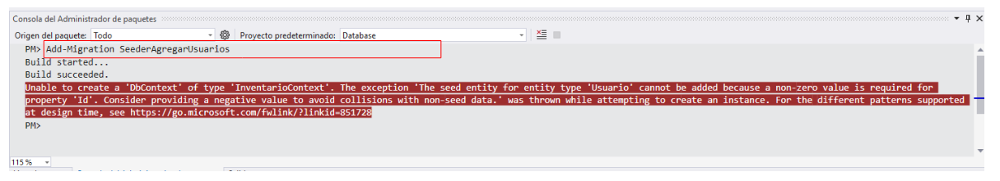
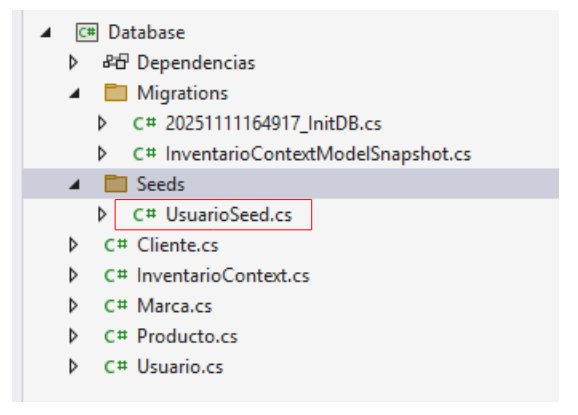

# Datos iniciales mediante seeders

:books: En esta guía se explicarán tres formas de insertar datos iniciales en la base de datos.

## FORMA 1

### Agregar los datos predeterminados en el método OnModelCreating

```cs
using Microsoft.EntityFrameworkCore;

namespace Database
{
    public class InventarioContext:DbContext
    {
        public InventarioContext(DbContextOptions<InventarioContext> options):base(options)
        {
            
        }
        public DbSet<Producto> Productos { get; set; }
        public DbSet<Marca> Marcas { get; set; }
        public DbSet<Cliente> Clientes { get; set; }
        public DbSet<Usuario> Usuarios { get; set; }
        protected override void OnModelCreating(ModelBuilder modelBuilder)
        {
            // ✂️ CÓDIGO OMITIDO
            modelBuilder.Entity<Usuario>().HasData(
                new Usuario { Nombre = "miguel", Correo = "mcortez_vasquez@yahoo.com", Clave="8c6976e5b5410415bde908bd4dee15dfb167a9c873fc4bb8a81f6f2ab448a918"},
                new Usuario { Nombre = "andrea", Correo = "andrea@gmail.com", Clave = "6bab3007f56e2a9175ff1222c2654ddcd08fa7981a1ddc42f1d95cfbd80ede47" },
                new Usuario { Nombre = "daniel", Correo = "daniel@gmail.com", Clave = "a29bb351ab7025926eb34a77f0485a0f8ab9dc993009f990cbd8eabbf0d947e3" }
            );
        }
    }
}
```

### Crear una migración para los datos predeterminados

```
Add-Migration SeederAgregarUsuarios
```

  

:warning: Luego de investigar supe que ***en los seeders se deben enviar los valores para el ID*** aún cuando el `Id` ha sido definido como autogenerado y esto es normal en `Entity Framework Core`. La razón es que los `IDs` son utilizados para hacer comparaciones a la hora de actualizar la base de datos o cuando se revierten migraciones. Esto es porque los datos no se ingresan en tiempo de ejecución, sino cuando ejecuta el comando `Update-Database` o `Update-Database <NombreMigracion>` 

:information_source: La solución es asignar un `ID` específico a cada usuario. A continuación se muestra el contenido del archivo anterior; pero con `IDs` asignados de forma estática.    


```cs
using Microsoft.EntityFrameworkCore;

namespace Database
{
    public class InventarioContext:DbContext
    {
        public InventarioContext(DbContextOptions<InventarioContext> options):base(options)
        {
            
        }
        public DbSet<Producto> Productos { get; set; }
        public DbSet<Marca> Marcas { get; set; }
        public DbSet<Cliente> Clientes { get; set; }
        public DbSet<Usuario> Usuarios { get; set; }
        protected override void OnModelCreating(ModelBuilder modelBuilder)
        {
            // ✂️ CÓDIGO OMITIDO
            modelBuilder.Entity<Usuario>().HasData(
                new Usuario { Id=1, Nombre = "miguel", Correo = "mcortez_vasquez@yahoo.com", Clave="8c6976e5b5410415bde908bd4dee15dfb167a9c873fc4bb8a81f6f2ab448a918"},
                new Usuario { Id=2, Nombre = "andrea", Correo = "andrea@gmail.com", Clave = "6bab3007f56e2a9175ff1222c2654ddcd08fa7981a1ddc42f1d95cfbd80ede47" },
                new Usuario { Id=3, Nombre = "daniel", Correo = "daniel@gmail.com", Clave = "a29bb351ab7025926eb34a77f0485a0f8ab9dc993009f990cbd8eabbf0d947e3" }
            );
        }
    }
}
```

```
Add-Migration SeederAgregarUsuarios
```

### Ejecutar la migración correspondiente a los datos iniciales

:books: No existen comandos específicos para insertar los datos iniciales (seeders). Lo único que se tiene que hacer es actualizar la base de datos con la última migración (asumiendo que la última migración corresponde a los datos iniciales - seeders). En caso contrario, será necesario indicar el nombre de la migración.  

El siguiente comando insertará los datos en la base de datos:  

```
Update-Database
```

## FORMA 2

:books: Insertar datos iniciales como se hizo en la `FORMA 1` es funcional; pero puede ser un problema si tenemos muchos datos iniciales que harían crecer de forma desmedida el método `OnModelCreating`  

En esta segunda forma se creará una clase que va a contener los datos iniciales y luego se va a instanciar en el método `OnModelCreating` de `InventarioContext` 

### Agregar una carpeta llama Seeds  

La carpeta **:file_folder: Seeds** se creó manualmente con `Clic derecho > Agregar > Nueva carpeta` en el proyecto `Database`  

### Agregar una clase llamada UsuarioSeed  

De igual forma, la clase **:cl: UsuarioSeed** se creó manualmente.  

  

Contenido de la clase **:cl: UsuarioSeed**  

```cs
using Microsoft.EntityFrameworkCore;
using System;
using System.Collections.Generic;
using System.Linq;
using System.Text;
using System.Threading.Tasks;

namespace Database.Seeds
{
    public class UsuarioSeed
    {
        public UsuarioSeed(ModelBuilder modelBuilder)
        {
            modelBuilder.Entity<Usuario>().HasData(
                new Usuario { Id=1, Nombre = "miguel", Correo = "mcortez_vasquez@yahoo.com", Clave="8c6976e5b5410415bde908bd4dee15dfb167a9c873fc4bb8a81f6f2ab448a918"},
                new Usuario { Id=2, Nombre = "andrea", Correo = "andrea@gmail.com", Clave = "6bab3007f56e2a9175ff1222c2654ddcd08fa7981a1ddc42f1d95cfbd80ede47" },
                new Usuario { Id=3, Nombre = "daniel", Correo = "daniel@gmail.com", Clave = "a29bb351ab7025926eb34a77f0485a0f8ab9dc993009f990cbd8eabbf0d947e3" }
            );
        }
    }
}
```

### Modificar de InventarioContext  

```cs
using Database.Seeds;
using Microsoft.EntityFrameworkCore;

namespace Database
{
    public class InventarioContext:DbContext
    {
        public InventarioContext(DbContextOptions<InventarioContext> options):base(options)
        {
            
        }
        // ✂️| código omitido
        protected override void OnModelCreating(ModelBuilder modelBuilder)
        {
            // ✂️ código omitido
            new UsuarioSeed(modelBuilder); // 👈 línea agregada
        }
    }
}
```

### Agregar la migración  

```
Add-Migration AgregarUsuarioSeed
```

### Ejecutar la migración

```
Update-Database
```

## FORMA 3

  
:books: Tal como se hizo en la forma dos, vamos a crear una clase llamada `UsuarioSeed`; pero esta clase va a heredar de `IEntityTypeConfiguration<Clase>`, donde ***Clase** será la clase `Usuario` que pasaremos al tipo genérico y luego, implementamos la interfaz para que genere el método `Configure` que es donde vamos a agregar los datos para el seeder.   

### Agregar una carpeta llama Seeds  

La carpeta **:file_folder: Seeds** se creó manualmente con `Clic derecho > Agregar > Nueva carpeta` en el proyecto `Database`  

### Agregar una clase llamada UsuarioSeed  

De igual forma, la clase **:cl: UsuarioSeed** se creó manualmente.  

  

Contenido de la clase `UsuarioSeed` 

```cs
using Microsoft.EntityFrameworkCore;
using Microsoft.EntityFrameworkCore.Metadata.Builders;
using System;
using System.Collections.Generic;
using System.Linq;
using System.Reflection.Emit;
using System.Text;
using System.Threading.Tasks;

namespace Database.Seeds
{
    public class UsuarioSeed:IEntityTypeConfiguration<Usuario>
    {
        public void Configure(EntityTypeBuilder<Usuario> builder)
        {
            builder.HasData(
                new Usuario { Id=1, Nombre = "miguel", Correo = "mcortez_vasquez@yahoo.com", Clave="8c6976e5b5410415bde908bd4dee15dfb167a9c873fc4bb8a81f6f2ab448a918"},
                new Usuario { Id=2, Nombre = "andrea", Correo = "andrea@gmail.com", Clave = "6bab3007f56e2a9175ff1222c2654ddcd08fa7981a1ddc42f1d95cfbd80ede47" },
                new Usuario { Id=3, Nombre = "daniel", Correo = "daniel@gmail.com", Clave = "a29bb351ab7025926eb34a77f0485a0f8ab9dc993009f990cbd8eabbf0d947e3" }
            );
        }
    }
}
```

### Modificar InventarioContext

```cs
using Database.Seeds;
using Microsoft.EntityFrameworkCore;

namespace Database
{
    public class InventarioContext:DbContext
    {
        public InventarioContext(DbContextOptions<InventarioContext> options):base(options)
        {
            
        }
        // ✂️ código omitido.
        protected override void OnModelCreating(ModelBuilder modelBuilder)
        {
            // ✂️ código omitido
            modelBuilder.ApplyConfiguration(new UsuarioSeed()); // 👈 Línea para aplicar UsuarioSeed.
        }
    }
}
```

### Agregar la migración  

```
Add-Migration AgregarUsuarioSeed
```

### Ejecutar la migración  

```
Update-Database
```


:fallen_leaf: **Otra recomenadación**. Hay una forma más práctica que podría se de utilidad investigar y es utilizar `modelBuilder.ApplyConfigurationsFromAssembly(typeof(...).Assembly);`, por ejemplo `modelBuilder.ApplyConfigurationsFromAssembly(typeof(InventarioContext).Assembly);`   

