# Datos iniciales mediante seeders

:books: En esta guía se explicarán cuatro formas de insertar datos iniciales en la base de datos.

## FORMA 1

### 1.1 Agregar los datos predeterminados en el método OnModelCreating

```cs
using Microsoft.EntityFrameworkCore;

namespace Database
{
    public class InventarioContext:DbContext
    {
        public InventarioContext(DbContextOptions<InventarioContext> options):base(options)
        {
            
        }
        public DbSet<Producto> Productos { get; set; }
        public DbSet<Marca> Marcas { get; set; }
        public DbSet<Cliente> Clientes { get; set; }
        public DbSet<Usuario> Usuarios { get; set; }
        protected override void OnModelCreating(ModelBuilder modelBuilder)
        {
            // ✂️ CÓDIGO OMITIDO

            // 👇 Líneas agregadas
            modelBuilder.Entity<Usuario>().HasData(
                new Usuario { Nombre = "miguel", Correo = "mcortez_vasquez@yahoo.com", Clave="8c6976e5b5410415bde908bd4dee15dfb167a9c873fc4bb8a81f6f2ab448a918"},
                new Usuario { Nombre = "andrea", Correo = "andrea@gmail.com", Clave = "6bab3007f56e2a9175ff1222c2654ddcd08fa7981a1ddc42f1d95cfbd80ede47" },
                new Usuario { Nombre = "daniel", Correo = "daniel@gmail.com", Clave = "a29bb351ab7025926eb34a77f0485a0f8ab9dc993009f990cbd8eabbf0d947e3" }
            );
            // Hasta aquí
        }
    }
}
```

### 1.2 Crear una migración para los datos predeterminados

```
Add-Migration SeedUsuarios
```

❌ No se pudo agregar la migración.

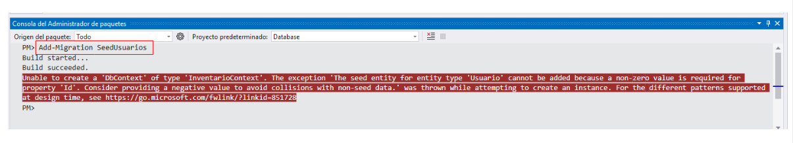  

✅ **Explicaciones**:

 - Luego de investigar supe que en los **seeding de datos** se deben enviar datos constantes y predecibles aún cuando `Id` haya sido definido como autogenerado.  

- La razón es que los valores constantes permiten hacer comparaciones a la hora de actualizar la base de datos o cuando se revierten migraciones.  

- Esto es porque los datos no se ingresan en tiempo de ejecución, sino, cuando se ejecutan las migraciones.  

- La solución es asignar un `Id` específico a cada usuario.  


📄 ***Asignando Id a cada usuario***  

```cs
using Microsoft.EntityFrameworkCore;

namespace Database
{
    public class InventarioContext:DbContext
    {
        public InventarioContext(DbContextOptions<InventarioContext> options):base(options)
        {
            
        }
        public DbSet<Producto> Productos { get; set; }
        public DbSet<Marca> Marcas { get; set; }
        public DbSet<Cliente> Clientes { get; set; }
        public DbSet<Usuario> Usuarios { get; set; }
        protected override void OnModelCreating(ModelBuilder modelBuilder)
        {
            // ✂️ CÓDIGO OMITIDO
            // 👇 Información de los usuarios incluyendo el Id para cada usuario
            modelBuilder.Entity<Usuario>().HasData(
                new Usuario { Id=1, Nombre = "miguel", Correo = "mcortez_vasquez@yahoo.com", Clave="8c6976e5b5410415bde908bd4dee15dfb167a9c873fc4bb8a81f6f2ab448a918"},
                new Usuario { Id=2, Nombre = "andrea", Correo = "andrea@gmail.com", Clave = "6bab3007f56e2a9175ff1222c2654ddcd08fa7981a1ddc42f1d95cfbd80ede47" },
                new Usuario { Id=3, Nombre = "daniel", Correo = "daniel@gmail.com", Clave = "a29bb351ab7025926eb34a77f0485a0f8ab9dc993009f990cbd8eabbf0d947e3" }
            );
            // 👆 Información de los usuarios
        }
    }
}
```

```bash
Add-Migration SeedUsuarios
```

Ahora sí se creó el archivo para la migración de usuarios  

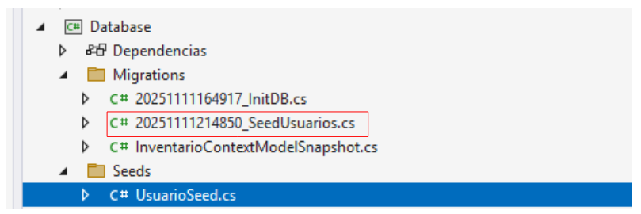  


### 1.3 Ejecutar la migración

El siguiente comando ejecuta la última migración creada. Como la última migración tiene la información para agregar usuarios, los usuarios serán agregados en la base de datos. No hay un comando específico para ejecutar seeds como ocurre en otros frameworks como Laravel por ejemplo.  

```
Update-Database
```

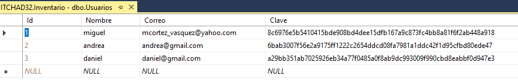  


## FORMA 2

:books: Insertar datos iniciales como se hizo en la `FORMA 1` es funcional; pero puede ser un problema si tenemos muchos datos iniciales que harían crecer de forma desmedida el método `OnModelCreating`  

En esta segunda forma se creará una clase llamada `UsuarioSeed` que va a contener los datos iniciales y luego se va a instanciar en el método `OnModelCreating` de `InventarioContext` 

### 2.1 Agregar una carpeta llama Seeds  

La carpeta **:file_folder: Seeds** se creó manualmente con `Clic derecho > Agregar > Nueva carpeta` en el proyecto `Database`  

### 2.2 Agregar una clase llamada UsuarioSeed  

De igual forma, la clase **:cl: UsuarioSeed** se creó manualmente.  

  

Contenido de la clase **:cl: UsuarioSeed**  

```cs
using Microsoft.EntityFrameworkCore;
using System;
using System.Collections.Generic;
using System.Linq;
using System.Text;
using System.Threading.Tasks;

namespace Database.Seeds
{
    public class UsuarioSeed
    {
        public UsuarioSeed(ModelBuilder modelBuilder)
        {
            modelBuilder.Entity<Usuario>().HasData(
                new Usuario { Id=1, Nombre = "miguel", Correo = "mcortez_vasquez@yahoo.com", Clave="8c6976e5b5410415bde908bd4dee15dfb167a9c873fc4bb8a81f6f2ab448a918"},
                new Usuario { Id=2, Nombre = "andrea", Correo = "andrea@gmail.com", Clave = "6bab3007f56e2a9175ff1222c2654ddcd08fa7981a1ddc42f1d95cfbd80ede47" },
                new Usuario { Id=3, Nombre = "daniel", Correo = "daniel@gmail.com", Clave = "a29bb351ab7025926eb34a77f0485a0f8ab9dc993009f990cbd8eabbf0d947e3" }
            );
        }
    }
}
```

:book: **Nota**. Los datos de los usuarios fueron agregados en el constructor de la clase UsuarioSeed.  

### 2.3 Modificar de InventarioContext  

```cs
using Database.Seeds;
using Microsoft.EntityFrameworkCore;

namespace Database
{
    public class InventarioContext:DbContext
    {
        public InventarioContext(DbContextOptions<InventarioContext> options):base(options)
        {
            
        }
        // ✂️| código omitido
        protected override void OnModelCreating(ModelBuilder modelBuilder)
        {
            // ✂️ código omitido
            new UsuarioSeed(modelBuilder); // 👈 Línea agregada para crear una instancia de la clase UsuarioSeed.
            new MonedaSeed(modelBuilder), // Así puede seguir agregando más datos ininiciales para otras tablas.
            ...
        }
    }
}
```

### 2.4 Agregar la migración  

```
Add-Migration SeedUsuarios
```

### 2.5 Ejecutar la migración

```
Update-Database
```

## FORMA 3

  
:books: Tal como se hizo en la forma dos, vamos a crear una clase llamada `UsuarioSeed`; pero esta clase va a heredar de `IEntityTypeConfiguration<T>`, donde ***T** será la clase `Usuario` que pasaremos al tipo genérico y luego, vamos a implementar la interfaz para que genere el método `Configure` que es donde serán agregados los datos de los usuarios.   

### 3.1 Agregar una carpeta llama Seeds  

La carpeta **:file_folder: Seeds** se creó manualmente con `Clic derecho > Agregar > Nueva carpeta` en el proyecto `Database`  

### 3.2 Agregar una clase llamada UsuarioSeed  

De igual forma, la clase **:cl: UsuarioSeed** se creó manualmente.  

  

Contenido de la clase `UsuarioSeed` 

```cs
using Microsoft.EntityFrameworkCore;
using Microsoft.EntityFrameworkCore.Metadata.Builders;
using System;
using System.Collections.Generic;
using System.Linq;
using System.Reflection.Emit;
using System.Text;
using System.Threading.Tasks;

namespace Database.Seeds
{
    public class UsuarioSeed:IEntityTypeConfiguration<Usuario>
    {
        public void Configure(EntityTypeBuilder<Usuario> builder)
        {
            builder.HasData(
                new Usuario { Id=1, Nombre = "miguel", Correo = "mcortez_vasquez@yahoo.com", Clave="8c6976e5b5410415bde908bd4dee15dfb167a9c873fc4bb8a81f6f2ab448a918"},
                new Usuario { Id=2, Nombre = "andrea", Correo = "andrea@gmail.com", Clave = "6bab3007f56e2a9175ff1222c2654ddcd08fa7981a1ddc42f1d95cfbd80ede47" },
                new Usuario { Id=3, Nombre = "daniel", Correo = "daniel@gmail.com", Clave = "a29bb351ab7025926eb34a77f0485a0f8ab9dc993009f990cbd8eabbf0d947e3" }
            );
        }
    }
}
```

:books: **Notas**

- Ahora, la clase `UsuarioSeed` no tiene un constructor con los datos de los usuarios. Más bien, se implementó la interfaz `IEntityTypeConfiguration<Usuario>` que generó el método `Configure(EntityTypeBuilder<Usuario> builder)`.  

- La interfaz `IEntityTypeConfiguration<T>` permite usar `modelBuilder.ApplyConfiguration(...);` 

### 3.3 Modificar InventarioContext

```cs
using Database.Seeds;
using Microsoft.EntityFrameworkCore;

namespace Database
{
    public class InventarioContext:DbContext
    {
        public InventarioContext(DbContextOptions<InventarioContext> options):base(options)
        {
            
        }
        // ✂️ código omitido.
        protected override void OnModelCreating(ModelBuilder modelBuilder)
        {
            // ✂️ código omitido
            modelBuilder.ApplyConfiguration(new UsuarioSeed()); // 👈 Línea para aplicar UsuarioSeed.
            modelBuilder.ApplyConfiguration(new MonedaSeed()); // Así puede seguir agregando datos predeterminados para otras tablas
        }
    }
}
```

### 3.4 Agregar la migración  

```
Add-Migration SeedUsuarios
```

### 3.5 Ejecutar la migración  

```
Update-Database
```


:fallen_leaf: **Otra recomenadación**. Hay una forma más práctica que podría se de utilidad investigar y es utilizar `modelBuilder.ApplyConfigurationsFromAssembly(typeof(...).Assembly);`, por ejemplo `modelBuilder.ApplyConfigurationsFromAssembly(typeof(InventarioContext).Assembly);`   


## Forma 4

### 4.1 Modificando la clase UsuarioSeed
```cs
using Microsoft.EntityFrameworkCore;
using Microsoft.EntityFrameworkCore.Metadata.Builders;
using System;
using System.Collections.Generic;
using System.Linq;
using System.Reflection.Emit;
using System.Text;
using System.Threading.Tasks;

namespace Database.Seeds
{
    public class UsuarioSeed:IEntityTypeConfiguration<Usuario>
    {
        public void Configure(EntityTypeBuilder<Usuario> builder)
        {
            builder.HasData(
                // ✂️ código omitido
                new Usuario { Id = 5, Nombre = "fatima", Correo = "fatima@gmail.com", Clave = "1ad4177ef6594bfbeb20d8a0748b8b2a5e01ced789e216dae151294457321a07" }
            );
        }
    }
}
```

### 4.2 Agregar una nueva migración

```
Add-Migration SeedUsuario5
```

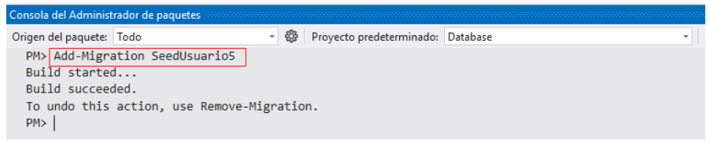 

### 4.3 Modifique InventarioContext

```csharp
using Database.Seeds;
using Microsoft.EntityFrameworkCore;

namespace Database
{
    public class InventarioContext:DbContext
    {
        public InventarioContext(DbContextOptions<InventarioContext> options):base(options)
        {
            
        }
        public DbSet<Producto> Productos { get; set; }
        public DbSet<Marca> Marcas { get; set; }
        public DbSet<Cliente> Clientes { get; set; }
        public DbSet<Usuario> Usuarios { get; set; }
        protected override void OnModelCreating(ModelBuilder modelBuilder)
        {
            // ✂️ código omitido
            modelBuilder.ApplyConfigurationsFromAssembly(typeof(InventarioContext).Assembly); // 👈 Línea agregada
        }
    }
}
```

:books: **Notas**  

- Cuando se utiliza `modelBuilder.ApplyConfigurationsFromAssembly(typeof(InventarioContext).Assembly);`, de forma automática busca todas las clases que heredan de `IEntityTypeConfiguration<T>` y que pertenecen al mismo ensamblado.

- No necesita instrucciones como `modelBuilder.ApplyConfiguration(new UsuarioSeed());`, `modelBuilder.ApplyConfiguration(new MonedaSeed());` 
- Las clases encontradas se ejecutan para insertar los datos iniciales.

- **Ventaja** Solo necesita una línea para los datos iniciales en `InventarioContext`.  

- **Desventaja** Puede ser más complicado dar seguimiento en cuanto a cuáles datos iniciales se están ejecutando. Por ejemplo, Si tiene una clase llamada `MonedaSeed` y no hereda de `IEntityTypeConfiguration<T>`, la inserción de datos no se realizará.  


### 4.4 Ejecute la migración

```csharp
Update-Migration
```

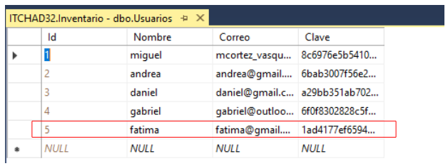  

# Más ejemplos

:books: Independiente de la forma que utilice para configurar los datos iniciales, se pueden agregar o quitar datos de la listas de usuario y cada vez será necesario crear y ejecutar una nueva migración.  

## Agregar un usuario 4

### Agregar los datos

```cs
// ✂️ código omitido

namespace Database.Seeds
{
    public class UsuarioSeed:IEntityTypeConfiguration<Usuario>
    {
        public void Configure(EntityTypeBuilder<Usuario> builder)
        {
            builder.HasData(
                // ✂️ código omitido
                new Usuario { Id = 4, Nombre = "gabriel", Correo = "gabriel@outlook.com", Clave = "6f0f8302828c5f89cb42d4c634d09a12bbd295c548bd5ac638d5ea7ca2da5ac1" }
            );
        }
    }
}
```

### Crear la migración

```
Add-Migration SeedUsuario4
```

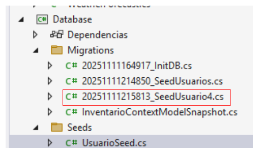  

### Ejecutar la migración

```
Update-Database
```

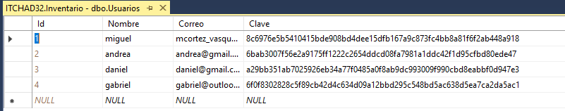  

## Eliminar el usuario 3

### Eliminar el usuario 3 de la lista de datos

```cs
// ✂️ código omitido

namespace Database.Seeds
{
    public class UsuarioSeed:IEntityTypeConfiguration<Usuario>
    {
        public void Configure(EntityTypeBuilder<Usuario> builder)
        {
            builder.HasData(
                new Usuario { Id = 1, Nombre = "miguel", Correo = "mcortez_vasquez@yahoo.com", Clave = "8c6976e5b5410415bde908bd4dee15dfb167a9c873fc4bb8a81f6f2ab448a918" },
                new Usuario { Id = 2, Nombre = "andrea", Correo = "andrea@gmail.com", Clave = "6bab3007f56e2a9175ff1222c2654ddcd08fa7981a1ddc42f1d95cfbd80ede47" },
                // Aquí se borró la lína del usuario 3.
                new Usuario { Id = 4, Nombre = "gabriel", Correo = "gabriel@outlook.com", Clave = "6f0f8302828c5f89cb42d4c634d09a12bbd295c548bd5ac638d5ea7ca2da5ac1" }
            );
        }
    }
}
```

### Crear una nueva migración

```
Add-Migration SeedRemoveUsuario3
```

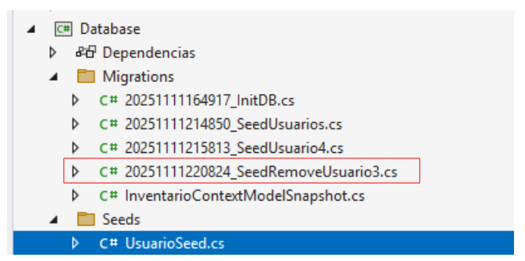  

### Ejecute la nueva migración

```
Update-Database
```

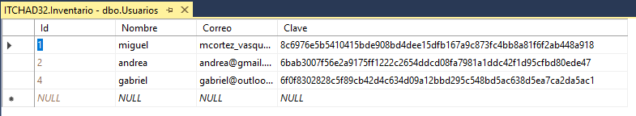  

## Recuperar el usuario 3

:books: Lo único que se hará es deshacer la última migración ejecutada.  

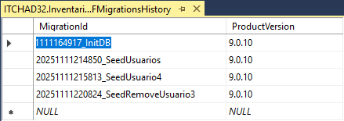  

```
Update-Database SeedUsuario4
```

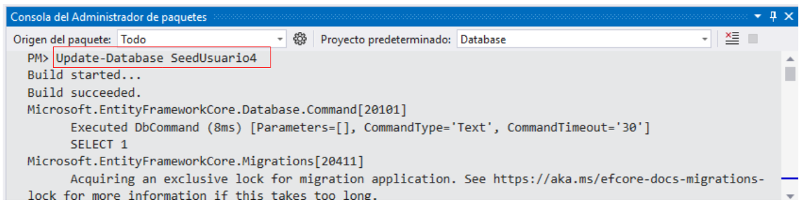  

Se borró del historial la última ejecución

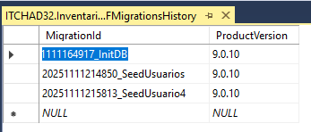  

El usuario 3 existe nuevamente en la base de datos

  

y las migración permanecen todas a no se que se eliminen a propósito


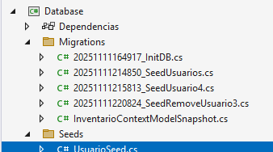  

## Eliminar un archivo de migración y su Snapshot correspondiente

```
Remove-Migration
```

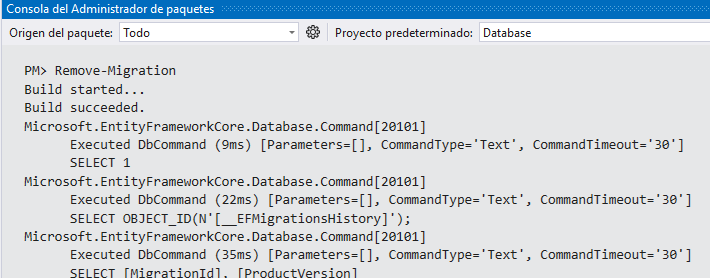   

ya no existe el archivo `20251111220824_SeedRemoveUsuario3`  

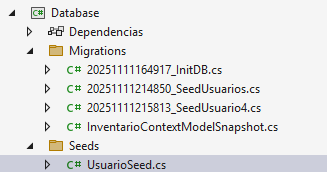  


## Referencia

NetMentor en Youtube:  

https://youtu.be/31haLJE9R6g?list=PLesmOrW3mp4i2RdfsPI5R6o5EVacGuovz
