# Proyecto ASP.NET Core (Model-View-Controller)

## Crear proyecto

1. Ingrese a Visual Studio 2026.  
2. Haga clic en `Crear un proyecto`.  
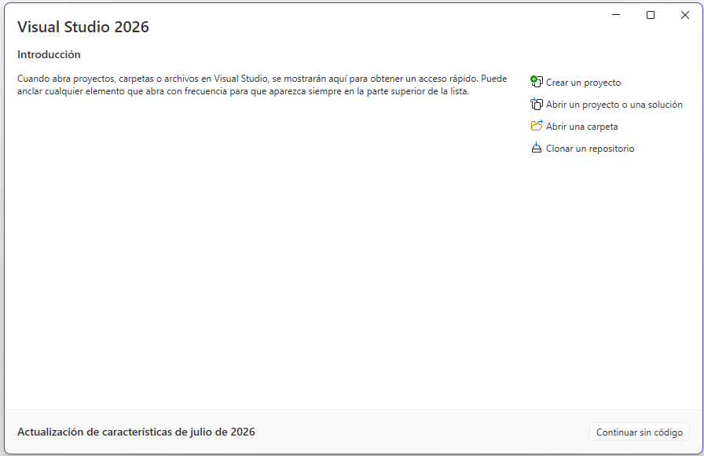   
3. Seleccione la plantilla `Aplicación Web de ASP.NET Core(Modelo-Vista-Controlador)` y haga clic en `Siguente`.  
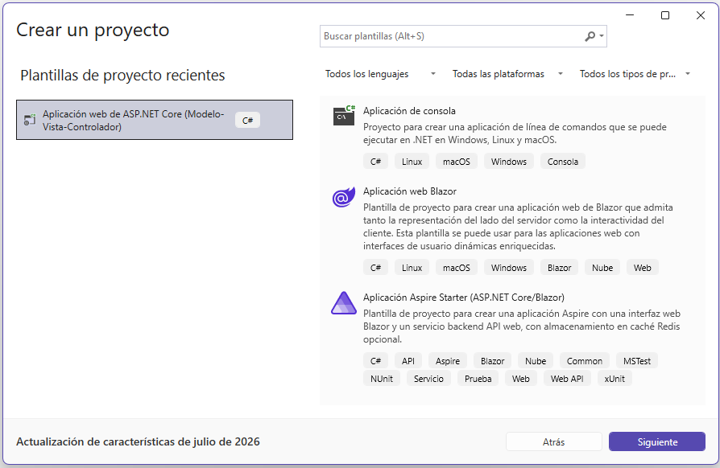   
4. Escriba un nombre al proyecto. En el ejemplo, el proyecto se llama `InventaMeCF` y haga clic en `Siguiente`   
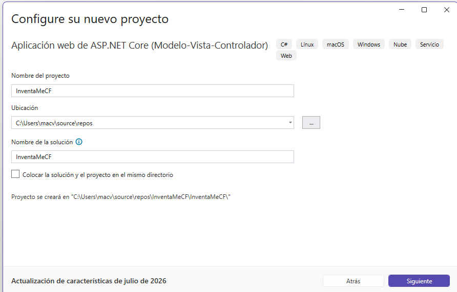   
5. Haga clic en `Crear` 
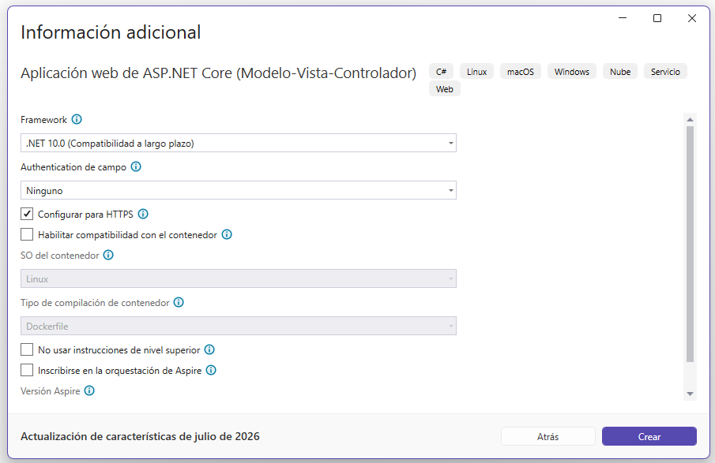   
6. El proyecto ha sido creado.  
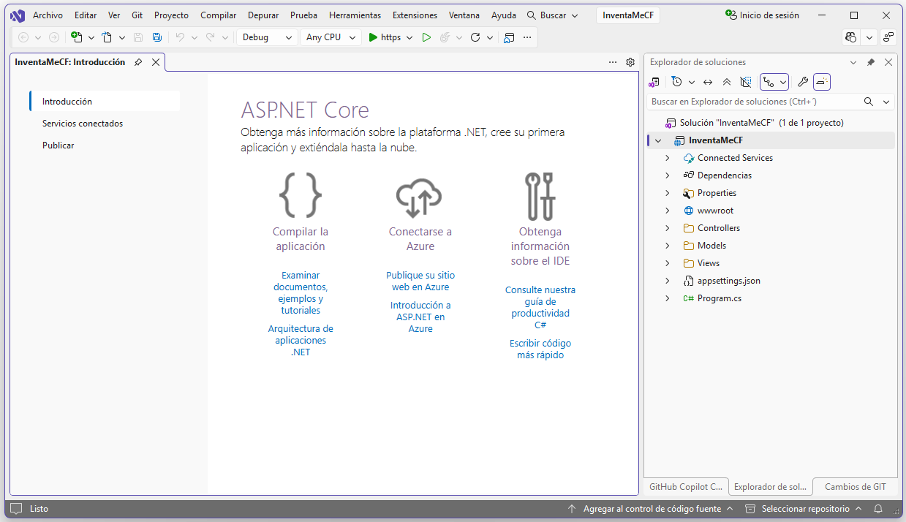   
## Instalación de paquetes  
Instale los paquetes:  
- Microsoft.EntityFrameworkCore  
- Microsoft.EntityFrameworkCore.Tools  
- Microsoft.EntityFrameworkCore.SqlServer  

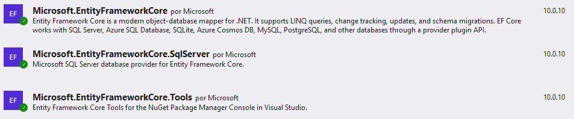   

**Nota**. El paquete `Microsoft.EntityFrameworkCore.SqlServer` es para trabajar con bases de datos de MSSQL. Si va a utilizar `MySQL` o `PostgreSQL` debe instalar el paquete correspondiente.  

## Instalación de dotnet-ef   
- Ingrese a CMD.
- Escriba `cd source` 
- Escriba `cd repos` 
- Escriba `cd InventaMeCF` 
- Escriba nuevamente `cd InventaMeCF` 
- Cree un archivo de manifiesto `dotnet new tool-manifest`   
- Instale **dotnet-ef** ejecutando el comando `dotnet tool install dotnet-ef`  

## Agregue las clases del modelo  
- Por ahora, solo se crearán dos clases: `Marca` y `Producto`  

Para crear cada clase, haga clic derecho en la carpeta `Models`, luego seleccione las opciones `Agregar` y `Clase`   

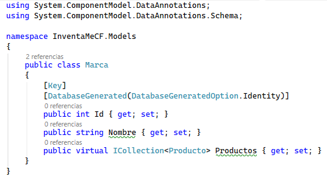   

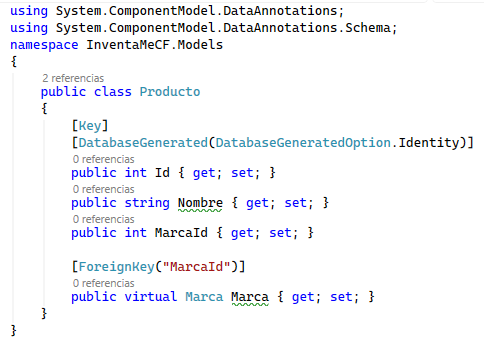   

## Agregue la clase de Contexto  

- Para crear la clase de contexto, haga clic derecho en la carpeta `Models`, luego seleccione las opciones `Agregar` y `Clase`.  

- Escriba el nombre `InventaMeCFContext`, luego complete el código de la clase como se ve en la imagen siguiente.  

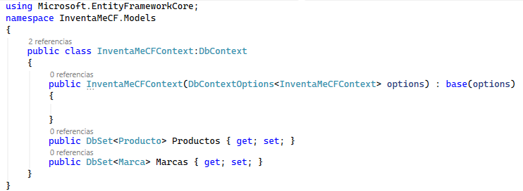   

## Cree una cadena de conexión  

Se debe modificar el archivo `appsettings.json`, agregando una configuración como la siguiente justo antes de la llave de cierre.  
```cs
,
  "ConnectionStrings": {
    "InventaMeCFConnection": "Server=ITCHAD32;Database=InventaMeCF;Uid=sa;Pwd=adminsql;Trust Server Certificate=true;MultipleActiveResultSets=true;"
  }
```

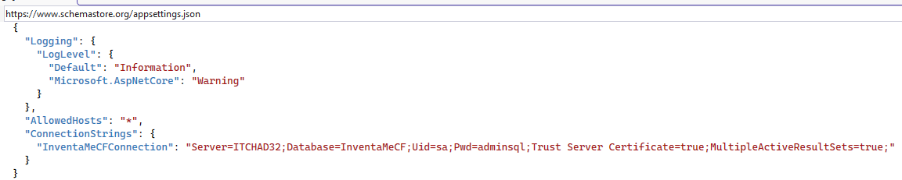   

## Configure el archivo Program.cs  

**Nota**. La clase `Program.cs` ya existe en el proyecto, lo único que debe hacer es modificarlo como se muestra en el siguiente código.

:warning: El `BLOQUE 2` solamente será usado la primera vez que se ejecute el proyecto y luego debe ser comentado o borrado. Este bloque lo que hace es ejecutar la primera migración.  

```cs
using InventaMeCF.Models; // 👇 LINEA AGREGADA
using Microsoft.EntityFrameworkCore; // 👇 LINEA AGREGADA
var builder = WebApplication.CreateBuilder(args);

// Add services to the container.
builder.Services.AddControllersWithViews();

// 👇 BLOQUE 1 AGREGADO
builder.Services.AddDbContext<InventaMeCFContext>(options =>
{
    options.UseSqlServer(builder.Configuration.GetConnectionString("InventaMeCFConnection"));
});
// 👆 FIN DEL BLOQUE 1.

var app = builder.Build();

// 👇 BLOQUE 2 AGREGADO
using (var scope = app.Services.CreateScope())
{
    var context = scope.ServiceProvider.GetRequiredService<InventaMeCFContext>();
    context.Database.Migrate();
}
// 👆 FIN DEL BLOQUE 2.

// Configure the HTTP request pipeline.
if (!app.Environment.IsDevelopment())
{
    app.UseExceptionHandler("/Home/Error");
    // The default HSTS value is 30 days. You may want to change this for production scenarios, see https://aka.ms/aspnetcore-hsts.
    app.UseHsts();
}

app.UseHttpsRedirection();
app.UseRouting();

app.UseAuthorization();

app.MapStaticAssets();

app.MapControllerRoute(
    name: "default",
    pattern: "{controller=Home}/{action=Index}/{id?}")
    .WithStaticAssets();


app.Run();

```

## Agregue la primera migración  

**Nota**. Debido a que solo se tienen dos clases `Marca` y `Producto`, la migración inicial, en la migración inicial se crearán las instrucciones para definir dos tablas de la base de datos. Estas tablas se crearán en la base de datos en el momento que se ejecute la aplicación por primera vez. Esto lo hace el `BLOQUE 2` que se agregó en la clase `Program.cs` 

Para crear la primera migración, ejecute uno de los siguientes dos comandos:  

```bash
Add-Migration MigracionInicial
```

```bash
dotnet ef migrations add MigracionInicial
```  

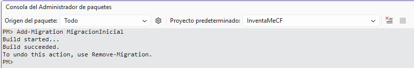   


## Ejecute la aplicación

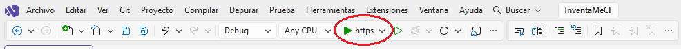   

## Ingrese a la base de datos  

En la base de datos consulte que se hayan creado las tablas `Marcas` y `Productos` 

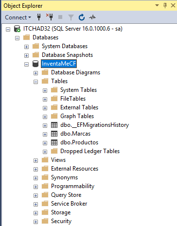   

## Modifique la clase Program.cs

Después de haber creado correctamente las primeras tablas en la base de datos, comente o elimine el `BLOQUE 2` de la clase `Program` porque ese bloque solo se debe ejecutar la primera vez para actualizar la base de datos con las tablas definidas en la primera migración.  

```cs
// 👇 BLOQUE 2 COMENTADO
/*
using (var scope = app.Services.CreateScope())
{
    var context = scope.ServiceProvider.GetRequiredService<InventaMeCFContext>();
    context.Database.Migrate();
}
*/
// 👆 FIN DEL BLOQUE 2.
```
