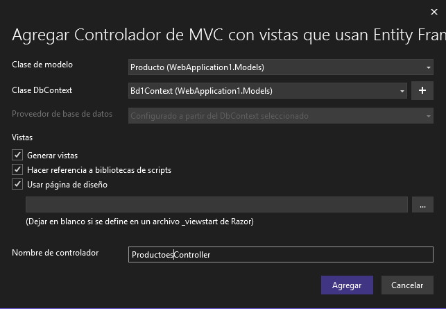
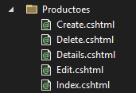

# Asistente para crear un CRUD
1. Haga clic derecho en Controllers
2. Seleccione la opción Agregar
3. Seleccione la opción Controlador...
4. Controlador de MVC con vistas que usan Entity Framework.
  
5. Agregar  

Se mostrará el siguiente cuadro de diálogo.
  

Llene como se muestra:

  
6. Agregar

  

  