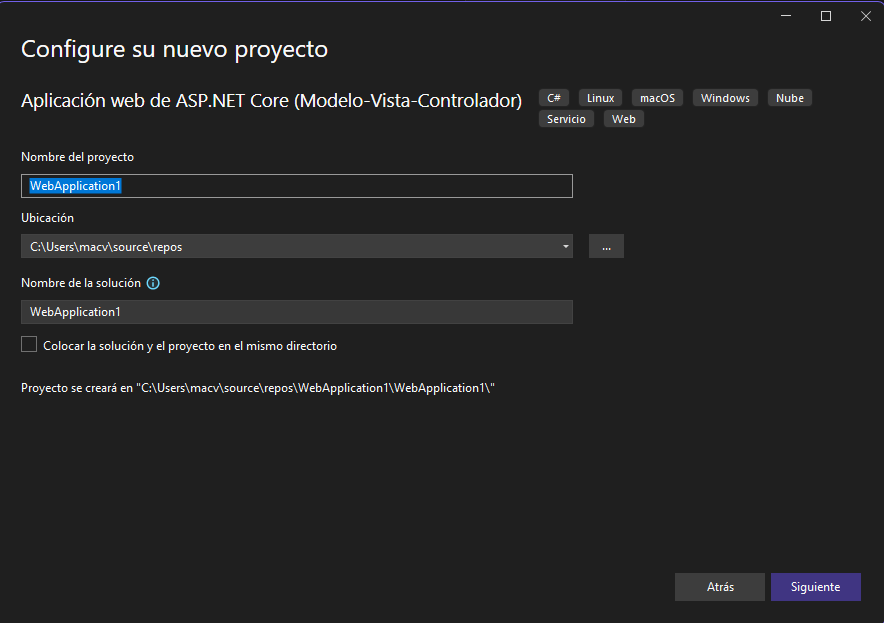
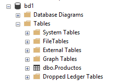

# Creación de un nuevo proyecto
1. Ingrese a Visual Studio 2022 y seleccione la opción **Crear un proyecto**  

  

2. Busque y seleccione la plantilla **Aplicación web aspnet Core".  

  

3. Haga clic en Siguiente.  

4. Puede cambiar las configuraciones de su proyecto en el siguiente cuadro de diálogo. Luego haga clic en Siguiente.  

  

5. En el siguiente cuadro de diálogo se muestra la versión del Framework. Sugiero que no la cambie. Solo haga clic en Crear  
  

Así se mostrará su nuevo proyecto ya creado:  

  

# Creación de un contexto a partir de una base de datos existente.

En este caso se utilizará MSSQL

1. Haga clic derecho en el nombre del proyecto (**WebApplication1**)

2. Seleccione la opción **Administrar paquetes NuGet...**

3. Instale los paquetes siguientes:  

  

  

  

Este es el cuadro de diálogo que se utiliza para instalar los paquetes indicados arriba:  

  

4. Crear las entidades a partir de la base de datos.

* Vaya al menú Herramientas.
* Seleccione la opción **Administrador de paquetes NuGet**
* Seleccione **Consola del administrador de paquetes**  
* Escriba el comando para generar el contexto. El comando se presenta a continuación:  

***FORMA 1***

```
Scaffold-DbContext "Server=ITCHAD32;Database=db1;Trusted_Connection=True; Trust Server Certificate=true;" Microsoft.EntityFrameworkCore.SqlServer -OutputDir Models -force
```

***FORMA 2***

```
Scaffold-DbContext "Server=ITCHAD32;Database=db1;User Id=sa;Password=adminsql; Trust Server Certificate=true;" Microsoft.EntityFrameworkCore.SqlServer -OutputDir Models -force
```

Cuando se ha creado en contexto, se presenta un mensaje como el siguiente:  

  

A continuación se muestra el contexto creado:  

  

El modelo está creado en función de las tablas de la base de datos **bd1** que actualmente solo tiene la tabla **Productos**  

  

