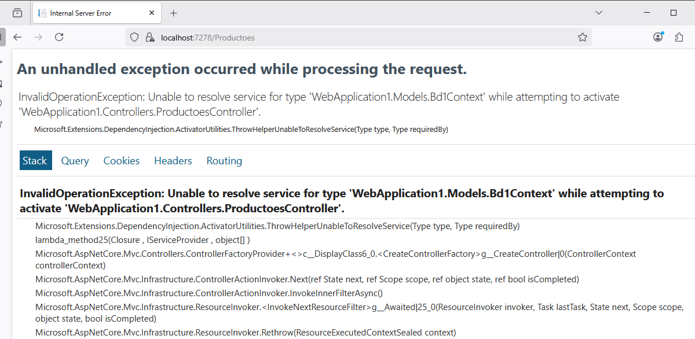
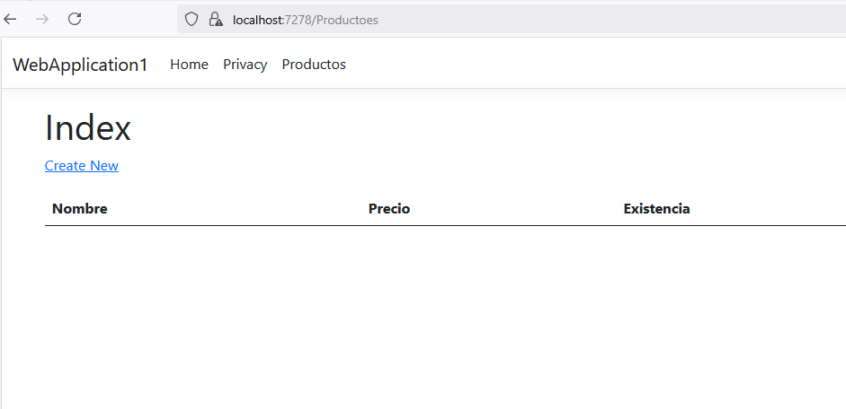

# Problema de conexión


## Agregar la cadena de conexión en appsettings.json

```json
{
  "Logging": {
    "LogLevel": {
      "Default": "Information",
      "Microsoft.AspNetCore": "Warning"
    }
  },
  "AllowedHosts": "*",
  "ConnectionStrings": {
    "DefaultConnection": "Server=ITCHAD32;Database=bd1;User Id=sa;Password=adminsql; Trust Server Certificate=true;"
  } // Bloque agregado desde "ConecctionStrings hasta esta línea."
}
```

## Modificar el archivo Program.css

```csharp
using WebApplication1.Models; // LINEA AGREGADA
using Microsoft.EntityFrameworkCore; // LINEA AGREGADA
var builder = WebApplication.CreateBuilder(args);

// Add services to the container.
builder.Services.AddControllersWithViews();

// AGREGAR DESDE AQUÍ
builder.Services.AddDbContext<Bd1Context>(o =>
{
    o.UseSqlServer(builder.Configuration.GetConnectionString("DefaultConecction"));
});
// HASTA AQUÍ

var app = builder.Build();


// Configure the HTTP request pipeline.
if (!app.Environment.IsDevelopment())
{
    app.UseExceptionHandler("/Home/Error");
    // The default HSTS value is 30 days. You may want to change this for production scenarios, see https://aka.ms/aspnetcore-hsts.
    app.UseHsts();
}

app.UseHttpsRedirection();
app.UseStaticFiles();

app.UseRouting();

app.UseAuthorization();

app.MapControllerRoute(
    name: "default",
    pattern: "{controller=Home}/{action=Index}/{id?}");

app.Run();
```

  